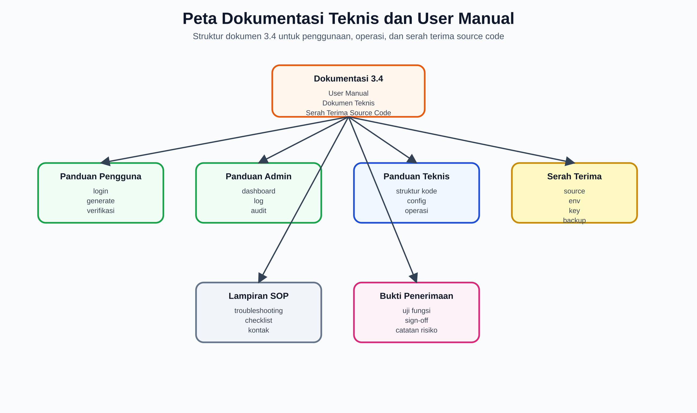
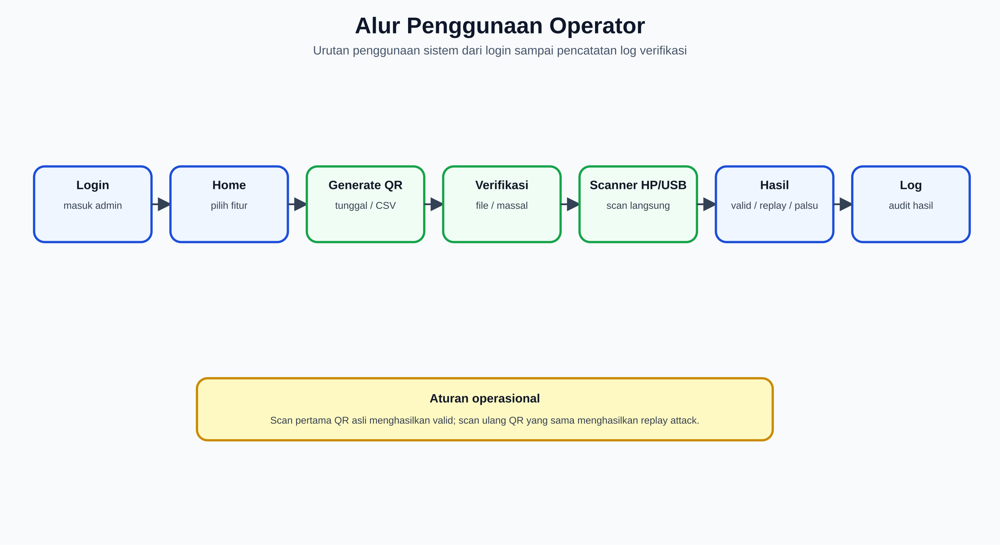
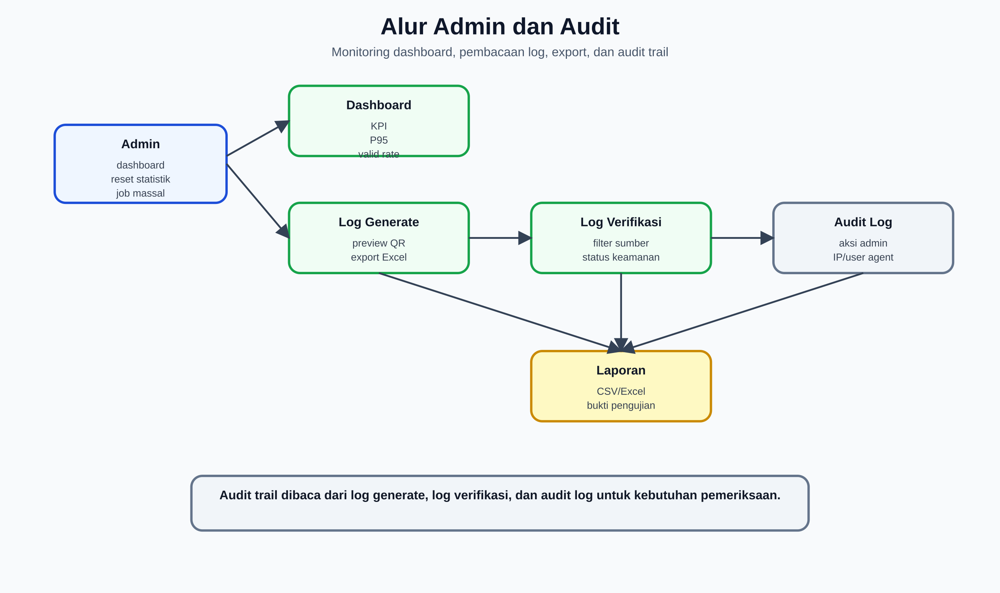
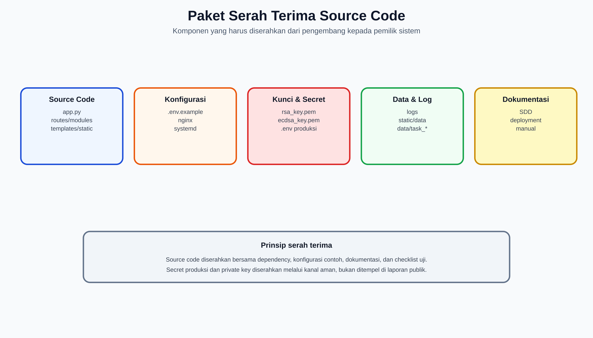
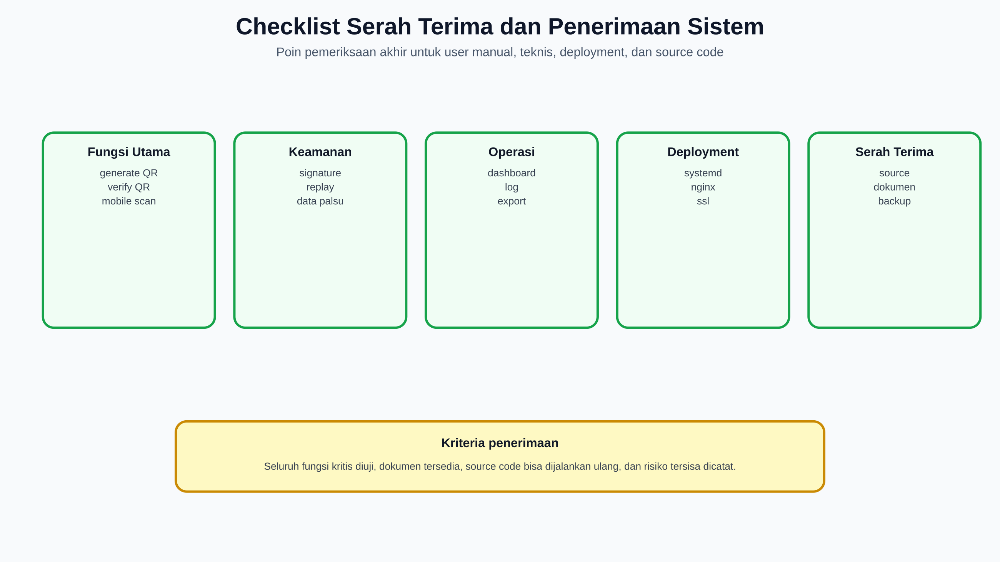

# 3.4 Penyusunan Dokumentasi Teknis dan User Manual

## Buku Panduan Penggunaan dan Dokumen Serah Terima Source Code

**Sistem:** QR Code Security System RSA-PSS  
**Domain implementasi:** `https://rsa-pss.com`  
**Lokasi kode:** `/opt/qrcode`  
**Tanggal penyusunan:** 16 Juni 2026  
**Tujuan dokumen:** Menyediakan buku panduan penggunaan sistem, dokumentasi teknis operasional, dan dokumen serah terima source code untuk admin, operator, auditor, dan pemilik sistem.

---

## 1. Ringkasan Eksekutif

Dokumen ini merupakan paket dokumentasi 3.4 yang berfungsi sebagai panduan akhir bagi pengguna dan penerima sistem QR Code Security System RSA-PSS. Isi dokumen mencakup:

- Buku panduan penggunaan untuk admin, operator, petugas lapangan, dan auditor.
- Panduan teknis ringkas untuk menjalankan, memantau, dan merawat sistem.
- SOP penggunaan fitur utama: generate QR, verifikasi QR, scanner HP, scanner USB, dashboard, log, job massal, audit log, dan testing.
- Format serah terima source code, termasuk daftar folder, file konfigurasi, dependency, private key, data/log, dan dokumen pendukung.
- Checklist penerimaan sistem dan berita acara serah terima.

Dokumen ini melengkapi dokumen teknis lain yang sudah disusun:

| Dokumen | Fungsi |
|---|---|
| `analisis_kebutuhan_bisnis_kriptograf.md` | Analisis kebutuhan bisnis dan kriptograf. |
| `perancangan_arsitektur_basis_data_log_storage.md` | Desain database, nonce, logging, dan storage. |
| `desain_ui_ux_wireframe_dashboard_scanner.md` | Desain UI/UX dan wireframe. |
| `dokumen_desain_sistem_sdd_dfd_flowchart_erd.md` | SDD, DFD, flowchart, dan ERD. |
| `instalasi_konfigurasi_deployment_produksi.md` | Instalasi, deployment Nginx/Gunicorn/SSL. |

### 1.1 Gambar Pendukung

| Gambar | File |
|---|---|
| Peta dokumentasi teknis dan user manual | `dokumen/Gambar-Asli/manual_documentation_map.png` |
| Alur penggunaan operator | `dokumen/Gambar-Asli/manual_operator_workflow.png` |
| Alur admin dan audit | `dokumen/Gambar-Asli/manual_admin_audit_workflow.png` |
| Paket serah terima source code | `dokumen/Gambar-Asli/manual_source_handover_package.png` |
| Checklist serah terima dan penerimaan sistem | `dokumen/Gambar-Asli/manual_acceptance_checklist.png` |

---

## 2. Peta Dokumentasi



Gambar di atas menunjukkan struktur dokumentasi 3.4: panduan pengguna, panduan admin, panduan teknis, serah terima source code, SOP, dan bukti penerimaan sistem.

### 2.1 Sasaran Pembaca

| Pembaca | Kebutuhan |
|---|---|
| Admin sistem | Login, monitoring dashboard, log, audit, reset statistik, job massal. |
| Operator verifikasi | Generate QR, verifikasi QR, membaca hasil valid/replay/data palsu. |
| Petugas lapangan | Scan QR menggunakan kamera HP melalui `/mobile_scan`. |
| Auditor | Memeriksa log generate, log verifikasi, audit log, dan export laporan. |
| Tim teknis | Deployment, konfigurasi `.env`, restart service, backup, recovery. |
| Pemilik sistem | Menerima source code, dokumen, akun, kunci, dan bukti pengujian. |

### 2.2 Cakupan Manual

Dokumen ini membahas penggunaan fitur yang tersedia di sistem:

| Area | Route/Halaman | Fungsi |
|---|---|---|
| Login | `/login` | Autentikasi admin/operator. |
| Home | `/` atau `/index` | Halaman utama fitur generate, scanner, log, dashboard. |
| Generate QR Tunggal | `/generate_qr` | Membuat satu QR dari nama dan ID. |
| Generate CSV | `/generate_csv` | Membuat CSV dan generate QR massal dari CSV. |
| Scanner File | `/scanner` | Verifikasi QR tunggal dan massal via upload file. |
| Scanner HP | `/mobile_scan` | Scan QR dengan kamera HP dan redirect hasil otomatis. |
| Scanner USB | `/verify_direct` | Verifikasi langsung via scanner USB/webcam. |
| Hasil Generate Massal | `/view_generate_results` | Melihat hasil job generate massal. |
| Hasil Verifikasi Massal | `/view_verify_massal_results` | Melihat hasil job verify massal. |
| Job Massal | `/jobs` | Daftar job generate/verifikasi massal. |
| Dashboard | `/dashboard` | Statistik generate, verifikasi, performa, file, dan metodologi. |
| Log Generate | `/log` | Riwayat generate QR dan preview QR. |
| Log Verifikasi | `/log_verifikasi` | Riwayat hasil verifikasi dan export. |
| Audit Log | `/audit_log` | Riwayat aksi admin/operator. |
| Security Profile | `/security_profile` | Informasi profil keamanan sistem. |
| Testing | `/testing/` | Simulated dan Real HTTP Stress Test. |

---

## 3. Peran dan Hak Akses

### 3.1 Admin Sistem

Admin memiliki akses penuh terhadap fitur utama:

- Login dan logout.
- Generate QR tunggal dan massal.
- Verifikasi QR tunggal dan massal.
- Membuka dashboard.
- Melihat log generate dan log verifikasi.
- Melihat audit log.
- Melihat job massal.
- Menjalankan testing jika diizinkan oleh guard aplikasi.
- Reset statistik atau log sesuai tombol yang tersedia.

### 3.2 Operator Verifikasi

Operator fokus pada proses kerja harian:

- Generate QR bila diperlukan.
- Verifikasi QR via upload file.
- Verifikasi QR via scanner HP atau USB.
- Membaca status hasil verifikasi.
- Melihat log verifikasi.

### 3.3 Petugas Lapangan

Petugas lapangan memakai perangkat mobile:

- Membuka `https://rsa-pss.com/mobile_scan`.
- Mengizinkan akses kamera.
- Memindai QR.
- Membaca hasil verifikasi valid/replay/data palsu.
- Memakai input manual jika kamera tidak aktif.

### 3.4 Auditor

Auditor membaca bukti operasi:

- Log generate.
- Log verifikasi.
- Audit log.
- Export Excel/CSV.
- Dashboard statistik.
- Dokumen teknis dan bukti serah terima.

---

## 4. Alur Penggunaan Operator



Gambar di atas merangkum alur operator dari login, memilih fitur di Home, generate/verifikasi QR, membaca hasil, dan melihat log.

### 4.1 Login

Langkah:

1. Buka `https://rsa-pss.com/login`.
2. Masukkan password admin/operator.
3. Klik tombol login.
4. Jika berhasil, sistem masuk ke halaman Home.

Catatan keamanan:

- Jangan membagikan password admin melalui chat publik.
- Ganti `AUTH_PASSWORD` secara berkala melalui file `.env`.
- Setelah mengubah `.env`, restart service `qrcode`.

### 4.2 Logout

Langkah:

1. Klik menu logout jika tersedia.
2. Tutup browser jika memakai komputer bersama.

### 4.3 Navigasi Home

Halaman Home menyediakan akses ke:

- Generate QR tunggal.
- Generate QR massal dari CSV.
- Scanner file.
- Scanner HP.
- Scanner USB.
- Log Generate.
- Log Verifikasi.
- Dashboard.
- Testing System.
- Job Massal.
- Audit Log.

Aturan navigasi:

- Tombol `Home` selalu kembali ke halaman index.
- Tombol `Dashboard` menuju statistik sistem.
- Tombol `Scanner` menuju workspace verifikasi.
- Tombol log hanya digunakan untuk membuka riwayat terkait.

---

## 5. Panduan Generate QR Code

### 5.1 Generate QR Tunggal

Tujuan: membuat satu QR Code bertanda tangan digital berdasarkan nama dan ID.

Langkah:

1. Buka halaman Home.
2. Isi field `Nama`.
3. Isi field `ID`.
4. Pilih algoritma jika tersedia, default sistem adalah RSA.
5. Klik `Generate QR Code`.
6. Sistem menampilkan halaman hasil generate.
7. Download atau scan QR yang dihasilkan.

Output yang dihasilkan:

| Output | Keterangan |
|---|---|
| QR PNG | Gambar QR Code. |
| URL verifikasi | URL pendek/encoded untuk scanner HP. |
| Metadata QR | Versi, modul, resolusi, ukuran file. |
| Timing generate | Waktu data, sign, render QR, save, total. |
| Log generate | Baris baru di `logs/log_generate.csv`. |

Catatan:

- QR yang baru dibuat dan belum diverifikasi akan valid pada scan pertama.
- Scan ulang QR yang sama akan menjadi replay.
- Jika QR lama dibuat ketika `BASE_URL` masih `localhost`, buat ulang QR setelah `BASE_URL` memakai domain publik.

### 5.2 Generate QR Massal dari CSV

Tujuan: membuat banyak QR berdasarkan file CSV.

Langkah:

1. Buka Home.
2. Pada bagian generate massal, pilih file CSV.
3. Klik `Upload CSV & Generate`.
4. Sistem masuk ke halaman progress.
5. Tunggu sampai proses selesai.
6. Buka hasil generate massal.
7. Download QR per file atau download semua QR dalam arsip.

Format CSV minimal:

```csv
nama,id
User 1,user_000001
User 2,user_000002
```

Jika menggunakan generator CSV internal, ikuti form di halaman `/generate_csv`.

### 5.3 Hasil Generate Massal

Pada halaman hasil generate massal, perhatikan:

- Total QR yang berhasil dibuat.
- Rata-rata waktu generate.
- Ukuran file rata-rata.
- Dimensi minimum, maksimum, dan rata-rata.
- Ringkasan task generate.
- Tombol download.

---

## 6. Panduan Verifikasi QR Code

### 6.1 Status Hasil Verifikasi

| Status | Arti | Tindakan |
|---|---|---|
| Valid dan Authentik | QR asli, signature valid, nonce belum pernah digunakan. | Terima QR sebagai valid. |
| Replay Attack | QR asli tetapi sudah pernah diverifikasi. | Tolak penggunaan ulang dan catat kejadian. |
| Data Telah Dimodifikasi | Isi QR berubah dari data original. | Tolak QR dan periksa sumber QR. |
| Data Palsu | Signature tidak cocok atau payload tidak sah. | Tolak QR. |
| Signature Invalid | Signature tidak dapat diverifikasi. | Tolak QR. |
| Nonce tidak valid | Format nonce tidak sesuai. | Tolak QR. |
| Data Tidak Ditemukan | Data tidak cocok dengan database original. | Periksa apakah QR berasal dari sistem ini. |
| QR tidak terbaca | Gambar QR rusak/blur/tidak valid. | Minta QR baru atau upload gambar yang lebih jelas. |

### 6.2 Verifikasi QR Tunggal via Upload File

Langkah:

1. Buka `/scanner`.
2. Pilih tab `Verifikasi Tunggal`.
3. Drag & drop file QR atau klik `Pilih File`.
4. Klik `Verifikasi QR Code`.
5. Baca badge status di bagian atas result card.
6. Periksa detail data, signature, dan timing jika diperlukan.

Format file yang didukung:

- PNG
- JPG/JPEG
- GIF

### 6.3 Verifikasi QR Massal

Langkah:

1. Buka `/scanner`.
2. Pilih tab `Verifikasi Massal`.
3. Pilih banyak file QR.
4. Klik `Verifikasi Massal`.
5. Untuk file sedikit, hasil tampil langsung.
6. Untuk file banyak, sistem mengarahkan ke halaman progress async.
7. Setelah selesai, buka hasil verifikasi massal.

Output verifikasi massal:

- Total file diproses.
- Jumlah valid/error/replay.
- Success rate.
- Total waktu.
- Breakdown waktu load, decode, verify, DB.
- Tabel detail per file.

#### 6.3.1 Batas Teknis Verifikasi QR Massal

Pada konfigurasi aplikasi saat dokumen ini dibuat, verifikasi massal melalui upload file memiliki batas praktis sekitar **20.000 file QR per sekali request upload**. Angka ini bukan batas QR Code atau batas kriptografi, melainkan batas aman untuk mekanisme upload banyak file melalui HTTP `multipart/form-data`.

Parameter teknis yang memengaruhi batas tersebut:

| Parameter | Nilai Saat Ini | Dampak Operasional |
|---|---:|---|
| `MAX_FORM_PARTS` | `20000` | Membatasi jumlah bagian multipart; satu file QR umumnya dihitung sebagai satu part. |
| `MAX_CONTENT_LENGTH` | `500MB` | Membatasi total ukuran request upload. |
| Batas per file | `10MB` | Mencegah satu file gambar terlalu besar membebani proses decode. |
| `MAX_FILES_MASSAL` | `0` | Aplikasi tidak membatasi jumlah file sendiri, tetapi tetap tunduk pada batas multipart dan ukuran request. |

Batas efektif dapat dipahami dengan rumus sederhana:

```text
jumlah file efektif = min(20.000, 500MB / rata-rata ukuran file QR)
```

Contoh estimasi:

| Rata-rata ukuran QR | Estimasi batas karena 500MB | Batas efektif |
|---:|---:|---:|
| 10KB | sekitar 50.000 file | 20.000 file, karena dibatasi `MAX_FORM_PARTS` |
| 25KB | sekitar 20.000 file | 20.000 file |
| 50KB | sekitar 10.000 file | 10.000 file, karena dibatasi ukuran request |
| 100KB | sekitar 5.000 file | 5.000 file, karena dibatasi ukuran request |

Alasan teknis penetapan batas aman 20.000 file:

1. **Satu file menjadi satu multipart part.** Browser mengirim upload massal sebagai banyak bagian `multipart/form-data`. Tanpa batas, request dengan puluhan ribu part dapat membebani parser request Flask/Werkzeug dan memicu `413 Request Entity Too Large`.
2. **Total request tetap dibatasi 500MB.** File QR yang kecil dapat mencapai 20.000 file, tetapi file QR yang besar akan lebih dulu mencapai batas ukuran request.
3. **Multipart memiliki overhead metadata.** Setiap file membawa boundary, nama field, nama file, content type, dan header lain. Overhead ini menambah ukuran request dan jumlah objek yang harus diparse server.
4. **Browser, proxy, dan web server dapat menjadi bottleneck.** Upload ribuan file dapat membuat browser lambat, koneksi terputus, atau reverse proxy mengalami timeout jika konfigurasi upload dan buffering tidak memadai.
5. **File disimpan sementara sebelum diproses.** Pada jalur async, sistem menyimpan file ke folder task sementara, lalu membacanya kembali untuk proses decode. Ribuan file berarti beban disk I/O, inode, dan cleanup yang lebih besar.
6. **Decode QR adalah proses image processing.** Setiap file perlu dibuka sebagai gambar, didecode, lalu payload-nya diekstrak. Ini memakai CPU dan waktu, terutama pada file gambar besar atau kualitas QR buruk.
7. **Verifikasi keamanan membutuhkan operasi tambahan.** Setelah decode, sistem melakukan parsing payload, verifikasi signature, pengecekan hash, pengecekan nonce/timestamp untuk anti-replay, update state, dan penulisan log.
8. **Hasil massal juga memakai memori dan storage.** Setiap hasil berisi nama file, status, detail error, timing, dan metadata. Semakin banyak file, semakin besar snapshot hasil dan report.

Rekomendasi operasional:

- Untuk **1.000-10.000 QR**, upload massal masih cocok untuk penggunaan normal dan uji performa.
- Untuk **10.000-20.000 QR**, gunakan mode async dan pastikan koneksi, proxy, storage, dan waktu proses memadai.
- Untuk **50.000-100.000 QR**, jangan mengirim semua file dalam satu upload browser. Gunakan batch bertahap atau verifikasi server-side dari hasil generate task.
- Jika muncul `413 Request Entity Too Large`, cek jumlah file, ukuran total upload, konfigurasi Flask `MAX_CONTENT_LENGTH`, `MAX_FORM_PARTS`, dan batas upload di reverse proxy.

### 6.4 Verifikasi via Kamera HP

Langkah:

1. Dari HP, buka `https://rsa-pss.com/mobile_scan`.
2. Izinkan akses kamera.
3. Arahkan kamera ke QR.
4. Setelah QR terbaca, browser membuka hasil verifikasi otomatis.
5. Jika kamera gagal, tempel URL/data QR pada input manual dan klik `Buka`.

Catatan:

- Browser harus memakai HTTPS agar izin kamera berjalan stabil.
- QR harus berisi URL publik `https://rsa-pss.com/...`.
- QR lama yang masih memakai localhost perlu dibuat ulang.

### 6.5 Verifikasi via Scanner USB

Langkah:

1. Buka `/verify_direct`.
2. Pastikan kursor fokus pada input scanner.
3. Arahkan scanner USB ke QR.
4. Scanner mengirim data dan tombol Enter otomatis.
5. Sistem menampilkan hasil verifikasi.
6. Input siap untuk scan berikutnya.

Jika scanner tidak mengirim Enter:

- Klik tombol `Verifikasi Sekarang`.
- Pastikan mode scanner USB disetel sebagai keyboard wedge.

---

## 7. Panduan Dashboard, Log, dan Audit



Gambar di atas menjelaskan alur admin/auditor dalam membaca dashboard, log generate, log verifikasi, audit log, dan export laporan.

### 7.1 Dashboard

Halaman: `/dashboard`

Dashboard menampilkan:

- Total QR digenerate.
- Total verifikasi.
- Median waktu generate.
- P95 waktu verifikasi.
- Statistik dimensi QR.
- Analisis waktu sistem.
- Statistik file.
- Analisis performa.
- Metodologi dan sumber data.

Interpretasi penting:

- `Median` menunjukkan kondisi tipikal.
- `P95` menunjukkan tail latency dan lebih relevan untuk response time grade.
- `Ops/sec` pada dashboard adalah estimasi dari median, bukan hasil load test paralel.
- Valid QR rate menghitung proporsi QR valid dari log verifikasi.

### 7.2 Log Generate

Halaman: `/log`

Fungsi:

- Melihat riwayat generate QR.
- Melihat statistik generate.
- Melihat preview QR tanpa download.
- Filter/pagination.
- Export Excel.
- Keyboard horizontal scroll pada tabel.

Kolom penting:

- Sumber
- Waktu
- Nama
- ID
- Versi QR
- Resolusi
- Ukuran File
- Waktu Sign
- Total Waktu
- Preview QR

### 7.3 Log Verifikasi

Halaman: `/log_verifikasi`

Fungsi:

- Melihat riwayat verifikasi QR.
- Filter berdasarkan status/sumber/tanggal.
- Export Excel.
- Melihat statistik verifikasi.

Sumber verifikasi:

- Tunggal
- Massal
- Massal_Async
- Kamera HP
- Direct/Scanner

### 7.4 Audit Log

Halaman: `/audit_log`

Fungsi:

- Melihat aksi admin/operator.
- Mencatat login, download log, hapus log, reset, cleanup, dan aksi sensitif lain.
- Menyimpan IP dan user agent.

Catatan:

- Isi detail panjang akan wrap ke baris bawah agar tidak menabrak kolom sebelahnya.
- Audit log penting untuk bukti operasional.

### 7.5 Job Massal

Halaman: `/jobs`

Fungsi:

- Melihat daftar job generate/verifikasi massal.
- Melihat status running/completed/error.
- Melihat jumlah file, bukan daftar file panjang.
- Membuka hasil job.

---

## 8. Panduan Testing Sistem

Halaman: `/testing/`

Jenis testing:

| Jenis | Fungsi |
|---|---|
| Simulated Stress Test | Menguji operasi internal/simulasi tanpa request HTTP nyata. |
| Real HTTP Stress Test (Local Server) | Menembak endpoint lokal server melalui HTTP dan menjalankan Generate + Verify QR. |

Catatan interpretasi:

- Real HTTP Stress Test local lebih realistis daripada simulasi internal, tetapi tetap bukan pengganti load test dari mesin eksternal.
- Untuk pengujian paling nyata, perlu k6/Locust/JMeter dari mesin lain.
- Metrik CPU/RAM/Disk/Network dipakai untuk memantau dampak test pada server.

---

## 9. Panduan Teknis Operasional

### 9.1 Struktur Folder Penting

| Path | Fungsi |
|---|---|
| `app.py` | Aplikasi Flask utama. |
| `wsgi.py` | Entry point Gunicorn. |
| `templates/` | HTML template. |
| `static/` | CSS/JS, QR PNG, upload, data JSON. |
| `data/` | Payload token, task result, metadata, download. |
| `logs/` | App log, CSV log, SQLite nonce state. |
| `routes/` | Blueprint/module route tambahan. |
| `modules/` | Modul pendukung. |
| `deploy/nginx/` | Contoh konfigurasi Nginx. |
| `deploy/systemd/` | Contoh service systemd. |
| `dokumen/` | Dokumen laporan dan diagram SVG. |
| `venv/` | Virtual environment Python. |

### 9.2 File Konfigurasi Penting

| File | Fungsi |
|---|---|
| `.env` | Konfigurasi produksi aktual. |
| `.env.example` | Contoh konfigurasi umum. |
| `.env.production.rsa-pss.example` | Contoh konfigurasi produksi domain `rsa-pss.com`. |
| `requirements.txt` | Dependency Python Linux/production. |
| `run_app.sh` | Runner manual. |
| `deploy/systemd/qrcode.service` | Service produksi Gunicorn. |
| `deploy/nginx/rsa-pss.com.conf` | Reverse proxy Nginx. |

### 9.3 Command Operasional Harian

Cek service:

```bash
sudo systemctl status qrcode --no-pager
sudo systemctl status nginx --no-pager
sudo systemctl status redis-server --no-pager
```

Restart aplikasi:

```bash
sudo systemctl restart qrcode
```

Lihat log aplikasi:

```bash
sudo journalctl -u qrcode -f
tail -f /opt/qrcode/logs/app.log
```

Cek domain:

```bash
curl -I https://rsa-pss.com/
curl -I http://127.0.0.1:5000/
```

Cek ukuran data:

```bash
du -sh /opt/qrcode/logs /opt/qrcode/static /opt/qrcode/data
df -h
```

### 9.4 Backup Minimal

Backup file/folder berikut:

- `.env`
- `rsa_key.pem`
- `ecdsa_key.pem`
- `logs/`
- `static/data/`
- `static/qr/`
- `static/qr_massal/`
- `data/`
- `deploy/`
- `dokumen/`

Contoh command:

```bash
sudo tar -czf /var/backups/qrcode/qrcode_backup_$(date +%Y%m%d_%H%M%S).tar.gz \
  /opt/qrcode/.env \
  /opt/qrcode/rsa_key.pem \
  /opt/qrcode/ecdsa_key.pem \
  /opt/qrcode/logs \
  /opt/qrcode/static/data \
  /opt/qrcode/static/qr \
  /opt/qrcode/static/qr_massal \
  /opt/qrcode/data \
  /opt/qrcode/deploy \
  /opt/qrcode/dokumen
```

---

## 10. Troubleshooting Pengguna

### 10.1 Tidak Bisa Login

Kemungkinan:

- Password salah.
- `.env` belum memakai `AUTH_PASSWORD` yang benar.
- Service belum direstart setelah perubahan `.env`.

Tindakan:

```bash
grep AUTH_PASSWORD /opt/qrcode/.env
sudo systemctl restart qrcode
```

### 10.2 QR Tidak Bisa Discanner HP

Kemungkinan:

- Browser tidak memberi izin kamera.
- Halaman tidak dibuka via HTTPS.
- QR lama masih berisi localhost.
- QR blur, terlalu kecil, atau rusak.

Tindakan:

- Buka `https://rsa-pss.com/mobile_scan`.
- Izinkan kamera.
- Generate ulang QR setelah `BASE_URL` memakai domain publik.
- Gunakan input manual jika kamera gagal.

### 10.3 Hasil Langsung Replay

Kemungkinan:

- QR sudah pernah diverifikasi sebelumnya.
- Link hasil scan dibuka ulang.
- File QR yang sama diuji berulang.

Tindakan:

- Gunakan QR baru untuk uji valid pertama.
- Cek `Log Verifikasi` untuk melihat jumlah verifikasi.

### 10.4 Hasil Data Palsu

Kemungkinan:

- Payload QR berubah.
- Signature tidak cocok.
- QR bukan dibuat oleh sistem ini.
- Data original tidak cocok.

Tindakan:

- Bandingkan perubahan field yang tampil di hasil.
- Cek data original di log generate.
- Gunakan QR resmi dari sistem.

### 10.5 Upload Massal Gagal

Kemungkinan:

- Jumlah file atau total ukuran upload melewati batas teknis verifikasi massal.
- File terlalu besar.
- Format file salah.
- Timeout reverse proxy.
- Permission folder upload/log bermasalah.

Catatan: untuk alasan teknis batas upload massal, lihat bagian **6.3.1 Batas Teknis Verifikasi QR Massal**.

Tindakan teknis:

```bash
sudo tail -100 /var/log/nginx/error.log
sudo journalctl -u qrcode -n 100 --no-pager
sudo chown -R www-data:www-data /opt/qrcode/static /opt/qrcode/data /opt/qrcode/logs
```

---

## 11. Dokumen Serah Terima Source Code



Gambar di atas menunjukkan paket yang harus diserahkan: source code, konfigurasi, key/secret, data/log, dan dokumen.

### 11.1 Tujuan Serah Terima

Serah terima source code bertujuan agar pemilik sistem dapat:

- Menjalankan sistem secara mandiri.
- Melakukan backup dan restore.
- Melakukan audit terhadap kode dan konfigurasi.
- Melanjutkan pengembangan sistem.
- Memiliki bukti bahwa source code, dokumen, dan konfigurasi sudah diterima.

### 11.2 Paket Source Code yang Diserahkan

| Komponen | Status | Keterangan |
|---|---|---|
| Source aplikasi | Diserahkan | `app.py`, `routes/`, `modules/`, `templates/`, `static/js`, `static/css`. |
| Dependency | Diserahkan | `requirements.txt`, `requirements-windows.txt`. |
| Runner | Diserahkan | `run_app.sh`, `wsgi.py`, `setup_ubuntu.sh`. |
| Deployment config | Diserahkan | `deploy/nginx`, `deploy/systemd`. |
| Dokumen | Diserahkan | Seluruh file di `dokumen/`. |
| Diagram gambar | Diserahkan | Seluruh SVG di `dokumen/gambar/`. |
| Test script | Diserahkan | `test_*.py`, `run_backend_tests*.py`, script testing lain. |
| Data contoh | Diserahkan jika disetujui | `static/data`, `static/sample.csv`, artefak uji. |
| Log historis | Diserahkan jika disetujui | `logs/`. Bisa disanitasi jika berisi data sensitif. |
| Private key | Diserahkan melalui kanal aman | `rsa_key.pem`, `ecdsa_key.pem`. |
| `.env` produksi | Diserahkan melalui kanal aman | Berisi secret dan password. Jangan masuk laporan publik. |

### 11.3 Item yang Harus Dijaga Kerahasiaannya

| Item | Risiko Jika Bocor | Perlakuan |
|---|---|---|
| `rsa_key.pem` | Penyerang bisa membuat QR palsu dengan signature valid. | Serahkan via kanal aman, mode file terbatas. |
| `ecdsa_key.pem` | Penyerang bisa membuat signature ECDSA palsu. | Serahkan via kanal aman. |
| `.env` | Secret/password bocor. | Jangan commit publik, jangan tempel di laporan. |
| `AUTH_PASSWORD` | Akun admin dapat diakses. | Ganti setelah serah terima. |
| `SECRET_KEY` | Session Flask dapat terganggu. | Ganti jika pernah terekspos. |
| `logs/` | Bisa berisi data operasional/IP. | Sanitasi jika perlu. |

### 11.4 Struktur Folder Serah Terima

```text
/opt/qrcode
  app.py
  wsgi.py
  run_app.sh
  setup_ubuntu.sh
  requirements.txt
  .env.example
  .env.production.rsa-pss.example
  deploy/
    nginx/
    systemd/
  templates/
  static/
  routes/
  modules/
  data/
  logs/
  dokumen/
    *.md
    gambar/*.svg
```

### 11.5 Prosedur Serah Terima Source Code

1. Pengembang menyiapkan arsip source code final.
2. Pengembang memastikan dokumen dan gambar terbaru sudah masuk folder `dokumen/`.
3. Pengembang membuat daftar versi dan tanggal serah terima.
4. Pengembang menyerahkan source code kepada pemilik sistem.
5. Secret dan private key diserahkan melalui kanal aman terpisah.
6. Pemilik sistem melakukan instalasi/verifikasi ulang berdasarkan dokumen deployment.
7. Pemilik sistem menjalankan checklist penerimaan.
8. Kedua pihak menandatangani berita acara serah terima.

### 11.6 Format Manifest Serah Terima

```text
Nama Sistem        : QR Code Security System RSA-PSS
Domain             : https://rsa-pss.com
Lokasi Deployment  : /opt/qrcode
Tanggal Serah Terima: 16 Juni 2026
Versi Dokumen      : 1.0
Diserahkan Oleh    : ................................
Diterima Oleh      : ................................

Daftar Paket:
[ ] Source code aplikasi
[ ] Requirements/dependency
[ ] Konfigurasi contoh .env
[ ] Konfigurasi Nginx
[ ] Konfigurasi systemd
[ ] Dokumen teknis
[ ] User manual
[ ] Diagram SVG
[ ] Private key RSA/ECDSA melalui kanal aman
[ ] Backup data/log jika termasuk cakupan
[ ] Bukti pengujian/penerimaan
```

---

## 12. Checklist Penerimaan Sistem



Gambar di atas merangkum pemeriksaan akhir sebelum sistem dianggap diterima.

### 12.1 Checklist Fungsi Utama

| ID | Pemeriksaan | Status |
|---|---|---|
| ACC-01 | Admin dapat login. | [ ] |
| ACC-02 | Admin dapat generate QR tunggal. | [ ] |
| ACC-03 | Admin dapat generate QR massal dari CSV. | [ ] |
| ACC-04 | QR pertama kali diverifikasi menghasilkan valid. | [ ] |
| ACC-05 | QR yang sama diverifikasi ulang menghasilkan replay. | [ ] |
| ACC-06 | QR yang dimodifikasi menghasilkan data palsu/dimodifikasi. | [ ] |
| ACC-07 | Scanner HP dapat membuka hasil verifikasi otomatis. | [ ] |
| ACC-08 | Scanner USB/direct dapat memproses QR string. | [ ] |
| ACC-09 | Log Generate menampilkan riwayat dan preview QR. | [ ] |
| ACC-10 | Log Verifikasi menampilkan status dan filter. | [ ] |
| ACC-11 | Dashboard menampilkan statistik. | [ ] |
| ACC-12 | Audit Log dapat dibuka dan terbaca rapi. | [ ] |

### 12.2 Checklist Teknis

| ID | Pemeriksaan | Status |
|---|---|---|
| TECH-01 | `qrcode.service` running. | [ ] |
| TECH-02 | Nginx running dan reverse proxy aktif. | [ ] |
| TECH-03 | HTTPS aktif di `https://rsa-pss.com`. | [ ] |
| TECH-04 | `.env` memakai `BASE_URL=https://rsa-pss.com/`. | [ ] |
| TECH-05 | `REQUIRE_HTTPS=True`. | [ ] |
| TECH-06 | `TRUST_PROXY_HEADERS=True`. | [ ] |
| TECH-07 | Private key dapat dibaca service tetapi tidak world-readable. | [ ] |
| TECH-08 | Folder `logs`, `static`, dan `data` writable oleh service user. | [ ] |
| TECH-09 | Backup awal sudah dibuat. | [ ] |
| TECH-10 | Dokumen deployment bisa diikuti ulang. | [ ] |

### 12.3 Checklist Dokumen

| ID | Dokumen | Status |
|---|---|---|
| DOC-01 | Analisis kebutuhan bisnis dan kriptograf. | [ ] |
| DOC-02 | Arsitektur basis data dan log storage. | [ ] |
| DOC-03 | Desain UI/UX dan wireframe. | [ ] |
| DOC-04 | SDD, DFD, flowchart, ERD. | [ ] |
| DOC-05 | Instalasi dan deployment produksi. | [ ] |
| DOC-06 | User manual dan serah terima source code. | [ ] |
| DOC-07 | Diagram SVG asli tersedia. | [ ] |

### 12.4 Catatan Risiko Tersisa

| Risiko | Dampak | Rekomendasi |
|---|---|---|
| Nonce masih 4 byte | Risiko collision lebih tinggi untuk skala besar. | Perbesar ke 128-bit. |
| Belum fully ISO/IEC 20248 compliant | Klaim compliance harus hati-hati. | Tambahkan DigSig envelope, PKI/X.509, offline verifier. |
| CSV masih primary log | Concurrency dan audit formal terbatas. | Migrasi log ke SQLite/PostgreSQL. |
| Scheduler internal di Gunicorn | Multi-worker dapat menjalankan scheduler dobel. | Pisahkan scheduler ke service/cron. |
| Private key lokal | Risiko jika server bocor. | Backup aman, permission ketat, rencana rotasi key. |

---

## 13. Format Berita Acara Serah Terima

```text
BERITA ACARA SERAH TERIMA SOURCE CODE DAN DOKUMENTASI

Pada hari ........ tanggal ........ bulan ........ tahun ........,
telah dilakukan serah terima sistem:

Nama Sistem : QR Code Security System RSA-PSS
Domain      : https://rsa-pss.com
Lokasi      : /opt/qrcode

Pihak Pertama (Pengembang):
Nama        : ........................................
Jabatan     : ........................................

Pihak Kedua (Penerima/Pemilik Sistem):
Nama        : ........................................
Jabatan     : ........................................

Paket yang diserahkan:
[ ] Source code aplikasi
[ ] Dependency dan file requirements
[ ] Konfigurasi deployment Nginx/systemd
[ ] Contoh file environment
[ ] Dokumen teknis dan user manual
[ ] Diagram/gambar pendukung
[ ] Backup data/log sesuai kesepakatan
[ ] Private key dan secret melalui kanal aman
[ ] Bukti pengujian/penerimaan

Catatan:
........................................................................
........................................................................

Dengan ini kedua pihak menyatakan bahwa paket sistem telah diserahkan
dan diterima sesuai daftar di atas.

Pihak Pertama,                         Pihak Kedua,


(............................)          (............................)
```

---

## 14. Rekomendasi Setelah Serah Terima

1. Ganti `AUTH_PASSWORD` setelah serah terima.
2. Ganti `SECRET_KEY` jika pernah dibagikan di luar kanal aman.
3. Simpan private key di lokasi aman dan batasi akses file.
4. Buat backup awal setelah sistem dinyatakan diterima.
5. Jadwalkan backup harian/mingguan.
6. Dokumentasikan setiap perubahan konfigurasi produksi.
7. Tentukan PIC operasional untuk monitoring log dan storage.
8. Buat rencana rotasi key dan upgrade nonce.
9. Rencanakan migrasi log CSV ke database event jika traffic meningkat.
10. Rencanakan roadmap ISO/IEC 20248 alignment jika diperlukan untuk klaim kepatuhan.

---

## 15. Kesimpulan

Dokumentasi teknis dan user manual ini disusun untuk memastikan sistem QR Code Security System RSA-PSS dapat digunakan, dioperasikan, diaudit, dan diserahterimakan secara jelas. Bagian user manual menjelaskan alur penggunaan harian mulai dari login, generate QR, verifikasi QR, scanner HP/USB, dashboard, log, dan audit. Bagian teknis menjelaskan struktur folder, file konfigurasi, command operasional, backup, dan troubleshooting. Bagian serah terima source code menjelaskan paket yang harus diserahkan, item rahasia, manifest, checklist penerimaan, dan format berita acara.

Dengan dokumen ini, pemilik sistem memiliki panduan praktis untuk menjalankan sistem dan bukti administratif bahwa source code, konfigurasi, dokumentasi, diagram, dan komponen pendukung telah disiapkan untuk diterima.

---

## Lampiran A - Ringkasan SOP Cepat

### A.1 Generate QR Tunggal

```text
Home -> Isi Nama dan ID -> Generate QR Code -> Simpan/scan QR -> Cek Log Generate
```

### A.2 Verifikasi QR Tunggal

```text
Scanner -> Verifikasi Tunggal -> Pilih file QR -> Verifikasi -> Baca status -> Cek Log Verifikasi
```

### A.3 Verifikasi Kamera HP

```text
HP -> https://rsa-pss.com/mobile_scan -> Izinkan kamera -> Scan QR -> Hasil terbuka otomatis
```

### A.4 Backup Operasional

```text
Backup .env + private key + logs + static/data + static/qr + data + dokumen
```

## Lampiran B - Daftar Dokumen Final

| No | Dokumen |
|---:|---|
| 1 | `analisis_kebutuhan_bisnis_kriptograf.md` |
| 2 | `perancangan_arsitektur_basis_data_log_storage.md` |
| 3 | `desain_ui_ux_wireframe_dashboard_scanner.md` |
| 4 | `dokumen_desain_sistem_sdd_dfd_flowchart_erd.md` |
| 5 | `instalasi_konfigurasi_deployment_produksi.md` |
| 6 | `3_4_dokumentasi_teknis_user_manual_serah_terima_source_code.md` |

## Lampiran C - Pernyataan Siap Pakai untuk Laporan

Penyusunan dokumentasi teknis dan user manual dilakukan untuk memastikan sistem QR Code Security System RSA-PSS dapat digunakan dan dikelola oleh pemilik sistem setelah proses pengembangan selesai. Dokumentasi mencakup buku panduan penggunaan, SOP operasional, panduan teknis, troubleshooting, serta dokumen serah terima source code.

User manual menjelaskan penggunaan fitur utama sistem, yaitu login, generate QR tunggal, generate QR massal, verifikasi QR tunggal, verifikasi QR massal, scanner HP, scanner USB, dashboard, log generate, log verifikasi, audit log, job massal, dan testing. Dokumentasi teknis menjelaskan struktur folder, file konfigurasi, command operasional, backup, dan recovery.

Dokumen serah terima source code memuat daftar komponen yang diserahkan, termasuk source code, dependency, konfigurasi deployment, dokumen teknis, diagram SVG, private key, environment file, data/log jika termasuk cakupan, serta checklist penerimaan sistem. Dengan adanya dokumen ini, proses penggunaan, operasional, audit, dan pengembangan lanjutan dapat dilakukan secara lebih terstruktur.
