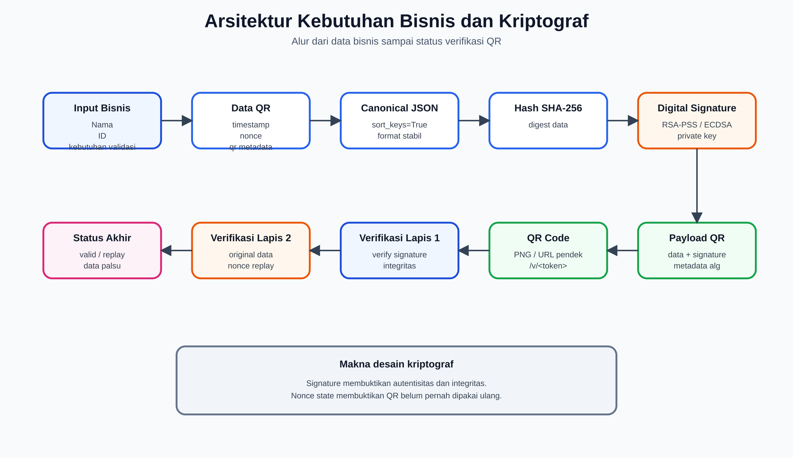
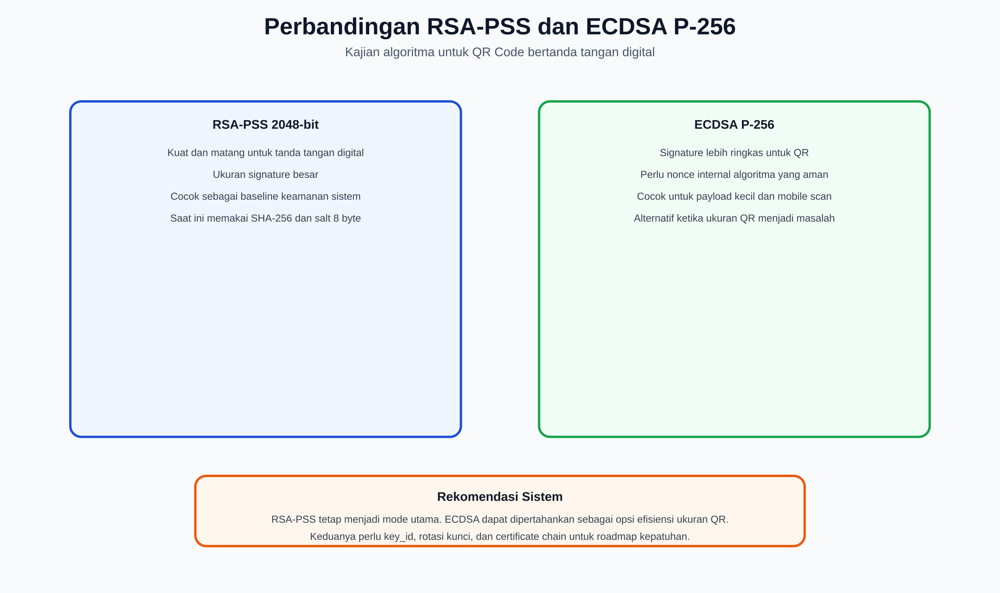
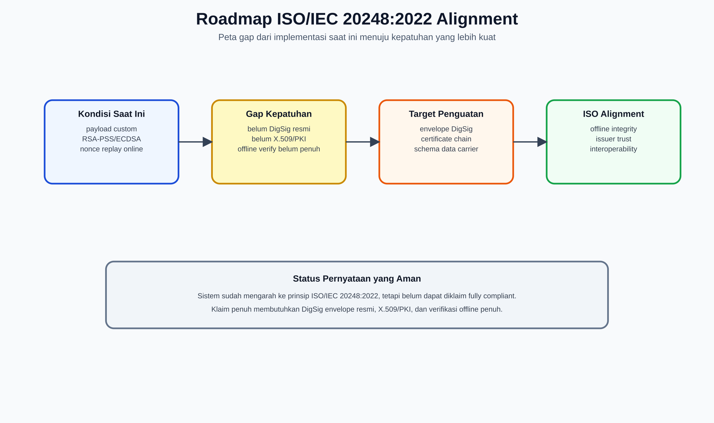
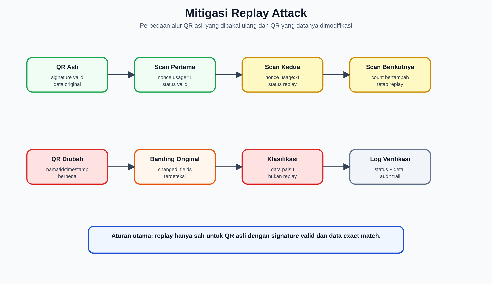

# Analisis Kebutuhan Bisnis dan Kriptograf

## Kajian Algoritma RSA/ECDSA, Kepatuhan ISO/IEC 20248:2022, dan Mitigasi Replay Attack

**Sistem:** QR Code Security System RSA-PSS  
**Domain implementasi:** `https://rsa-pss.com`  
**Lokasi kode:** `/opt/qrcode`  
**Tanggal penyusunan:** 16 Juni 2026  
**Tujuan dokumen:** Bahan laporan analisis kebutuhan bisnis dan kebutuhan kriptograf untuk sistem pembangkitan, verifikasi, logging, dan pengujian QR Code bertanda tangan digital.

---

## 1. Ringkasan Eksekutif

Sistem QR Code Security System adalah aplikasi web untuk menghasilkan QR Code berisi data identitas sederhana, menandatangani data tersebut secara digital, lalu memverifikasi keaslian QR Code melalui upload file, kamera HP, verifikasi massal, dan pengujian keamanan/performa. Implementasi saat ini menjadikan **RSA-PSS 2048-bit dengan SHA-256** sebagai algoritma utama, dengan **ECDSA P-256** sebagai dukungan legacy/alternatif. Sistem juga memakai **nonce**, **timestamp**, **database state nonce berbasis SQLite**, dan **log verifikasi** untuk mendeteksi replay attack secara cepat.

Secara bisnis, sistem ini memenuhi kebutuhan utama untuk:

- Membuktikan bahwa data QR berasal dari penerbit yang sah.
- Mendeteksi perubahan data setelah QR dibuat.
- Mendeteksi penggunaan ulang QR yang sama setelah verifikasi pertama.
- Menyediakan jejak audit generate dan verifikasi.
- Mendukung skenario operasional tunggal, massal, kamera HP, dan dashboard monitoring.

Secara kriptograf, sistem sudah memiliki fondasi yang baik untuk **integritas data**, **autentikasi penerbit**, dan **deteksi replay berbasis server**. Namun, untuk klaim kepatuhan penuh terhadap **ISO/IEC 20248:2022**, sistem masih perlu penguatan karena format payload saat ini masih berupa struktur JSON kustom, belum memakai struktur **DigSig** formal, belum memakai distribusi sertifikat publik berbasis PKI/X.509, dan mode QR utama memakai URL pendek `/v/<token>` yang membutuhkan server sehingga belum memenuhi karakter **offline verification** secara penuh.

Kesimpulan utama:

- **Status keamanan operasional:** layak untuk sistem verifikasi QR online berbasis server dengan kebutuhan anti-tamper dan anti-replay.
- **Status ISO/IEC 20248:2022:** selaras secara konsep, tetapi belum dapat diklaim compliant penuh.
- **Prioritas peningkatan:** perbesar nonce, tambahkan key identifier dan sertifikat publik, definisikan skema data formal, implementasikan envelope DigSig/format setara, perbaiki kebijakan expiry, dan buat mode offline verification yang benar-benar mandiri.

### 1.1 Gambar Pendukung

| Gambar | File |
|---|---|
| Arsitektur kebutuhan bisnis dan kriptograf | `dokumen/Gambar-Asli/analisis_crypto_architecture.png` |
| Perbandingan RSA-PSS dan ECDSA P-256 | `dokumen/Gambar-Asli/analisis_rsa_ecdsa_comparison.png` |
| Roadmap ISO/IEC 20248:2022 alignment | `dokumen/Gambar-Asli/analisis_iso20248_gap_roadmap.png` |
| Mitigasi replay attack | `dokumen/Gambar-Asli/analisis_replay_mitigation.png` |

---

## 2. Gambaran Sistem Saat Ini



Gambar di atas merangkum hubungan antara kebutuhan bisnis, pembentukan data QR, signing, payload QR, verifikasi kriptograf, verifikasi state, dan klasifikasi hasil.

### 2.1 Fungsi Utama

Sistem memiliki beberapa fungsi utama:

| Area | Fungsi | Keterangan |
|---|---|---|
| Generate tunggal | Membuat QR dari nama dan ID | Data ditandatangani dan disimpan sebagai PNG serta JSON pendamping. |
| Generate massal | Membuat banyak QR dari CSV | Proses background dengan statistik waktu, ukuran file, dan hasil. |
| Verifikasi tunggal | Upload QR untuk diverifikasi | QR dibaca, payload diekstrak, signature diverifikasi, data dicocokkan dengan database. |
| Verifikasi kamera HP | Scan QR via URL `/v/<token>` atau `/verify/<encoded>` | Mendukung hasil valid/replay/data palsu secara real time. |
| Verifikasi massal | Upload banyak QR | Untuk file <= 5 diproses langsung, lebih dari itu diproses async. |
| Modifikasi QR | Membuat QR palsu untuk uji tamper | Digunakan untuk demonstrasi data palsu, signature corrupt, replay, dan skenario serangan lain. |
| Log dan dashboard | Monitoring generate/verifikasi | CSV log, statistik dashboard, audit log, dan hasil testing. |
| Stress testing | Simulated Stress Test dan Real HTTP Stress Test | Menguji alur generate dan verify serta memantau metrik server. |

### 2.2 Struktur Data QR

Data utama yang ditandatangani berisi:

```json
{
  "nama": "Nama pengguna",
  "id": "ID pengguna",
  "timestamp": "ISO-8601 timestamp",
  "nonce": "8 karakter hex",
  "qr_modules": 25,
  "qr_version": 2
}
```

Payload yang diproses sistem berisi:

```json
{
  "data": { ... },
  "signature": "base64 signature",
  "alg": "RSA",
  "metadata": {
    "algorithm": "RSA-PSS",
    "key_size": 2048,
    "hash_function": "SHA-256",
    "salt_length": 8,
    "mgf": "MGF1-SHA256"
  }
}
```

Catatan implementasi:

- Data diserialisasi dengan `json.dumps(data, sort_keys=True)` sebelum ditandatangani.
- Hash yang digunakan adalah SHA-256.
- Untuk RSA, signature dibuat dengan RSA-PSS dan salt 8 byte.
- Untuk ECDSA, signature dibuat dengan DSS mode `fips-186-3` pada kurva P-256.
- QR yang tampil ke pengguna umumnya memuat URL pendek `/v/<token>`, bukan seluruh payload JSON, agar lebih mudah dibaca kamera HP.
- Payload asli untuk URL pendek disimpan di `data/verify_payloads` dengan retensi konfigurasi 30 hari.

### 2.3 Komponen Keamanan Implementasi

| Komponen | Implementasi Saat Ini |
|---|---|
| Algoritma utama | RSA-PSS 2048-bit |
| Algoritma alternatif/legacy | ECDSA P-256 |
| Hash | SHA-256 |
| RSA-PSS MGF | MGF1-SHA256 |
| RSA-PSS salt | 8 byte |
| Nonce | 4 byte random, disimpan sebagai 8 karakter hex |
| Timestamp | ISO-8601, WIB saat generate |
| Batas kedaluwarsa payload | 1 jam saat verifikasi |
| State anti-replay | SQLite `logs/security_state.db`, fallback file `logs/used_nonces.txt` |
| Key file | `rsa_key.pem`, `ecdsa_key.pem` dengan mode file terbatas |
| Log | `logs/log_generate.csv`, `logs/log_verifikasi.csv`, `logs/audit_log.csv` |
| Rate limit | Default 1000/jam, generate 60/menit, dashboard 60/menit |
| Cache hasil verifikasi | Header `Cache-Control: no-store, no-cache` pada endpoint kamera HP |

Snapshot sistem per 16 Juni 2026:

- RSA key: 2048-bit, private key tersedia di server.
- ECDSA key: NIST P-256, private key tersedia di server.
- Payload verifikasi tersimpan: sekitar 5.130 record.
- Nonce unik dalam SQLite: sekitar 7.832.
- Total penggunaan nonce tercatat: sekitar 7.907.
- Log generate: sekitar 5.004 baris.
- Log verifikasi: sekitar 273 baris.

---

## 3. Analisis Kebutuhan Bisnis

### 3.1 Masalah Bisnis yang Diselesaikan

Tanpa signature digital, QR Code mudah disalin, diubah, atau dibuat ulang oleh pihak tidak sah. QR Code biasa hanya menyimpan data; pembaca QR tidak dapat membedakan apakah data tersebut benar-benar dibuat oleh penerbit yang sah atau sudah dimodifikasi.

Sistem ini menyelesaikan tiga masalah bisnis utama:

1. **Keaslian data**  
   Verifikator perlu memastikan bahwa QR diterbitkan oleh sistem resmi, bukan dibuat manual oleh pihak lain.

2. **Integritas data**  
   Jika nama, ID, timestamp, nonce, atau field lain diubah, sistem harus mendeteksi perubahan tersebut.

3. **Pencegahan pemakaian ulang**  
   Untuk proses yang bersifat sekali pakai, QR yang sudah diverifikasi tidak boleh diterima kembali sebagai valid.

### 3.2 Tujuan Bisnis

| Tujuan | Penjelasan | Ukuran Keberhasilan |
|---|---|---|
| Menjamin keaslian QR | QR hanya dianggap valid jika signature cocok dengan public key sistem. | QR palsu/signature invalid selalu ditolak. |
| Mendeteksi perubahan data | Setiap perubahan pada data signed harus membuat signature invalid atau terklasifikasi sebagai data dimodifikasi. | Data palsu tidak tertukar menjadi replay. |
| Mendeteksi replay | Scan pertama valid, scan berikutnya menjadi replay. | Replay terdeteksi real time dan count meningkat. |
| Mendukung operasi massal | Sistem dapat generate dan verify banyak QR. | CSV batch dan hasil task tersedia. |
| Memudahkan verifikasi lapangan | Kamera HP dapat langsung membuka hasil verifikasi. | QR berisi URL pendek yang mudah discan. |
| Menyediakan audit | Semua generate dan verify tercatat. | Log dapat dilihat, difilter, dan diekspor. |
| Mendukung laporan performa | Dashboard dan testing memperlihatkan statistik. | Statistik generate, verify, success rate, dan response time tersedia. |

### 3.3 Pemangku Kepentingan

| Stakeholder | Kepentingan |
|---|---|
| Admin sistem | Mengelola generate, verifikasi, log, testing, dan reset statistik. |
| Operator generate | Membuat QR tunggal/massal dari input atau CSV. |
| Verifikator lapangan | Memindai QR dan melihat status valid/replay/data palsu. |
| Auditor | Memeriksa log generate, log verifikasi, dan bukti deteksi serangan. |
| Manajemen | Melihat performa sistem, volume transaksi, dan tingkat keberhasilan. |
| Pengembang/maintainer | Menjaga konsistensi algoritma, schema, key, dan reliability. |

### 3.4 Kebutuhan Fungsional

| Kode | Kebutuhan | Status Implementasi |
|---|---|---|
| FB-01 | Sistem dapat membuat QR tunggal dari nama dan ID. | Sudah ada. |
| FB-02 | Sistem dapat membuat QR massal dari CSV. | Sudah ada. |
| FB-03 | Sistem menandatangani data QR secara digital. | Sudah ada. |
| FB-04 | Sistem menyimpan data asli untuk pencocokan verifikasi. | Sudah ada di `static/data`. |
| FB-05 | Sistem dapat memverifikasi QR dari file upload. | Sudah ada. |
| FB-06 | Sistem dapat memverifikasi QR dari kamera HP. | Sudah ada melalui `/v/<token>` dan `/verify/<encoded>`. |
| FB-07 | Sistem membedakan valid, replay, data palsu, signature invalid, dan data tidak ditemukan. | Sudah ada, dengan klasifikasi baru yang memprioritaskan data palsu sebelum replay. |
| FB-08 | Sistem mencatat riwayat generate dan verifikasi. | Sudah ada. |
| FB-09 | Sistem mendukung export log/report. | Sudah ada sebagian. |
| FB-10 | Sistem menyediakan testing dan monitoring metrik server. | Sudah ada. |

### 3.5 Kebutuhan Non-Fungsional

| Kategori | Kebutuhan | Implikasi Teknis |
|---|---|---|
| Keamanan | Data QR tidak boleh bisa dimodifikasi tanpa terdeteksi. | Digital signature wajib atas seluruh field penting. |
| Reliabilitas | Scan kedua harus langsung replay. | Nonce store harus atomik dan konsisten. |
| Performa | Verifikasi harus cukup cepat untuk kamera HP. | Payload URL pendek dan proses verify ringan. |
| Skalabilitas | Batch generate dan verify harus bisa background. | Task async dan progress endpoint. |
| Auditabilitas | Semua aksi penting terekam. | Generate log, verify log, audit log. |
| Maintainability | Algoritma dan schema harus eksplisit. | Metadata algoritma, schema version, key id. |
| Portabilitas | Verifikasi idealnya bisa offline. | Perlu full payload, public key/cert, dan schema standar. |
| Kepatuhan | Selaras dengan ISO/IEC 20248:2022. | Perlu DigSig/PKI/data description formal. |

---

## 4. Kebutuhan Kriptograf

### 4.1 Security Objectives

Sistem membutuhkan layanan keamanan berikut:

| Security Objective | Makna | Mekanisme Saat Ini |
|---|---|---|
| Data integrity | Data tidak berubah sejak ditandatangani. | SHA-256 + signature RSA-PSS/ECDSA atas data canonical. |
| Data origin authentication | Data berasal dari pemegang private key. | Verifikasi dengan public key RSA/ECDSA. |
| Anti-forgery | Penyerang tidak bisa membuat QR valid tanpa private key. | Private key server-side, signature asymmetric. |
| Replay detection | QR yang sudah dipakai tidak diterima lagi sebagai valid. | Nonce unik + SQLite usage count. |
| Freshness | QR hanya berlaku dalam jendela waktu tertentu. | Timestamp dan expiry 1 jam. |
| Auditability | Verifikasi dapat ditelusuri. | CSV log dan audit log. |
| Availability | Verifikasi tetap berjalan dengan beban wajar. | Rate limit dan async task. |

### 4.2 Properti Data yang Harus Ditandatangani

Field yang wajib masuk signature:

- `nama`
- `id`
- `timestamp`
- `nonce`
- `qr_modules`
- `qr_version`
- `schema_version` (disarankan, belum eksplisit)
- `issuer_id` atau `domain_authority_id` (disarankan, belum eksplisit)
- `key_id` (disarankan, belum eksplisit)
- `purpose` atau `transaction_type` jika QR dipakai untuk jenis proses berbeda.

Field yang sebaiknya tidak mempengaruhi signature:

- Informasi tampilan UI.
- Nama file PNG.
- Statistik performa generate.
- Data log operasional.

### 4.3 Kebutuhan Canonicalization

Signature digital sensitif terhadap perubahan byte. Dua JSON dengan isi sama tetapi urutan key atau spasi berbeda bisa menghasilkan hash berbeda. Sistem saat ini memakai `json.dumps(data, sort_keys=True)`, sehingga canonicalization konsisten di aplikasi yang sama.

Untuk laporan dan pengembangan lanjutan, kebutuhan canonicalization adalah:

1. Urutan key harus deterministik.
2. Encoding harus UTF-8.
3. Format angka, tanggal, dan timezone harus konsisten.
4. Field tambahan tidak boleh diam-diam ikut mempengaruhi hasil verifikasi kecuali memang masuk schema.
5. Jika akan interoperable lintas platform, gunakan skema canonical yang terdokumentasi, misalnya JSON Canonicalization Scheme atau format DigSig/DDD sesuai ISO/IEC 20248.

### 4.4 Kebutuhan Key Management

Kunci privat adalah akar kepercayaan sistem. Jika private key bocor, penyerang dapat membuat QR valid. Karena itu kebutuhan key management minimal adalah:

| Kebutuhan | Status Saat Ini | Rekomendasi |
|---|---|---|
| Private key tidak ikut QR | Terpenuhi. | Pertahankan. |
| File permission terbatas | Terpenuhi, mode key file terdeteksi terbatas. | Pertahankan dan audit berkala. |
| Key identifier | Belum eksplisit. | Tambahkan `kid` pada payload. |
| Certificate/public key distribution | Belum formal. | Gunakan X.509 certificate atau trust store verifier. |
| Key rotation | Belum formal. | Buat prosedur rotasi berkala dan masa berlaku key. |
| Revocation | Belum formal. | Tambahkan daftar key revoked atau CRL/OCSP jika memakai PKI. |
| HSM/KMS | Belum ada. | Disarankan untuk produksi bernilai tinggi. |
| Backup key | Tidak dibahas di aplikasi. | Harus ada backup terenkripsi dan prosedur recovery. |

---

## 5. Kajian Algoritma RSA-PSS

### 5.1 Deskripsi

RSA-PSS adalah skema tanda tangan digital berbasis RSA dengan probabilistic padding. Dibandingkan RSA PKCS#1 v1.5, RSA-PSS lebih modern karena menggunakan salt acak dan mask generation function. Dalam sistem ini:

- Modulus RSA: 2048-bit.
- Hash: SHA-256.
- Padding: PSS.
- MGF: MGF1-SHA256.
- Salt: 8 byte.
- Signature disimpan base64 dalam payload.

NIST FIPS 186-5 mengakui RSA sebagai salah satu teknik digital signature, bersama ECDSA dan EdDSA. FIPS 186-5 juga menyebut digital signature dipakai untuk mendeteksi modifikasi tidak sah dan mengautentikasi identitas penanda tangan.

### 5.2 Kesesuaian dengan Sistem

RSA-PSS cocok untuk sistem ini karena:

1. **Keamanan kuat untuk anti-forgery**  
   Tanpa private key RSA, pihak luar tidak dapat membuat signature valid atas data QR baru.

2. **Verifikasi sederhana**  
   Verifikator hanya membutuhkan public key.

3. **Cocok untuk server-centric flow**  
   Karena payload QR saat ini berupa URL pendek, ukuran signature RSA yang besar tidak terlalu membebani QR.

4. **Standar modern**  
   RSA-PSS lebih direkomendasikan dibanding RSA PKCS#1 v1.5 untuk desain baru.

### 5.3 Kelebihan

| Aspek | Kelebihan |
|---|---|
| Maturitas | RSA sangat luas didukung library dan sistem keamanan. |
| Interoperabilitas | Public key RSA mudah didistribusikan melalui sertifikat X.509. |
| Keamanan padding | PSS lebih modern daripada PKCS#1 v1.5. |
| Audit | Mudah dijelaskan dalam laporan keamanan dan compliance. |

### 5.4 Keterbatasan

| Aspek | Keterbatasan | Dampak |
|---|---|---|
| Ukuran signature | RSA-2048 menghasilkan signature 256 byte, base64 sekitar 344 karakter. | Berat jika payload penuh harus masuk QR offline. |
| Security strength | RSA-2048 umum dipetakan sekitar 112-bit security strength. | Untuk target jangka panjang >= 128-bit, RSA-3072 lebih sesuai. |
| Performa signing | Signing RSA lebih berat daripada ECDSA P-256. | Berpengaruh saat generate massal. |
| Post-quantum risk | RSA rentan terhadap komputer kuantum skala besar. | Perlu roadmap post-quantum untuk jangka panjang. |
| Salt 8 byte | FIPS mengizinkan sLen <= hLen untuk PSS, tetapi 8 byte lebih kecil dari output SHA-256 32 byte. | Sebaiknya dinaikkan ke 32 byte untuk align dengan praktik umum; ukuran signature RSA tetap 256 byte. |

### 5.5 Rekomendasi RSA-PSS

1. Pertahankan RSA-PSS sebagai algoritma utama untuk flow online berbasis server.
2. Naikkan salt RSA-PSS dari 8 byte ke 32 byte jika tidak ada kebutuhan kompatibilitas lama.
3. Tambahkan `key_id` agar verifikasi bisa memilih public key yang benar setelah rotasi.
4. Untuk target keamanan jangka panjang, pertimbangkan RSA-3072 atau migrasi ke ECDSA P-256/EdDSA tergantung kebutuhan QR dan compliance.
5. Jangan klaim FIPS validated kecuali library, modul kriptografi, dan lingkungan operasi memang divalidasi melalui proses FIPS 140.

---

## 6. Kajian Algoritma ECDSA P-256

### 6.1 Deskripsi

ECDSA adalah skema signature berbasis elliptic curve. Sistem menyediakan ECDSA P-256 sebagai dukungan legacy/alternatif. Implementasi memakai PyCryptodome DSS mode `fips-186-3` dengan kurva NIST P-256 dan SHA-256.

### 6.2 Kelebihan ECDSA untuk QR

| Aspek | Kelebihan |
|---|---|
| Ukuran signature | Lebih kecil daripada RSA-2048, sehingga lebih cocok untuk QR offline berpayload penuh. |
| Security strength | P-256 umum setara sekitar 128-bit security strength. |
| Performa | Signature dan public key lebih ringkas. |
| Kesesuaian AIDC | Lebih cocok untuk data carrier terbatas seperti QR Code. |

### 6.3 Risiko dan Keterbatasan ECDSA

| Risiko | Penjelasan | Mitigasi |
|---|---|---|
| Random nonce ECDSA | ECDSA sensitif terhadap kualitas nilai random per-signature. Jika random buruk, private key bisa bocor. | Pastikan library memakai CSPRNG baik atau gunakan deterministic ECDSA/RFC 6979 jika cocok. |
| Implementasi lebih sensitif | ECDSA lebih rentan salah implementasi dibanding RSA verify biasa. | Gunakan library matang, hindari implementasi manual. |
| PKI tetap dibutuhkan | ECDSA tetap butuh trust anchor/public key distribution. | Gunakan certificate/key registry. |
| Post-quantum risk | ECDSA juga rentan terhadap komputer kuantum skala besar. | Siapkan roadmap post-quantum. |

### 6.4 Rekomendasi ECDSA

1. Jadikan ECDSA P-256 opsi utama jika targetnya QR offline yang harus membawa payload penuh.
2. Pastikan signature encoding terdokumentasi, misalnya DER atau raw `(r,s)`, agar interoperable.
3. Tambahkan test lintas platform antara Python server dan verifier mandiri.
4. Jangan gunakan ECDSA tanpa CSPRNG yang kuat.

---

## 7. Perbandingan RSA-PSS dan ECDSA untuk Sistem Ini



Gambar di atas memperlihatkan posisi RSA-PSS sebagai baseline keamanan dan ECDSA sebagai alternatif efisiensi ukuran signature untuk QR.

| Kriteria | RSA-PSS 2048 | ECDSA P-256 | Implikasi untuk Sistem |
|---|---|---|---|
| Status di sistem | Algoritma utama | Legacy/alternatif | Saat ini RSA paling stabil karena menjadi default generate. |
| Signature size | Besar, 256 byte sebelum base64 | Lebih kecil | ECDSA lebih baik untuk QR offline penuh. |
| Security strength | Sekitar 112-bit | Sekitar 128-bit | ECDSA lebih kuat per ukuran key untuk target jangka panjang. |
| Verifikasi | Cepat dan mudah | Cepat, tetapi format signature harus jelas | Keduanya layak. |
| Signing massal | Lebih berat | Umumnya lebih ringan | ECDSA berpotensi mempercepat generate massal. |
| Interoperabilitas PKI | Sangat luas | Luas | Keduanya dapat masuk sertifikat X.509. |
| Risiko implementasi | Lebih toleran | Sensitif terhadap random nonce | ECDSA perlu kontrol RNG lebih ketat. |
| Kesesuaian QR URL pendek | Baik | Baik | Karena QR hanya URL pendek, ukuran signature tidak terlalu masalah. |
| Kesesuaian QR offline payload penuh | Kurang ideal | Lebih ideal | Untuk ISO/IEC 20248 offline, ECDSA lebih menarik. |

Kesimpulan algoritma:

- Untuk implementasi saat ini yang online/server-centric, RSA-PSS 2048-bit masih layak dan mudah diaudit.
- Untuk target ISO/IEC 20248 yang compact dan offline-verifiable, ECDSA P-256 lebih sesuai karena signature lebih kecil dan security strength lebih efisien.
- Untuk target jangka panjang setelah 2030 atau untuk data bernilai tinggi, rencanakan transisi menuju 128-bit minimum secara formal dan pantau standar post-quantum.

---

## 8. Kajian ISO/IEC 20248:2022



Gambar di atas menampilkan status sistem saat ini, gap kepatuhan, dan target penguatan agar sistem semakin dekat dengan ISO/IEC 20248:2022.

### 8.1 Inti ISO/IEC 20248:2022

ISO/IEC 20248:2022 membahas skema struktur data tanda tangan digital untuk teknologi **Automatic Identification and Data Capture (AIDC)** seperti barcode dan RFID. Tujuannya adalah menyediakan metode terbuka dan interoperable antara layanan identifikasi otomatis dan data carrier untuk membaca data serta memverifikasi **originality** dan **integrity** dalam use case offline.

Elemen penting ISO/IEC 20248:2022 meliputi:

1. **Data carrier AIDC**  
   Contoh: barcode, QR Code, RFID.

2. **Structured data**  
   Data harus memiliki struktur dan makna yang terdokumentasi.

3. **Digital signature**  
   Data dikodekan dan ditandatangani agar perubahan dapat dideteksi.

4. **DigSig metadata structure**  
   Struktur metadata berisi signature dan encoded structured data.

5. **DigSig Data Description**  
   Deskripsi data yang memungkinkan pihak verifikator memahami field, tipe, encoding, dan makna data.

6. **PKI/X.509**  
   Standar mengacu pada penggunaan PKI untuk manajemen public key, certificate, dan deskripsi data.

7. **Offline verification**  
   Verifikator idealnya dapat memverifikasi data tanpa bergantung pada server online setiap kali scan.

### 8.2 Pemetaan Sistem terhadap ISO/IEC 20248:2022

| Elemen ISO/IEC 20248:2022 | Status Sistem Saat Ini | Analisis |
|---|---|---|
| AIDC data carrier | Ada | QR Code digunakan sebagai data carrier. |
| Structured data | Ada sebagian | Data memakai JSON (`nama`, `id`, `timestamp`, `nonce`, dll). |
| Encoded data | Ada | Payload di-JSON-kan, dikompresi/base64 pada fallback, atau disimpan server dengan token URL pendek. |
| Digital signature | Ada | RSA-PSS/ECDSA atas data canonical. |
| DigSig metadata structure | Belum formal | Payload kustom belum mengikuti envelope DigSig ISO/IEC 20248. |
| DigSig Data Description | Belum formal | Belum ada DDD/schema resmi yang mendeskripsikan tipe, field, authority, dan encoding. |
| PKI/X.509 certificate | Belum formal | Public key ada di server, tetapi belum sebagai certificate chain/trust anchor. |
| Key/certificate identifier | Belum eksplisit | Belum ada `kid`, certificate id, DAID, atau issuer id formal di payload. |
| Offline verification | Belum penuh | Mode utama `/v/<token>` membutuhkan server untuk mengambil payload. |
| Online verification | Ada | Sistem sangat kuat untuk verifikasi online berbasis domain. |
| Tamper evidence | Ada | Perubahan data atau signature invalid terdeteksi. |
| Replay prevention | Ada sebagai kontrol aplikasi | ISO fokus signature/integrity; anti-replay ditambahkan sistem melalui nonce state. |

### 8.3 Status Kepatuhan

Status yang tepat untuk laporan:

> Sistem saat ini **selaras secara konseptual** dengan ISO/IEC 20248:2022 karena memakai QR Code sebagai AIDC carrier, structured data, dan digital signature untuk mendeteksi perubahan data. Namun sistem **belum dapat diklaim compliant penuh** karena belum mengimplementasikan DigSig metadata structure, DigSig Data Description, certificate/key distribution berbasis PKI/X.509, domain authority identifier, dan offline verification mandiri sesuai kerangka ISO/IEC 20248:2022.

### 8.4 Gap terhadap ISO/IEC 20248:2022

| Gap | Dampak | Prioritas |
|---|---|---|
| Payload masih JSON kustom | Interoperabilitas dengan verifier standar terbatas. | Tinggi |
| Tidak ada schema/DDD formal | Pihak luar tidak dapat memahami struktur data secara standar. | Tinggi |
| Tidak ada key id/certificate id | Sulit melakukan rotasi key dan verifikasi multi-key. | Tinggi |
| Tidak ada PKI/X.509 distribution | Trust anchor belum standar. | Tinggi |
| QR mode utama hanya token URL | Tidak bisa diverifikasi offline jika server/payload tidak tersedia. | Tinggi |
| Belum ada revocation model | Jika key kompromi, mekanisme pencabutan belum jelas. | Sedang |
| Belum ada DAID | Identitas domain authority belum mengikuti amendment/domain authority model. | Sedang |
| Nonce 32-bit | Berisiko collision pada volume besar. | Sedang-Tinggi |

### 8.5 Roadmap Menuju Kepatuhan Lebih Kuat

Tahap 1 - Rapikan schema internal:

- Tambahkan `schema_version`.
- Tambahkan `issuer_id`.
- Tambahkan `key_id`.
- Definisikan field wajib, tipe data, format timestamp, dan aturan canonicalization.

Tahap 2 - Perkuat key management:

- Buat certificate public key X.509 untuk issuer.
- Tambahkan chain/trust anchor untuk verifier.
- Buat prosedur key rotation dan revocation.
- Simpan private key di HSM/KMS jika skala produksi.

Tahap 3 - Implementasi envelope DigSig/ISO-aligned:

- Ubah payload menjadi envelope yang memuat encoded structured data, signature, metadata, key/certificate reference, dan schema reference.
- Buat DigSig Data Description atau format schema yang dapat dipetakan ke ISO/IEC 20248.
- Sediakan verifier mandiri yang bisa membaca envelope tanpa server.

Tahap 4 - Offline verification:

- QR harus memuat data signed penuh atau URI-RAW yang tetap membawa data cukup untuk diverifikasi.
- Verifier HP menyimpan public key/certificate issuer.
- Verifier dapat memverifikasi signature dan menampilkan data tanpa memanggil server.
- Untuk replay prevention offline, gunakan strategi berbeda karena replay detection stateful membutuhkan sinkronisasi. Misalnya: QR sekali pakai tetap butuh online state, sedangkan QR dokumen statis dapat hanya membuktikan authenticity/integrity.

---

## 9. Analisis Replay Attack



Gambar di atas menjelaskan perbedaan alur QR asli yang digunakan ulang dan QR yang datanya dimodifikasi. Klasifikasi data palsu diprioritaskan sebelum replay jika payload berubah.

### 9.1 Definisi dan Risiko

Replay attack terjadi ketika data valid yang pernah digunakan dikirim atau dipakai ulang untuk mendapatkan hasil valid kembali. Dalam konteks QR Code:

- Penyerang memfoto atau menyalin QR valid.
- Penyerang memindai QR yang sama di waktu berbeda.
- Jika sistem hanya memeriksa signature, QR tetap valid karena data dan signature memang asli.
- Karena itu sistem butuh kontrol tambahan berupa nonce, timestamp, dan state penggunaan.

OWASP merekomendasikan mitigasi replay melalui penggunaan nonce unik, validasi timestamp, dan mekanisme replay protection.

### 9.2 Skenario Replay pada Sistem QR

| Skenario | Contoh | Dampak Jika Tidak Dicegah |
|---|---|---|
| Scan ulang QR sama | QR valid discan dua kali. | Sistem menerima transaksi ganda. |
| Copy QR dari dokumen | QR difoto dan dipakai pihak lain. | Data asli tetapi dipakai ulang. |
| URL `/v/<token>` dibuka ulang | Link hasil scan dikunjungi lagi. | Verifikasi ulang bisa dianggap sah. |
| QR valid lama | QR dari periode sebelumnya dipakai lagi. | Data expired tetap diterima. |
| Replay massal | Banyak file QR valid lama diupload batch. | Statistik valid menyesatkan dan proses bisnis bocor. |

### 9.3 Mitigasi yang Sudah Ada

| Kontrol | Implementasi | Kekuatan |
|---|---|---|
| Nonce per QR | `secrets.token_hex(4)` menghasilkan 8 hex char. | Membedakan setiap QR. |
| Timestamp | Timestamp ISO-8601 saat generate. | Membatasi umur QR. |
| Expiry check | Payload lebih dari 1 jam tidak dianggap valid. | Mengurangi replay lama. |
| Atomic nonce state | SQLite `nonce_state` dengan `usage_count`. | Scan kedua langsung replay. |
| Backup nonce file | `logs/used_nonces.txt`. | Fallback dan audit sederhana. |
| Exact match check | Replay hanya untuk payload asli dan signature valid. | Data palsu tidak salah diklasifikasikan sebagai replay. |
| Changed fields | Perubahan data dibanding original ditampilkan. | Membantu audit forensic. |
| Cache-Control no-store | Response verifikasi kamera tidak dicache. | Mengurangi hasil lama ditampilkan browser. |
| Logging | Hasil verifikasi dicatat. | Memudahkan audit dan statistik. |
| Rate limit | Generate/dashboard dibatasi. | Mengurangi abuse. |

### 9.4 Alur Klasifikasi Saat Ini

Alur klasifikasi verifikasi yang benar:

1. Extract payload QR.
2. Pastikan ada `data` dan `signature`.
3. Decode signature base64.
4. Canonicalize `data` dengan JSON sort key.
5. Hitung SHA-256.
6. Verifikasi signature dengan RSA-PSS atau ECDSA.
7. Cari data original di database berdasarkan ID/nonce.
8. Jika payload sama persis dengan original dan signature valid:
   - Catat nonce secara atomik.
   - Jika usage count sebelumnya 0 dan belum expired: status valid.
   - Jika usage count sebelumnya >= 1 atau expired: status replay.
9. Jika payload tidak sama persis dengan original:
   - Tampilkan status data dimodifikasi/data palsu.
   - Jangan mengklasifikasikan sebagai replay walaupun nonce sama.
10. Jika data tidak ditemukan:
   - Signature invalid -> data palsu.
   - Signature valid tetapi tidak ada di database -> data tidak ditemukan.

Kekuatan penting dari desain ini adalah **urutan klasifikasi**. Sistem tidak langsung menandai semua nonce yang pernah dipakai sebagai replay. Sistem terlebih dahulu memastikan bahwa payload adalah payload asli yang signature-nya valid. Ini mencegah kasus QR palsu dengan nonce lama salah ditampilkan sebagai replay.

### 9.5 Keterbatasan Mitigasi Replay Saat Ini

| Keterbatasan | Risiko | Rekomendasi |
|---|---|---|
| Nonce hanya 32-bit | Collision makin mungkin saat jumlah QR sangat besar. | Naikkan ke 96-bit atau 128-bit, misalnya `secrets.token_hex(16)`. |
| Replay state online | Verifikasi replay membutuhkan server/state. | Bedakan mode QR sekali pakai online vs QR dokumen offline. |
| GET verification mengubah state | Link preview/crawler yang melakukan GET dapat menghitung sebagai verifikasi. | Gunakan halaman konfirmasi atau POST untuk final verification; HEAD tetap no-op. |
| Expired diklasifikasikan sebagai replay | Secara audit, expired dan replay berbeda. | Pisahkan status `Expired` dari `Replay Attack`. |
| Token payload retensi 30 hari vs expiry 1 jam | Payload masih tersedia walau QR expired. | Selaraskan lifecycle payload dengan kebijakan bisnis. |
| Tidak ada binding ke perangkat/lokasi | QR yang difoto bisa dipakai pihak lain sebelum scan pertama. | Tambahkan challenge, OTP, session, atau device binding untuk use case high-risk. |
| Log CSV belum tamper-evident | Admin/root bisa mengubah log. | Gunakan append-only log, hash chain, atau database audit immutable. |

### 9.6 Rekomendasi Anti-Replay Produksi

Minimal untuk produksi:

1. Gunakan nonce minimal 96-bit; 128-bit lebih aman dan sederhana.
2. Simpan nonce dengan unique constraint dan status lifecycle: `issued`, `verified`, `expired`, `revoked`.
3. Pisahkan status `Valid`, `Replay`, `Expired`, `Revoked`, `Data Modified`, `Signature Invalid`.
4. Untuk QR sekali pakai, jadikan verifikasi final sebagai POST atau aksi eksplisit setelah user membuka halaman hasil scan.
5. Tambahkan TTL payload sesuai kebutuhan bisnis.
6. Tambahkan event audit untuk setiap perubahan status nonce.
7. Jika verifikasi offline dibutuhkan, jangan klaim anti-replay penuh tanpa sinkronisasi state; offline signature hanya membuktikan integritas dan asal data, bukan uniqueness penggunaan.

---

## 10. Analisis Risiko

### 10.1 Matriks Risiko

| Risiko | Dampak | Kemungkinan | Level | Mitigasi Saat Ini | Rekomendasi Tambahan |
|---|---:|---:|---:|---|---|
| Private key bocor | Sangat tinggi | Rendah-Sedang | Tinggi | File permission terbatas | HSM/KMS, rotation, audit akses key. |
| Data QR dimodifikasi | Tinggi | Sedang | Tinggi | Signature verification | Pertahankan; tambah schema strict. |
| Replay QR valid | Tinggi | Sedang | Tinggi | Nonce SQLite + timestamp | Nonce 128-bit, status lifecycle. |
| Nonce collision | Sedang | Naik seiring volume | Sedang | Random 32-bit | Naikkan nonce ke 128-bit. |
| Server payload hilang | Tinggi untuk `/v/<token>` | Sedang | Tinggi | Retensi payload 30 hari | QR offline full payload atau backup payload. |
| Log dimanipulasi | Sedang | Sedang | Sedang | CSV log | Hash-chained log/append-only storage. |
| Verifikasi false positive replay | Sedang | Sudah dimitigasi | Rendah | Classify modified before replay | Pertahankan test regression. |
| DoS upload batch | Sedang | Sedang | Sedang | Validasi file dan async | Rate limit upload, worker queue, quota. |
| Ketergantungan satu algoritma | Sedang | Sedang | Sedang | RSA + ECDSA tersedia | Tambahkan key agility dan algorithm policy. |
| Klaim compliance berlebihan | Tinggi reputasi | Sedang | Tinggi | Belum ada klaim formal | Gunakan bahasa "aligned", bukan "certified/compliant". |

### 10.2 Risiko Khusus ISO/IEC 20248

Risiko terbesar bukan pada signature digitalnya, tetapi pada klaim kepatuhan. Karena ISO/IEC 20248:2022 mendefinisikan struktur data, metadata, certificate, dan data description, maka sistem kustom JSON tidak boleh disamakan begitu saja dengan implementasi DigSig penuh.

Kalimat yang aman untuk laporan:

> Sistem ini mengadopsi prinsip ISO/IEC 20248:2022, yaitu penggunaan AIDC carrier, structured data, dan digital signature untuk membuktikan data originality dan integrity. Implementasi saat ini merupakan custom server-based implementation dan belum merupakan implementasi DigSig ISO/IEC 20248:2022 yang sepenuhnya interoperable/offline-verifiable.

---

## 11. Kebutuhan Pengembangan Lanjutan

### 11.1 Requirement Prioritas Tinggi

| ID | Requirement | Alasan |
|---|---|---|
| KR-01 | Tambahkan `schema_version` dalam signed data. | Agar perubahan struktur data tidak merusak kompatibilitas. |
| KR-02 | Tambahkan `issuer_id` dan `key_id`. | Agar trust dan key rotation jelas. |
| KR-03 | Naikkan nonce ke minimal 96/128-bit. | Mengurangi collision risk. |
| KR-04 | Pisahkan status expired dan replay. | Akurasi audit dan laporan. |
| KR-05 | Buat policy key rotation. | Mengurangi dampak key compromise. |
| KR-06 | Dokumentasikan canonicalization. | Interoperabilitas verifier. |
| KR-07 | Tambahkan regression test klasifikasi QR palsu vs replay. | Mencegah bug lama muncul lagi. |

### 11.2 Requirement untuk ISO/IEC 20248 Alignment

| ID | Requirement | Alasan |
|---|---|---|
| ISO-01 | Buat data description/schema formal. | Pemetaan ke DigSig Data Description. |
| ISO-02 | Buat envelope payload yang memuat data, signature, algorithm id, key id, issuer id. | Mendekati struktur DigSig. |
| ISO-03 | Gunakan X.509 certificate/public key distribution. | Trust anchor sesuai prinsip PKI. |
| ISO-04 | Implementasikan verifier offline proof-of-concept. | Membuktikan data originality/integrity tanpa server. |
| ISO-05 | Evaluasi DAID/Domain Authority Identifier. | Relevan dengan amendment ISO/IEC 20248:2022/Amd 1:2024. |
| ISO-06 | Sediakan mode QR URI-RAW/full payload untuk dokumen statis. | Agar QR tetap dapat diverifikasi jika server tidak tersedia. |

### 11.3 Requirement Operasional

| ID | Requirement | Alasan |
|---|---|---|
| OPS-01 | Backup terenkripsi untuk key dan payload. | Recovery jika server rusak. |
| OPS-02 | Audit akses file key. | Deteksi akses tidak sah. |
| OPS-03 | Monitoring payload retention. | Hindari token invalid karena cleanup tidak terkendali. |
| OPS-04 | Immutable audit log. | Bukti audit lebih kuat. |
| OPS-05 | Dokumentasi SOP generate/verify/reset. | Mengurangi kesalahan operator. |

---

## 12. Rencana Pengujian untuk Laporan

### 12.1 Pengujian Kriptograf

| Test Case | Langkah | Hasil yang Diharapkan |
|---|---|---|
| Valid QR | Generate QR, scan pertama. | Status valid dan autentik. |
| Replay QR | Scan QR yang sama kedua kali. | Status replay, count bertambah. |
| Data tamper | Ubah `nama` tetapi signature tetap. | Status data dimodifikasi/data palsu, bukan replay. |
| Signature corrupt | Rusak base64 signature. | Signature invalid/data palsu. |
| Unknown data | Payload valid format tetapi tidak ada di database. | Data tidak ditemukan atau data palsu sesuai signature. |
| Expired timestamp | Pakai timestamp lama. | Status expired/replay sesuai kebijakan saat ini; direkomendasikan dipisah. |
| Algorithm mismatch | Payload `alg` tidak dikenal. | Signature invalid algoritma tidak diketahui. |
| ECDSA QR | Generate/verify dengan ECDSA. | Signature valid jika public key cocok. |

### 12.2 Pengujian ISO/IEC 20248 Alignment

| Test Case | Tujuan | Status Saat Ini |
|---|---|---|
| QR sebagai AIDC carrier | Membuktikan data dibawa QR. | Terpenuhi. |
| Structured data | Membuktikan data punya field terstruktur. | Terpenuhi sebagian. |
| Signature over data | Membuktikan integrity. | Terpenuhi. |
| Verifier offline | Membuktikan tidak butuh server. | Belum penuh. |
| Certificate trust | Membuktikan public key terikat issuer. | Belum formal. |
| DigSig/DDD schema | Membuktikan interoperabilitas standar. | Belum formal. |

### 12.3 Pengujian Operasional

| Test Case | Hasil yang Diharapkan |
|---|---|
| Generate 1 QR | QR tersimpan, log generate bertambah. |
| Generate CSV 100 data | Semua data valid digenerate, statistik task sesuai. |
| Verify massal | Valid/replay/data palsu terhitung benar. |
| Server restart | Key lama tetap dipakai; QR lama masih dapat diverifikasi jika payload ada. |
| Payload cleanup | Token lama hilang sesuai retention policy. |
| Log export | Log bisa diekspor tanpa merusak data. |

---

## 13. Rekomendasi Arsitektur Target

### 13.1 Target untuk Sistem Online Sekali Pakai

Jika tujuan bisnis utama adalah QR sekali pakai dengan replay detection real time, arsitektur terbaik adalah online/stateful:

1. QR memuat URL pendek atau compact token.
2. Server menyimpan payload signed dan status nonce.
3. Scan pertama mengubah status nonce menjadi `verified`.
4. Scan berikutnya menjadi `replay`.
5. Data palsu tetap diklasifikasikan berdasarkan signature dan mismatch data.

Arsitektur ini cocok untuk:

- Tiket sekali pakai.
- Absensi.
- Validasi kupon.
- Proses kontrol akses.
- Proses yang perlu log terpusat.

Kelemahannya:

- Tidak offline.
- Bergantung pada server dan database.
- QR bisa gagal jika payload token hilang.

### 13.2 Target untuk Dokumen Offline Verifiable

Jika tujuan bisnis adalah dokumen fisik yang harus tetap bisa diverifikasi tanpa server, arsitektur terbaik adalah offline/stateless:

1. QR memuat full signed payload atau DigSig envelope.
2. Verifier menyimpan public key/certificate issuer.
3. Verifier memeriksa signature lokal.
4. Hasil valid berarti data asli dan tidak berubah.
5. Replay tidak bisa dicegah penuh tanpa server; QR dokumen memang bisa disalin tetapi salinan tetap hanya membuktikan data yang sama.

Arsitektur ini cocok untuk:

- Sertifikat.
- Surat keterangan.
- Dokumen identitas internal.
- Label produk yang perlu validasi integritas.

Kelemahannya:

- Payload QR lebih besar.
- Perlu schema/certificate/trust store.
- Tidak bisa mendeteksi pemakaian ulang tanpa sinkronisasi online.

### 13.3 Rekomendasi Hybrid

Untuk sistem ini, pendekatan hybrid paling realistis:

- Tetap gunakan `/v/<token>` untuk verifikasi online cepat dan anti-replay.
- Tambahkan mode `offline_payload` untuk QR dokumen statis.
- Tambahkan `schema_version`, `issuer_id`, `key_id`, dan `signature_profile`.
- Sediakan endpoint publik untuk mengambil public certificate.
- Siapkan aplikasi/verifier sederhana yang bisa memverifikasi offline.

---

## 14. Kesimpulan

Sistem QR Code Security System sudah menjawab kebutuhan bisnis dasar: generate QR bertanda tangan digital, verifikasi keaslian, deteksi perubahan data, deteksi replay, log audit, dan dukungan proses massal. Pemilihan RSA-PSS 2048-bit dengan SHA-256 sebagai algoritma utama sudah tepat untuk sistem online berbasis server. ECDSA P-256 juga relevan sebagai alternatif yang lebih ringkas, terutama jika sistem diarahkan ke verifikasi offline atau QR berpayload penuh.

Dari sisi ISO/IEC 20248:2022, sistem sudah mengadopsi prinsip inti berupa structured data, QR sebagai carrier, dan digital signature. Akan tetapi, sistem belum memenuhi implementasi formal DigSig karena belum ada data description standar, certificate distribution, domain authority identifier, key identifier, dan offline verification mandiri. Karena itu, istilah yang tepat untuk laporan adalah **ISO/IEC 20248-aligned secara konseptual**, bukan **fully compliant**.

Dari sisi replay attack, sistem sudah memiliki desain yang kuat untuk verifikasi online sekali pakai: nonce dicatat secara atomik, scan kedua langsung replay, dan data palsu tidak lagi salah diklasifikasikan sebagai replay. Peningkatan penting berikutnya adalah memperbesar nonce, memisahkan status expired dari replay, memperbaiki lifecycle token, dan membuat audit log yang tamper-evident.

---

## 15. Referensi

1. ISO, **ISO/IEC 20248:2022 - Information technology - Automatic identification and data capture techniques - Digital signature data structure schema**.  
   https://www.iso.org/standard/81314.html

2. ISO, **ISO/IEC 20248:2022/Amd 1:2024 - Domain authority identifier (DAID) specification for the GS1 legal entity identifier and encoding clarifications**.  
   https://www.iso.org/standard/87125.html

3. NIST, **FIPS 186-5 - Digital Signature Standard (DSS)**.  
   https://csrc.nist.gov/pubs/fips/186-5/final

4. NIST, **FIPS 186-5 PDF - Digital Signature Standard (DSS)**.  
   https://nvlpubs.nist.gov/nistpubs/FIPS/NIST.FIPS.186-5.pdf

5. NIST, **SP 800-57 Part 1 Revision 5 - Recommendation for Key Management: Part 1 - General**.  
   https://nvlpubs.nist.gov/nistpubs/specialpublications/nist.sp.800-57pt1r5.pdf

6. NIST, **SP 800-131A Revision 2 - Transitioning the Use of Cryptographic Algorithms and Key Lengths**.  
   https://csrc.nist.gov/pubs/sp/800/131/a/r2/final

7. OWASP, **SCWE-022: Message Replay Vulnerabilities**.  
   https://scs.owasp.org/SCWE/SCSVS-COMM/SCWE-022/

---

## Lampiran A - Ringkasan Requirement

| ID | Requirement | Prioritas | Status |
|---|---|---|---|
| FB-01 | Generate QR tunggal | Tinggi | Ada |
| FB-02 | Generate QR massal | Tinggi | Ada |
| FB-03 | Verify QR file | Tinggi | Ada |
| FB-04 | Verify QR kamera HP | Tinggi | Ada |
| FB-05 | Verify massal | Tinggi | Ada |
| FB-06 | Log generate/verifikasi | Tinggi | Ada |
| KR-01 | RSA-PSS SHA-256 | Tinggi | Ada |
| KR-02 | ECDSA P-256 | Sedang | Ada |
| KR-03 | Nonce >= 96-bit | Tinggi | Belum |
| KR-04 | Key ID | Tinggi | Belum |
| KR-05 | Certificate/PKI | Tinggi | Belum |
| KR-06 | Schema version | Tinggi | Belum |
| KR-07 | Offline verification | Sedang-Tinggi | Belum penuh |
| KR-08 | Tamper-evident audit log | Sedang | Belum |
| ISO-01 | DigSig envelope | Tinggi untuk compliance | Belum |
| ISO-02 | DigSig Data Description | Tinggi untuk compliance | Belum |
| ISO-03 | Domain authority identifier | Sedang | Belum |

## Lampiran B - Pernyataan yang Aman Dipakai di Laporan

### Pernyataan Singkat

Sistem QR Code Security System menggunakan tanda tangan digital RSA-PSS/SHA-256 untuk menjamin integritas dan autentikasi data QR Code. Sistem juga menerapkan nonce, timestamp, dan pencatatan state berbasis SQLite untuk mendeteksi replay attack secara real time.

### Pernyataan Kepatuhan ISO

Sistem ini selaras secara konseptual dengan ISO/IEC 20248:2022 karena menggunakan QR Code sebagai AIDC carrier, structured data, dan digital signature untuk memverifikasi data originality dan integrity. Namun, implementasi saat ini belum dapat disebut compliant penuh terhadap ISO/IEC 20248:2022 karena belum menggunakan DigSig metadata structure, DigSig Data Description, certificate distribution berbasis PKI/X.509, dan offline verification mandiri sesuai standar.

### Pernyataan Replay Attack

Replay attack dimitigasi dengan nonce unik per QR, timestamp, dan state `nonce_state` yang mencatat jumlah penggunaan. Scan pertama terhadap QR asli yang signature-nya valid diterima sebagai valid, sedangkan scan berikutnya langsung diklasifikasikan sebagai replay. Jika data QR dimodifikasi, sistem memprioritaskan klasifikasi sebagai data palsu/data dimodifikasi, bukan replay.
