# Desain Antarmuka Pengguna dan Pengalaman Pengguna

## Wireframe dan Mockup untuk Dashboard dan Scanner Workspace

**Sistem:** QR Code Security System RSA-PSS  
**Domain implementasi:** `https://rsa-pss.com`  
**Lokasi kode:** `/opt/qrcode`  
**Tanggal penyusunan:** 16 Juni 2026  
**Tanggal pembaruan layout sistem:** 18 Juni 2026  
**Tujuan dokumen:** Menjelaskan rancangan UI/UX, wireframe, mockup tekstual, alur pengguna, state tampilan, dan rekomendasi antarmuka untuk Dashboard dan Scanner Workspace.

**Catatan update:** Rancangan layout terbaru untuk seluruh halaman sistem sudah diperluas pada dokumen `dokumen/dokumen_ui_ux_layout_terbaru_2026.md`. Dokumen pembaruan tersebut memakai screenshot aktual dari folder `Screenshoot/` sebagai lampiran visual laporan dan mencakup halaman Login, Home, Dashboard, Generator, Scanner, Log, Audit, Security Profile, Jobs, Benchmark, Verify Massal, dan Automated Testing.

---

## 1. Ringkasan Eksekutif

Sistem QR Code Security System memiliki dua area antarmuka yang paling penting untuk operasi harian:

1. **Dashboard QR Code Security** untuk memantau statistik generate, verifikasi, performa, file, dan kualitas response time.
2. **Scanner Workspace** untuk melakukan verifikasi QR melalui upload file, verifikasi massal, scanner USB, dan kamera HP.

Desain UI/UX sistem saat ini menggunakan pendekatan dashboard operasional berbasis kartu statistik, badge status, tabel, progress bar, dan action button yang langsung mengarah ke pekerjaan utama. Dari sisi pengalaman pengguna, sistem ditujukan untuk admin/operator yang perlu bekerja cepat: membuat QR, memverifikasi QR, membaca status valid/replay/data palsu, melihat log, dan mengevaluasi performa.

Dokumen ini merancang wireframe dan mockup tekstual yang konsisten dengan implementasi saat ini di template berikut:

- `templates/dashboard.html`
- `templates/scanner.html`
- `templates/scan_hp.html`
- `templates/verify_direct.html`
- `templates/log.html`
- `templates/log_verifikasi.html`

Prinsip utama desain:

- Informasi kritis tampil di area atas halaman.
- Aksi primer mudah ditemukan dan tidak berulang secara membingungkan.
- Status keamanan harus terbaca cepat: valid, replay attack, data palsu, signature invalid, error proses.
- Dashboard membedakan metrik operasional, metrik performa, dan metodologi perhitungan.
- Scanner workspace harus meminimalkan langkah pengguna dari scan sampai hasil verifikasi.
- Mobile scanner harus mengutamakan preview kamera, status scan, dan input manual.

### 1.1 Gambar Pendukung

| Gambar | File |
|---|---|
| Peta alur pengguna UI/UX | `dokumen/Gambar-Asli/ui_user_flow_overview.png` |
| Wireframe dashboard operasional | `dokumen/Gambar-Asli/ui_dashboard_wireframe.png` |
| Wireframe scanner workspace | `dokumen/Gambar-Asli/ui_scanner_workspace_wireframe.png` |
| Wireframe mobile scanner HP | `dokumen/Gambar-Asli/ui_mobile_scanner_wireframe.png` |

---

## 2. Tujuan Desain UI/UX

### 2.1 Tujuan Bisnis

| Tujuan | Penjelasan |
|---|---|
| Mempercepat verifikasi QR | Operator dapat langsung memilih metode scan yang sesuai. |
| Memperjelas status keamanan | Hasil valid, replay, data palsu, dan invalid harus mudah dibedakan. |
| Mendukung audit operasional | Log generate dan verifikasi dapat diakses dari halaman terkait. |
| Mendukung monitoring performa | Dashboard menampilkan metrik yang dapat dipakai untuk evaluasi sistem. |
| Mengurangi kebingungan navigasi | Tombol Home dan tombol aksi harus konsisten di semua halaman. |
| Mendukung penggunaan lapangan | Kamera HP dapat dipakai tanpa perlu scroll panjang sebelum preview kamera terlihat. |

### 2.2 Tujuan Pengguna

| Pengguna | Kebutuhan Utama |
|---|---|
| Admin sistem | Memantau total QR, total verifikasi, performa, dan log. |
| Operator verifikasi | Memindai QR dengan cepat dan membaca hasil verifikasi. |
| Petugas lapangan | Menggunakan kamera HP untuk scan QR dan membuka hasil otomatis. |
| Auditor | Melihat riwayat generate, verifikasi, status keamanan, dan waktu proses. |
| Penguji sistem | Menjalankan skenario verifikasi tunggal, massal, replay, dan data palsu. |

---

## 3. Prinsip Desain Antarmuka

### 3.1 Prinsip Hierarki Informasi

Halaman dashboard dan scanner harus mengikuti urutan prioritas informasi berikut:

1. **Identitas halaman:** judul, deskripsi singkat, tombol Home.
2. **Aksi utama:** verifikasi, upload QR, mulai kamera, lihat log.
3. **Status utama:** valid, invalid, replay, data palsu, progress, error.
4. **Data pendukung:** nama, ID, timestamp, nonce, algoritma, signature.
5. **Metrik teknis:** load time, decode time, verify time, DB time, total time.
6. **Aksi sekunder:** download report, buka log, dashboard, reset statistik.
7. **Metodologi:** rumus, sumber data, asumsi, batasan.

Dengan hierarki ini, pengguna tidak dipaksa membaca detail teknis sebelum tahu hasil utamanya.

### 3.2 Prinsip Konsistensi Navigasi

Aturan navigasi yang disarankan:

| Elemen | Aturan |
|---|---|
| Tombol kembali ke index | Selalu memakai label `Home`. |
| Posisi Home | Di bagian atas halaman, dekat judul. |
| Duplikasi Home | Hindari tombol Home kedua di bagian bawah. |
| Tombol Dashboard | Hanya dipakai jika halaman memang perlu menuju statistik. |
| Tombol Scanner | Dipakai untuk kembali ke workspace verifikasi. |
| Tombol Log | Dipakai dari halaman hasil, dashboard, dan scanner. |
| Tombol Reset | Hanya ada di dashboard atau halaman admin yang relevan. |

### 3.3 Prinsip Status Visual

Status keamanan harus memakai warna dan label yang konsisten:

| Status | Warna | Makna UX |
|---|---|---|
| Valid | Hijau | QR asli, signature valid, nonce pertama kali digunakan. |
| Replay Attack | Kuning atau biru-info | QR asli tetapi sudah pernah diverifikasi. |
| Data Palsu | Merah | Data berubah, mismatch dengan data original, atau signature tidak sesuai. |
| Signature Invalid | Merah | Signature tidak bisa diverifikasi. |
| Expired | Kuning | QR melewati masa berlaku. |
| Error Sistem | Merah gelap | Gagal decode, file rusak, atau exception proses. |
| Loading/Processing | Biru atau abu | Sistem sedang memproses. |

Status harus ditampilkan dalam bentuk badge singkat, diikuti detail teknis pada area bawah.

### 3.4 Prinsip Responsif

Dashboard dan scanner harus nyaman pada desktop dan mobile:

| Viewport | Pola Layout |
|---|---|
| Desktop | Grid 2 sampai 4 kolom, tabel penuh, ringkasan dan chart berdampingan. |
| Tablet | Grid 2 kolom, action button tetap mudah ditekan. |
| Mobile | Semua panel stack vertikal, kamera tampil paling atas, tombol full-width. |

---

## 4. Information Architecture

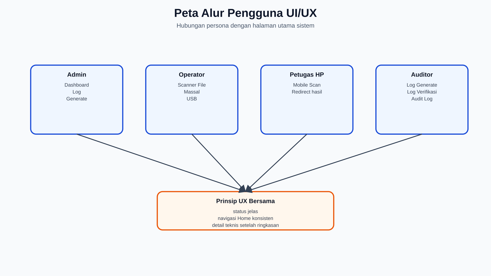

Gambar di atas memperlihatkan hubungan persona utama dengan halaman yang paling sering digunakan: dashboard, scanner file/massal, scanner HP, scanner USB, dan log audit.

### 4.1 Peta Halaman Utama

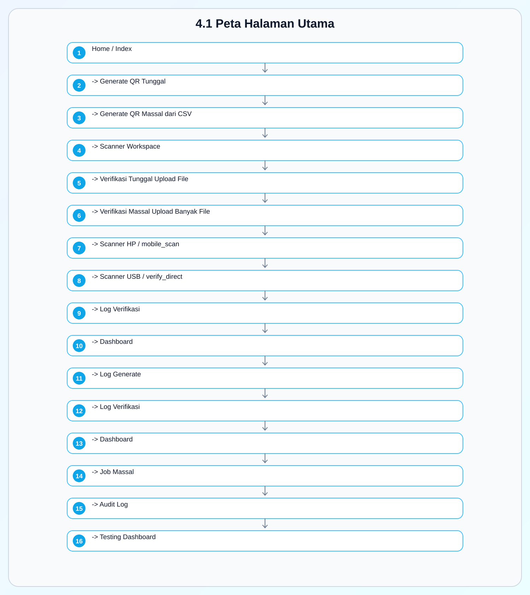

Gambar di atas adalah versi grafis dari rancangan `4.1 Peta Halaman Utama`; blok wireframe teks telah diganti agar dokumen Word menampilkan layout visual.

### 4.2 Area Fungsional

| Area | Route | Fungsi |
|---|---|---|
| Dashboard | `/dashboard` | Monitoring statistik dan performa. |
| Scanner File | `/scanner` | Upload QR tunggal dan massal. |
| Scanner HP | `/mobile_scan` | Kamera HP untuk scan URL verifikasi. |
| Scanner USB | `/verify_direct` | Input barcode scanner USB atau webcam. |
| Log Generate | `/log` | Riwayat generate QR. |
| Log Verifikasi | `/log_verifikasi` | Riwayat hasil verifikasi. |
| Audit Log | `/audit_log` | Riwayat aksi admin/operator. |

---

## 5. Persona dan Skenario Penggunaan

### 5.1 Persona Admin Sistem

**Tujuan:** Melihat kesehatan sistem, performa generate/verifikasi, dan log aktivitas.

**Kebutuhan UX:**

- Ringkasan KPI di bagian atas.
- Metrik performa yang tidak menyesatkan.
- Tombol cepat ke Log Generate dan Log Verifikasi.
- Metodologi perhitungan terlihat jelas.
- Reset statistik hanya terlihat sebagai aksi admin yang eksplisit.

### 5.2 Persona Operator Verifikasi

**Tujuan:** Memverifikasi QR secara cepat dan memahami hasilnya.

**Kebutuhan UX:**

- Upload area besar untuk QR tunggal.
- Tab massal jika memproses banyak file.
- Hasil utama harus langsung terlihat.
- Detail seperti nonce dan waktu proses ada, tetapi tidak mendominasi.

### 5.3 Persona Petugas Lapangan

**Tujuan:** Scan QR dengan kamera HP.

**Kebutuhan UX:**

- Preview kamera muncul di atas.
- Tombol Mulai dan Stop besar.
- Status scan terbaca jelas.
- Jika kamera gagal, tersedia input manual.
- Cara penggunaan ada di bawah, bukan sebelum kamera.

### 5.4 Persona Auditor

**Tujuan:** Memeriksa bukti generate/verifikasi dan status keamanan.

**Kebutuhan UX:**

- Tabel log rapi dan bisa digeser horizontal dengan keyboard.
- Data panjang tidak menabrak kolom lain.
- Preview QR tersedia di log generate.
- Export Excel tersedia.

---

## 6. Wireframe Dashboard

### 6.1 Tujuan Halaman Dashboard

Dashboard berfungsi sebagai pusat monitoring performa dan statistik sistem. Pengguna tidak melakukan generate atau verifikasi langsung dari dashboard, tetapi dapat berpindah ke halaman terkait.

Fungsi utama:

- Menampilkan total QR digenerate.
- Menampilkan total verifikasi dan komposisi status.
- Menampilkan median waktu generate.
- Menampilkan P95 waktu verifikasi.
- Menampilkan statistik file.
- Menampilkan analisis performa.
- Menampilkan metodologi dan sumber data.

### 6.2 Wireframe Desktop Dashboard

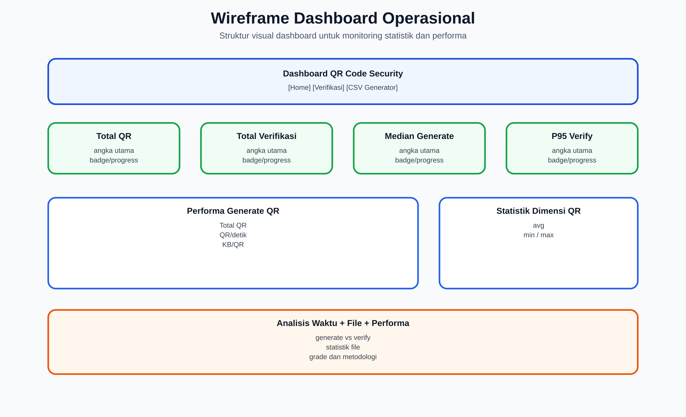

Gambar di atas adalah mockup grafis struktur dashboard: header, KPI, visualisasi performa, analisis waktu, statistik file, analisis performa, dan tombol aksi.

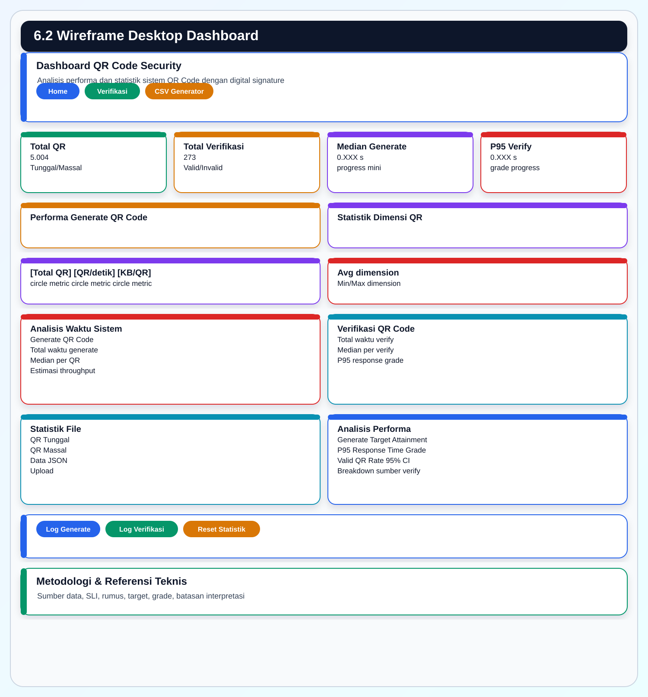

Gambar di atas adalah versi grafis dari rancangan `6.2 Wireframe Desktop Dashboard`; blok wireframe teks telah diganti agar dokumen Word menampilkan layout visual.

### 6.3 Wireframe Mobile Dashboard

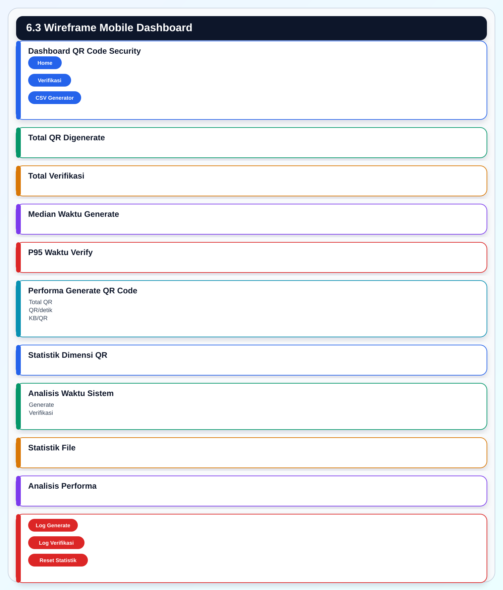

Gambar di atas adalah versi grafis dari rancangan `6.3 Wireframe Mobile Dashboard`; blok wireframe teks telah diganti agar dokumen Word menampilkan layout visual.

### 6.4 Komponen Dashboard

| Komponen | Isi | Perilaku UX |
|---|---|---|
| Header | Judul, deskripsi, Home, Verifikasi, CSV Generator | Memberi orientasi dan akses cepat. |
| KPI Card Total QR | Total generate, split tunggal/massal | Ringkasan volume output. |
| KPI Card Total Verifikasi | Total verify, valid, invalid, replay | Ringkasan keamanan. |
| KPI Median Generate | Median dari log generate | Mewakili kondisi tipikal. |
| KPI P95 Verify | P95 dari log verifikasi | Mewakili tail latency. |
| Performa Generate | Total QR, QR/detik, KB/QR | Visualisasi cepat performa generate. |
| Statistik Dimensi QR | Min, max, average dimension | Menilai kompleksitas output QR. |
| Analisis Waktu | Generate vs verify | Membandingkan durasi proses utama. |
| Statistik File | Jumlah file QR, JSON, uploads | Monitoring storage operasional. |
| Analisis Performa | Target attainment, grade, valid rate | Interpretasi metrik. |
| Action Buttons | Log Generate, Log Verifikasi, Reset Statistik | Aksi lanjutan yang relevan. |
| Metodologi | Sumber data, rumus, asumsi | Mencegah salah tafsir metrik. |

### 6.5 State Dashboard

| State | Tampilan yang Disarankan |
|---|---|
| Loading | Spinner dan teks `Memuat statistik...`. |
| Data kosong | Card tetap tampil dengan nilai 0 dan catatan `Belum ada data`. |
| Data normal | KPI dan chart aktif. |
| Data outlier | Badge atau catatan outlier pada analisis performa. |
| Error baca log | Alert peringatan, dashboard tetap render data yang tersedia. |
| Reset statistik | Dialog konfirmasi sebelum reset. |

### 6.6 Catatan UX Dashboard

Dashboard harus menghindari angka yang terasa terlalu absolut jika sebenarnya hanya estimasi. Contoh: `ops/sec` di dashboard harus dijelaskan sebagai estimasi dari median, bukan throughput load-test. Untuk itu, label dan metodologi perlu tetap tampil.

Rekomendasi label:

| Metrik | Label yang Lebih Jelas |
|---|---|
| Throughput generate | `Estimasi QR/detik dari median` |
| Response time grade | `P95 Response Time Grade` |
| Success rate | `Valid QR Rate`, bukan success proses saja |
| File size | `Rata-rata ukuran file QR` |
| Total time | `Akumulasi waktu dari log` |

---

## 7. Wireframe Scanner Workspace

### 7.1 Tujuan Scanner Workspace

Scanner Workspace adalah pusat kerja untuk verifikasi QR. Halaman ini harus mengarahkan pengguna ke metode scan yang tepat:

- Upload file QR tunggal.
- Upload banyak file QR untuk verifikasi massal.
- Kamera HP untuk scan langsung di lapangan.
- Scanner USB atau webcam untuk alur front-desk.
- Log verifikasi untuk audit hasil.

### 7.2 Wireframe Desktop Scanner Upload

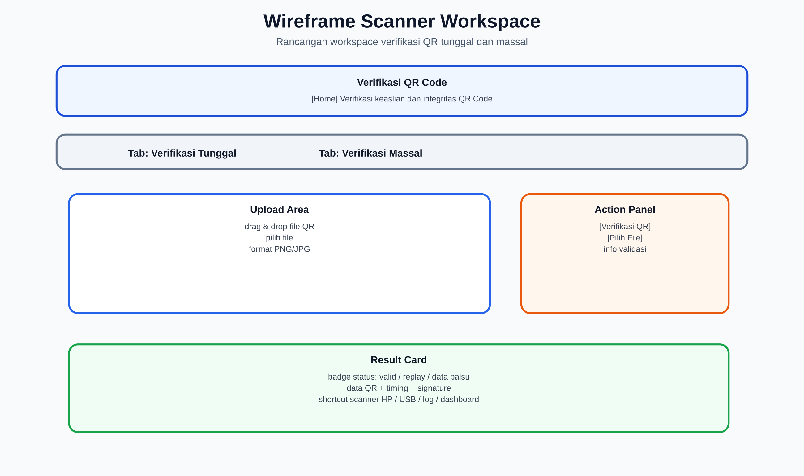

Gambar di atas adalah mockup grafis scanner workspace untuk verifikasi tunggal/massal, upload area, action panel, result card, dan shortcut workflow.

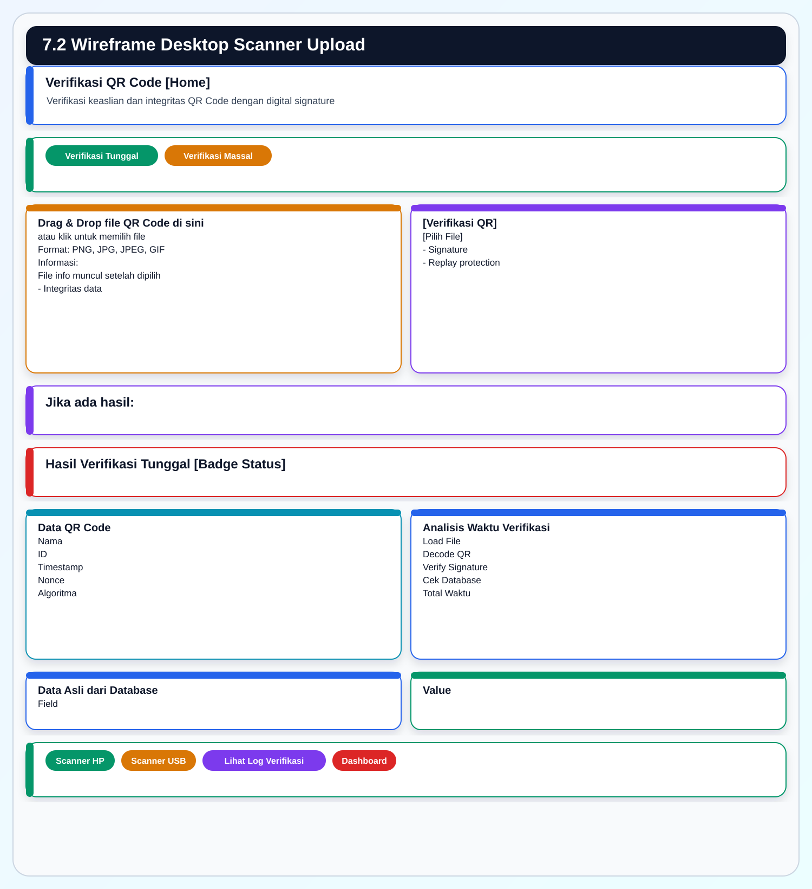

Gambar di atas adalah versi grafis dari rancangan `7.2 Wireframe Desktop Scanner Upload`; blok wireframe teks telah diganti agar dokumen Word menampilkan layout visual.

### 7.3 Wireframe Desktop Scanner Massal

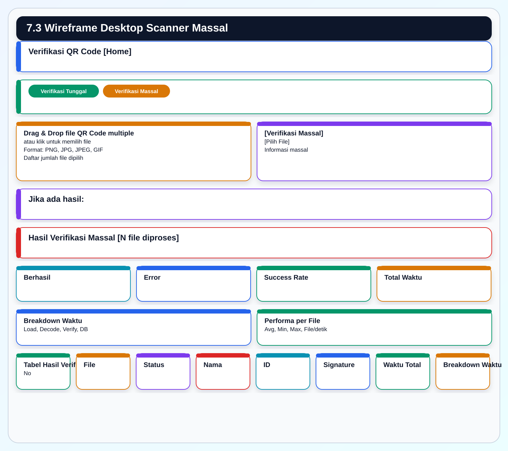

Gambar di atas adalah versi grafis dari rancangan `7.3 Wireframe Desktop Scanner Massal`; blok wireframe teks telah diganti agar dokumen Word menampilkan layout visual.

### 7.4 Wireframe Mobile Scanner Upload

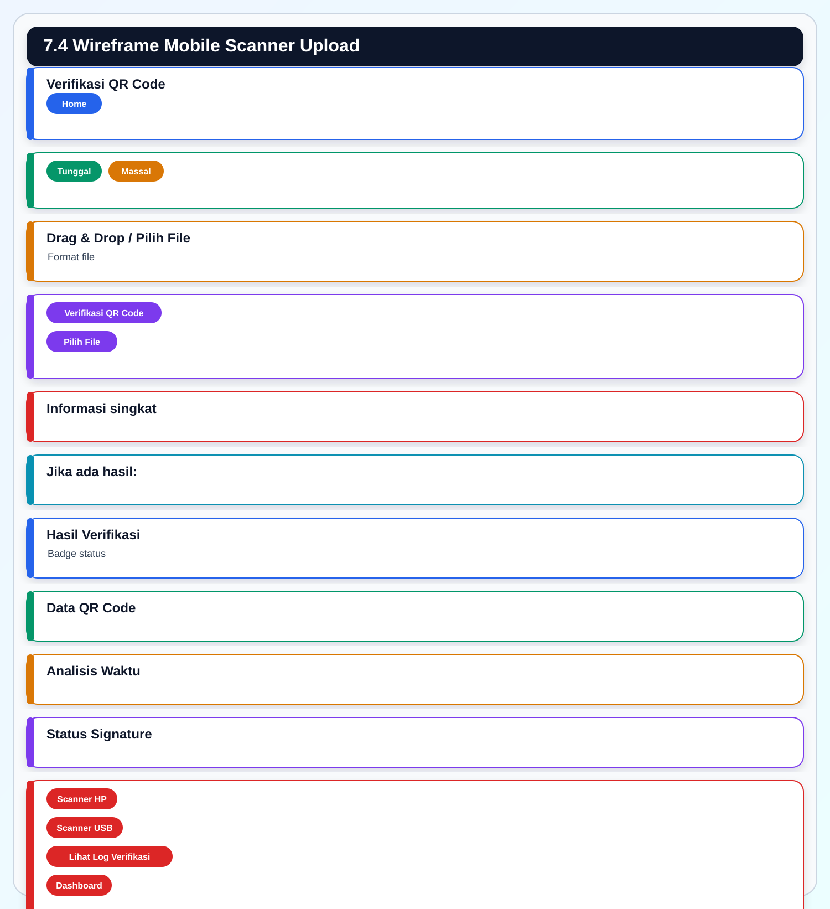

Gambar di atas adalah versi grafis dari rancangan `7.4 Wireframe Mobile Scanner Upload`; blok wireframe teks telah diganti agar dokumen Word menampilkan layout visual.

### 7.5 Komponen Scanner Workspace

| Komponen | Fungsi | UX yang Diharapkan |
|---|---|---|
| Header Scanner | Orientasi halaman dan Home | Pengguna tahu sedang di workspace verifikasi. |
| Tab Tunggal/Massal | Memilih mode verifikasi | Mode aktif jelas, tidak perlu pindah halaman. |
| Upload Area | Drag/drop atau klik file | Target besar, cocok untuk operator desktop. |
| File Info | Menampilkan file terpilih | Pengguna yakin file benar sebelum submit. |
| Action Panel | Tombol verifikasi dan pilih file | Aksi primer terlihat tanpa scroll jauh. |
| Hasil Tunggal | Status, data QR, signature, timing | Status utama terlihat sebelum detail. |
| Hasil Massal | Ringkasan dan tabel hasil | Batch mudah dinilai secara statistik. |
| Shortcut Scanner | Scanner HP, USB, Log, Dashboard | Navigasi antar-workflow cepat. |

### 7.6 State Scanner Workspace

| State | Tampilan yang Disarankan |
|---|---|
| Empty | Upload area dengan instruksi singkat. |
| File selected | Alert info berisi nama file dan tombol clear. |
| Multiple selected | Alert info berisi jumlah file, bukan daftar panjang penuh. |
| Processing | Tombol submit disabled, spinner, teks proses. |
| Valid | Badge hijau dan ringkasan data QR. |
| Replay | Badge replay dengan jumlah verifikasi. |
| Data palsu | Badge merah dan daftar perubahan data. |
| Signature invalid | Badge merah, detail signature invalid. |
| Decode error | Alert error, instruksi pilih file lain. |

---

## 8. Wireframe Scanner HP

### 8.1 Tujuan Scanner HP

Scanner HP dirancang untuk penggunaan mobile. Prioritasnya berbeda dari halaman desktop: kamera harus tampil paling atas agar pengguna tidak perlu scroll sebelum bisa scan.

### 8.2 Wireframe Mobile Scanner HP

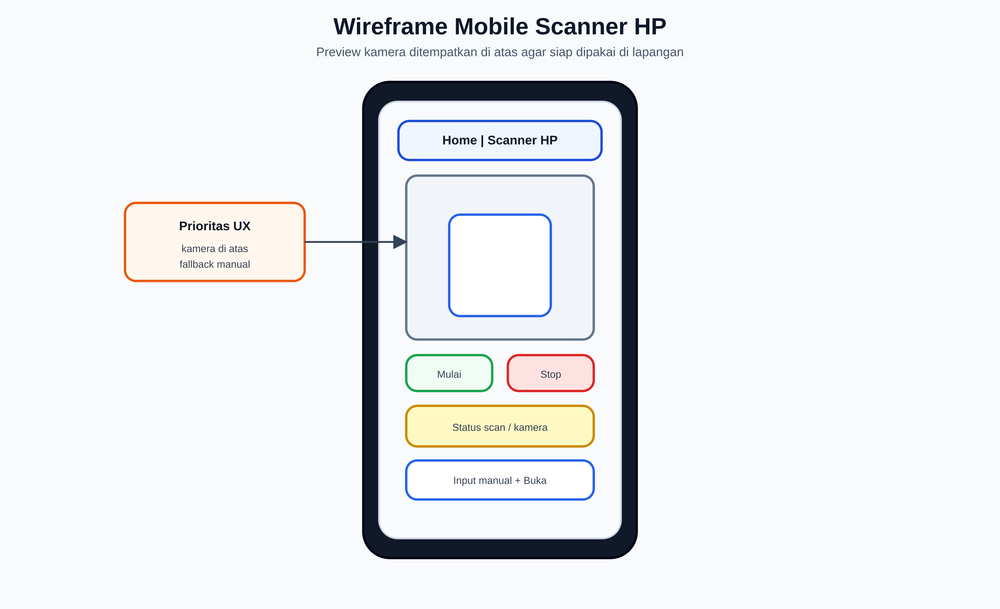

Gambar di atas adalah mockup grafis mobile scanner HP yang menempatkan preview kamera di atas, diikuti kontrol, status, input manual, dan instruksi penggunaan.

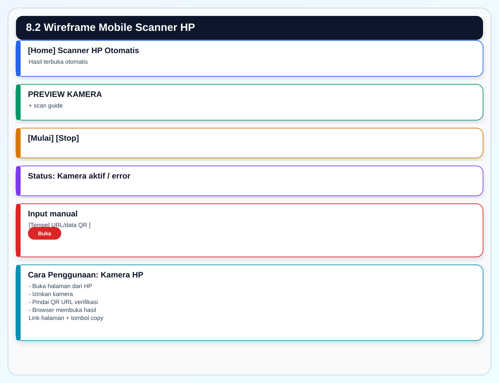

Gambar di atas adalah versi grafis dari rancangan `8.2 Wireframe Mobile Scanner HP`; blok wireframe teks telah diganti agar dokumen Word menampilkan layout visual.

### 8.3 State Scanner HP

| State | Tampilan | Aksi Pengguna |
|---|---|---|
| Initializing | Status `Menyiapkan kamera` | Izinkan kamera. |
| Camera active | Status hijau `Kamera aktif` | Arahkan QR ke area scan. |
| QR detected | Status `QR terbaca` dan spinner | Tunggu redirect otomatis. |
| Redirecting | Tombol disabled | Sistem membuka hasil verifikasi. |
| Camera denied | Status error | Beri izin kamera atau pakai input manual. |
| Invalid QR | Status error | Scan ulang atau tempel manual. |
| Manual input | Field teks dan tombol Buka | Tempel URL/data QR. |

### 8.4 Prinsip UX Scanner HP

| Prinsip | Implementasi |
|---|---|
| Kamera pertama | Preview kamera berada di atas cara penggunaan. |
| Kontrol ringkas | Hanya tombol Mulai dan Stop di area utama. |
| Status langsung | Status box memakai `aria-live` agar perubahan terbaca assistive technology. |
| Fallback manual | Input manual ada setelah kamera dan sebelum instruksi. |
| Redirect otomatis | Setelah QR valid terbaca, pengguna langsung dibawa ke hasil. |
| Hindari double scan | Sistem mengunci scan dan mengabaikan scan sama dalam waktu singkat. |

---

## 9. Wireframe Scanner USB dan Direct Scanner

### 9.1 Tujuan Scanner USB

Scanner USB digunakan pada meja layanan atau front-desk. Pengguna men-scan QR dengan perangkat barcode scanner, lalu sistem memproses input seperti teks.

### 9.2 Wireframe Scanner USB

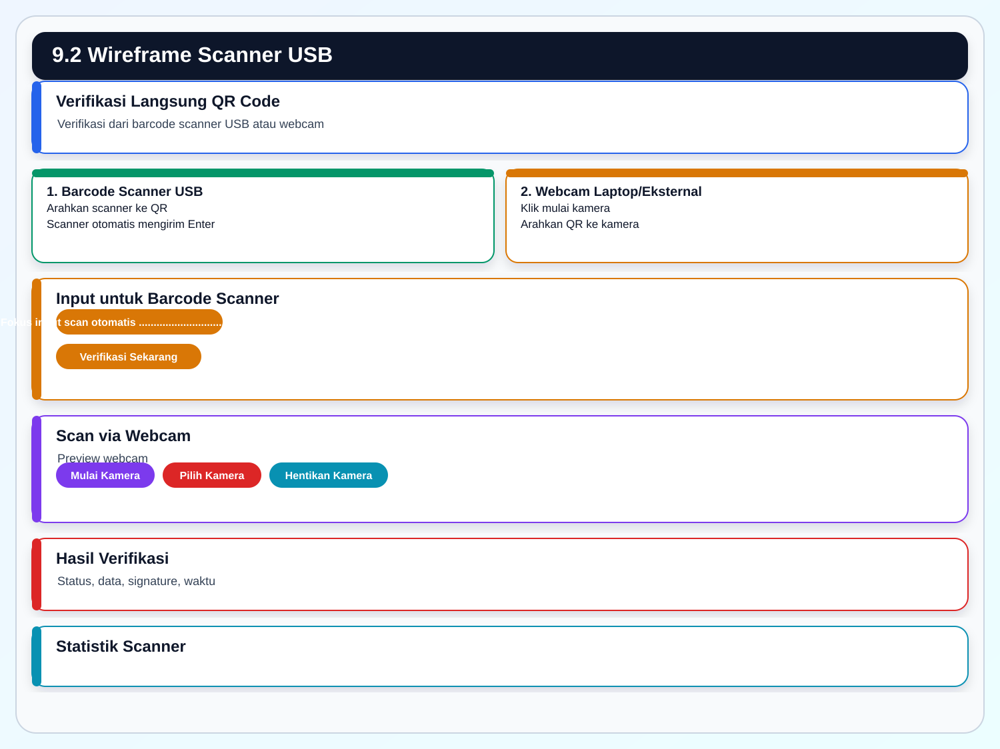

Gambar di atas adalah versi grafis dari rancangan `9.2 Wireframe Scanner USB`; blok wireframe teks telah diganti agar dokumen Word menampilkan layout visual.

### 9.3 Catatan UX Scanner USB

- Input scanner harus fokus otomatis saat halaman terbuka.
- Setelah hasil verifikasi muncul, field input sebaiknya dikosongkan dan siap untuk scan berikutnya.
- Tombol `Verifikasi Sekarang` tetap ada untuk fallback jika scanner tidak mengirim Enter.
- Status valid/replay/data palsu harus memakai label yang sama dengan scanner file dan kamera HP.

---

## 10. Mockup Komponen Visual

### 10.1 Header Page

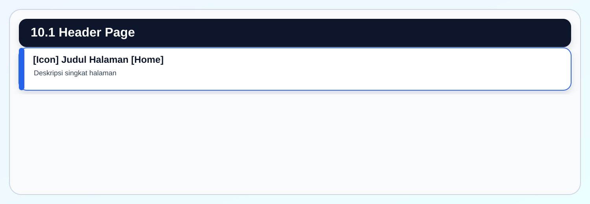

Gambar di atas adalah versi grafis dari rancangan `10.1 Header Page`; blok wireframe teks telah diganti agar dokumen Word menampilkan layout visual.

Spesifikasi:

| Properti | Nilai |
|---|---|
| Judul | Singkat, sesuai fungsi halaman. |
| Deskripsi | Satu kalimat, menjelaskan manfaat halaman. |
| Home | Tombol outline primary, posisi kanan atas pada desktop. |
| Mobile | Home dapat berada di atas atau full-width, tetapi tetap dekat judul. |

### 10.2 KPI Card

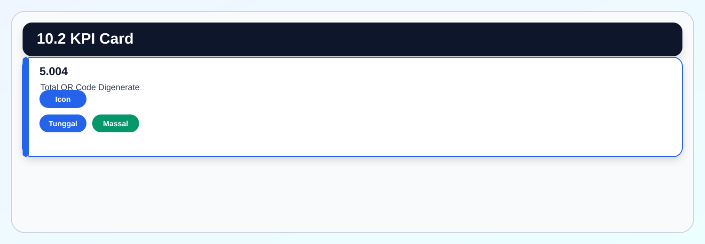

Gambar di atas adalah versi grafis dari rancangan `10.2 KPI Card`; blok wireframe teks telah diganti agar dokumen Word menampilkan layout visual.

Spesifikasi:

| Properti | Nilai |
|---|---|
| Angka utama | Besar dan tebal. |
| Label | Ringkas dan spesifik. |
| Badge | Dipakai untuk breakdown kecil. |
| Tooltip | Dipakai untuk menjelaskan sumber data. |

### 10.3 Status Result Card

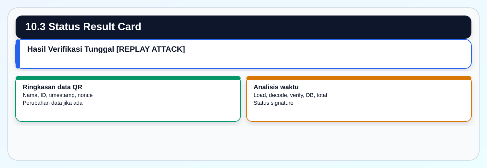

Gambar di atas adalah versi grafis dari rancangan `10.3 Status Result Card`; blok wireframe teks telah diganti agar dokumen Word menampilkan layout visual.

Spesifikasi status:

| Status | Badge | Detail Tambahan |
|---|---|---|
| Valid | Hijau | Data QR dan signature valid. |
| Replay | Info/warning | Tampilkan `verification_count`. |
| Data Palsu | Merah | Tampilkan perubahan field. |
| Invalid Signature | Merah | Tampilkan alasan signature gagal. |
| Expired | Warning | Tampilkan timestamp dan masa berlaku. |

### 10.4 Upload Area

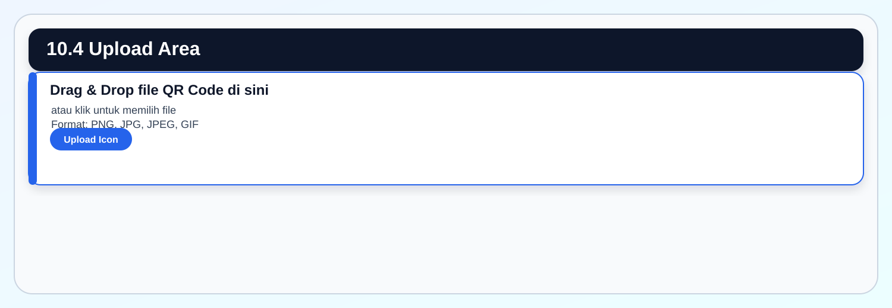

Gambar di atas adalah versi grafis dari rancangan `10.4 Upload Area`; blok wireframe teks telah diganti agar dokumen Word menampilkan layout visual.

Spesifikasi:

| Properti | Nilai |
|---|---|
| Target area | Besar, mudah diklik. |
| Drag state | Border berubah warna saat file hover. |
| Selected state | Tampilkan nama file atau jumlah file. |
| Error state | Pesan format file tidak valid. |

### 10.5 Camera Frame

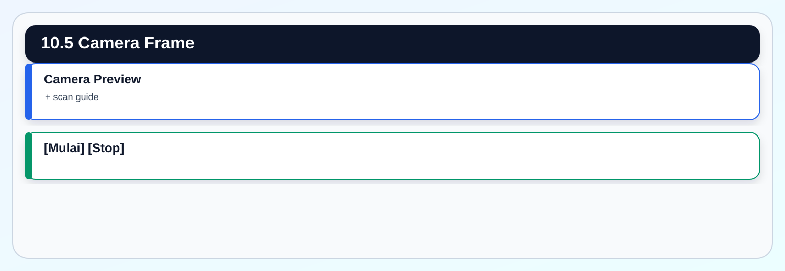

Gambar di atas adalah versi grafis dari rancangan `10.5 Camera Frame`; blok wireframe teks telah diganti agar dokumen Word menampilkan layout visual.

Spesifikasi:

| Properti | Nilai |
|---|---|
| Aspect ratio | Mendekati 1:1 agar QR mudah diarahkan. |
| Scan guide | Garis bantu berada di tengah frame. |
| Tombol | Besar dan mudah ditekan dengan ibu jari. |
| Error kamera | Jangan menutup input manual. |

---

## 11. Alur UX Utama

### 11.1 Alur Dashboard Monitoring

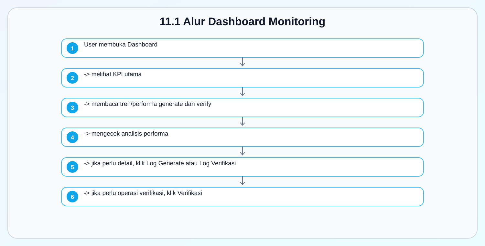

Gambar di atas adalah versi grafis dari rancangan `11.1 Alur Dashboard Monitoring`; blok wireframe teks telah diganti agar dokumen Word menampilkan layout visual.

Kriteria keberhasilan:

- Pengguna tahu jumlah QR dan verifikasi tanpa scroll jauh.
- Pengguna tahu apakah performa verify masuk grade A/B/C/D.
- Pengguna tahu sumber data metrik dari log CSV.

### 11.2 Alur Verifikasi QR Tunggal

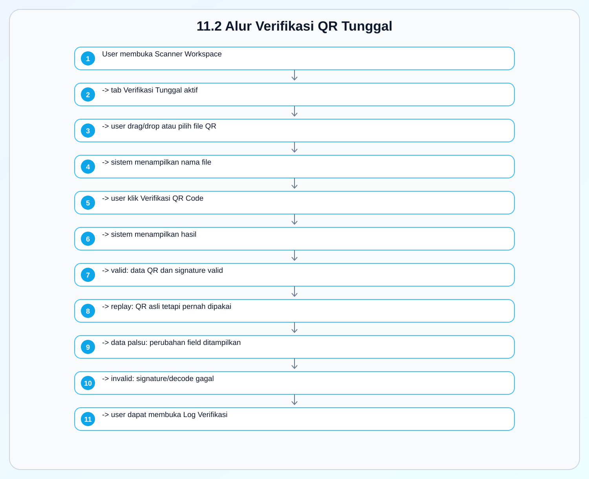

Gambar di atas adalah versi grafis dari rancangan `11.2 Alur Verifikasi QR Tunggal`; blok wireframe teks telah diganti agar dokumen Word menampilkan layout visual.

### 11.3 Alur Verifikasi Massal

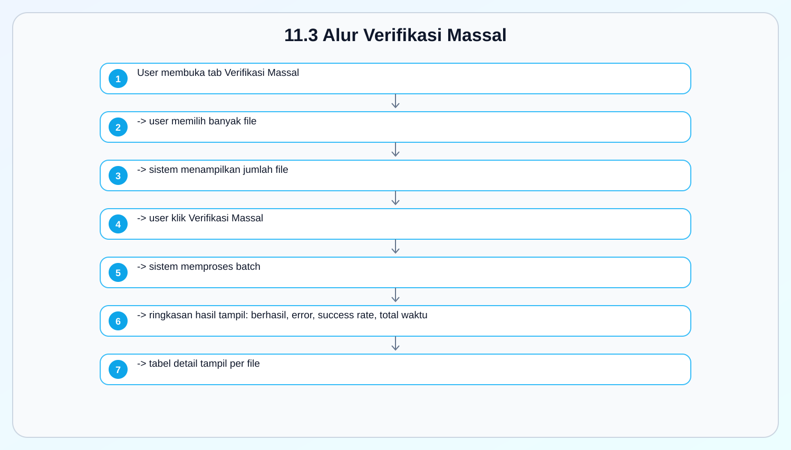

Gambar di atas adalah versi grafis dari rancangan `11.3 Alur Verifikasi Massal`; blok wireframe teks telah diganti agar dokumen Word menampilkan layout visual.

### 11.4 Alur Scanner HP

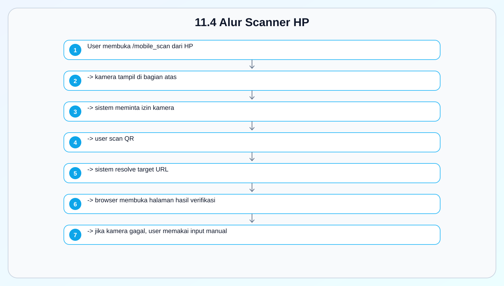

Gambar di atas adalah versi grafis dari rancangan `11.4 Alur Scanner HP`; blok wireframe teks telah diganti agar dokumen Word menampilkan layout visual.

### 11.5 Alur Scanner USB

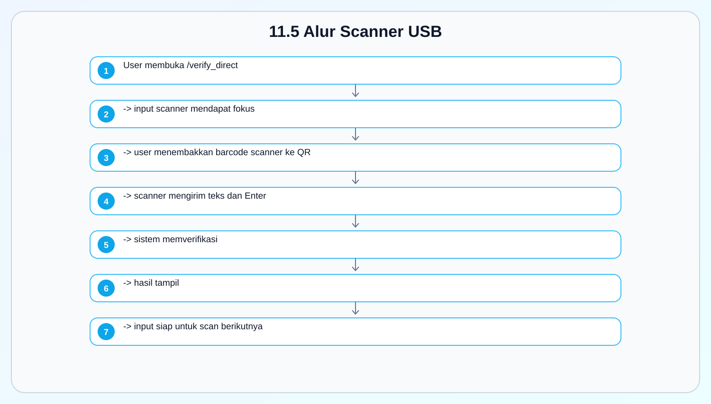

Gambar di atas adalah versi grafis dari rancangan `11.5 Alur Scanner USB`; blok wireframe teks telah diganti agar dokumen Word menampilkan layout visual.

---

## 12. UX Writing dan Label

### 12.1 Label Tombol

| Konteks | Label Disarankan |
|---|---|
| Kembali ke index | `Home` |
| Upload QR tunggal | `Pilih File` |
| Submit verify tunggal | `Verifikasi QR Code` |
| Submit verify massal | `Verifikasi Massal` |
| Kamera HP | `Scanner HP` |
| Scanner USB | `Scanner USB` |
| Log generate | `Log Generate` |
| Log verifikasi | `Log Verifikasi` |
| Reset statistik | `Reset Statistik` |

### 12.2 Label Status Verifikasi

| Kondisi Sistem | Label UX |
|---|---|
| Signature valid dan nonce pertama | `Valid` |
| Signature valid tetapi nonce sudah pernah dipakai | `Replay Attack` |
| Data payload berubah dari data original | `Data Palsu` |
| Signature tidak cocok | `Signature Invalid` |
| QR tidak bisa dibaca | `Decode Error` |
| Token URL tidak ditemukan | `Token QR Tidak Ditemukan` |
| Format QR tidak dikenal | `Format QR Tidak Valid` |

### 12.3 Pesan Error yang Disarankan

| Error | Pesan UX |
|---|---|
| Kamera ditolak | `Kamera belum aktif. Izinkan akses kamera atau gunakan input manual.` |
| File kosong | `Pilih file QR terlebih dahulu.` |
| Format file salah | `Format file tidak didukung. Gunakan PNG, JPG, JPEG, atau GIF.` |
| QR tidak terbaca | `QR tidak dapat dibaca. Pastikan gambar jelas dan tidak terpotong.` |
| Signature invalid | `Signature tidak valid. QR kemungkinan dimodifikasi atau tidak dibuat oleh sistem.` |
| Replay | `QR sudah pernah diverifikasi. Penggunaan ulang terdeteksi.` |

---

## 13. Aksesibilitas

### 13.1 Rekomendasi Aksesibilitas

| Area | Rekomendasi |
|---|---|
| Tombol icon | Selalu memiliki teks atau `aria-label`. |
| Status scan | Gunakan `role="status"` dan `aria-live="polite"`. |
| Tab scanner | Gunakan role tab Bootstrap dengan state aktif jelas. |
| Upload area | Tetap sediakan input file asli yang bisa diakses keyboard. |
| Warna status | Jangan hanya mengandalkan warna; tampilkan label teks. |
| Tabel lebar | Beri `tabindex="0"` agar area scroll bisa fokus keyboard. |
| Form | Setiap input memiliki label. |
| Kontras | Badge dan teks harus tetap terbaca pada latar terang. |

### 13.2 Keyboard Interaction

| Elemen | Perilaku Keyboard |
|---|---|
| Tombol | Fokus tab normal dan Enter/Space mengaktifkan. |
| Upload | Enter pada tombol Pilih File membuka picker. |
| Tabel log | Arrow kiri/kanan menggeser tabel horizontal. |
| Input manual HP | Enter menjalankan buka/verifikasi. |
| Scanner USB | Input auto-focus untuk scan cepat. |

---

## 14. Responsive Design Detail

### 14.1 Breakpoint Desktop

| Area | Layout Desktop |
|---|---|
| KPI Dashboard | 4 kolom. |
| Chart Dashboard | 8 kolom + 4 kolom. |
| File/Performance | 6 kolom + 6 kolom. |
| Scanner Upload | 8 kolom upload + 4 kolom action. |
| Result Card | 6 kolom data + 6 kolom timing. |

### 14.2 Breakpoint Tablet

| Area | Layout Tablet |
|---|---|
| KPI Dashboard | 2 kolom. |
| Chart Dashboard | Stack sebagian jika sempit. |
| Scanner Upload | Upload dan action tetap berdampingan jika muat. |
| Action Buttons | 2 kolom. |

### 14.3 Breakpoint Mobile

| Area | Layout Mobile |
|---|---|
| Header | Judul, deskripsi, tombol stack. |
| KPI | 1 kolom. |
| Chart | 1 kolom, hindari grafik terlalu tinggi. |
| Scanner Upload | Upload, tombol, info stack vertikal. |
| Scanner HP | Kamera paling atas, kontrol langsung di bawah. |
| Tabel | Horizontal scroll dengan keyboard/touch. |

---

## 15. Evaluasi UI Saat Ini

### 15.1 Kekuatan

| Aspek | Keterangan |
|---|---|
| Dashboard kaya informasi | Banyak metrik operasional sudah tersedia. |
| Scanner mendukung banyak mode | Upload tunggal, massal, HP, USB/webcam. |
| Status verifikasi detail | Data QR, signature, perubahan, dan timing tersedia. |
| Log dapat diekspor | Mendukung audit dan laporan. |
| Mobile scan sudah diprioritaskan | Preview kamera berada di atas instruksi. |
| Keyboard table scroll | Tabel lebar lebih mudah dibaca tanpa scroll ke bawah. |

### 15.2 Risiko UX

| Risiko | Dampak | Rekomendasi |
|---|---|---|
| Dashboard terlalu padat | Pengguna baru sulit membedakan KPI utama dan detail metodologi. | Pertahankan KPI atas, pindahkan detail teknis ke accordion jika perlu. |
| Terlalu banyak jenis scanner | Pengguna bingung memilih HP, USB, upload file, atau massal. | Tambahkan deskripsi pendek per metode di scanner workspace. |
| Status replay vs data palsu bisa membingungkan | Operator salah mengira QR palsu sebagai replay. | Prioritaskan klasifikasi data palsu sebelum replay jika data berubah. |
| Angka throughput disalahartikan | Metrik dashboard dianggap hasil load-test. | Label sebagai estimasi dari median dan tampilkan metodologi. |
| Tabel log sangat lebar | Kolom kanan sulit dijangkau. | Keyboard horizontal scroll dan wrap konten panjang. |
| Reset statistik terlihat dekat tombol log | Risiko klik tidak sengaja. | Tetap gunakan konfirmasi dan warna warning. |

---

## 16. Rekomendasi Pengembangan UI/UX

### 16.1 Tahap Cepat

| Rekomendasi | Dampak |
|---|---|
| Konsistenkan label status di semua scanner. | Mengurangi kebingungan operator. |
| Tambahkan helper text pada pilihan scanner. | Pengguna tahu mode scan yang tepat. |
| Tambahkan empty state yang lebih spesifik. | Halaman tetap informatif saat data kosong. |
| Tambahkan loading state pada submit verifikasi. | Pengguna tahu proses sedang berjalan. |
| Pastikan tombol Home hanya satu per halaman. | Navigasi lebih bersih. |

### 16.2 Tahap Menengah

| Rekomendasi | Dampak |
|---|---|
| Buat komponen reusable untuk result status. | Status valid/replay/data palsu konsisten. |
| Buat summary card scanner mode. | Pemilihan scanner lebih mudah. |
| Tambahkan filter cepat di hasil massal. | Operator bisa fokus ke error/replay. |
| Tambahkan modal detail hasil per file. | Tabel massal tetap ringkas. |
| Simpan preferensi mode scanner terakhir. | Workflow operator lebih cepat. |

### 16.3 Tahap Lanjutan

| Rekomendasi | Dampak |
|---|---|
| Desain dashboard role-based. | Admin, operator, auditor melihat informasi sesuai kebutuhan. |
| Tambahkan real-time event stream. | Dashboard bisa memantau aktivitas langsung. |
| Tambahkan design system internal. | Warna, spacing, badge, dan button konsisten lintas halaman. |
| Tambahkan usability testing formal. | Validasi alur berdasarkan pengguna nyata. |
| Tambahkan audit-ready UI mode. | Laporan dan bukti verifikasi lebih mudah dibuat. |

---

## 17. Acceptance Criteria Desain

### 17.1 Dashboard

| ID | Kriteria |
|---|---|
| UI-DASH-01 | KPI utama terlihat pada viewport pertama desktop. |
| UI-DASH-02 | Tombol Home, Verifikasi, dan CSV Generator berada dekat header. |
| UI-DASH-03 | Metrik generate dan verify membedakan median, mean, P95, dan grade. |
| UI-DASH-04 | Metodologi menjelaskan sumber data dari CSV log. |
| UI-DASH-05 | Tombol Log Generate dan Log Verifikasi rapi dan sejajar. |
| UI-DASH-06 | Pada mobile, card stack vertikal tanpa overlap. |

### 17.2 Scanner Workspace

| ID | Kriteria |
|---|---|
| UI-SCAN-01 | Pengguna dapat memilih verifikasi tunggal atau massal dari tab. |
| UI-SCAN-02 | Upload area dapat diklik dan mendukung drag/drop. |
| UI-SCAN-03 | File terpilih tampil sebelum submit. |
| UI-SCAN-04 | Hasil verifikasi menampilkan status utama di bagian atas result card. |
| UI-SCAN-05 | Replay menampilkan jumlah verifikasi. |
| UI-SCAN-06 | Data palsu menampilkan perubahan field. |
| UI-SCAN-07 | Shortcut Scanner HP, Scanner USB, Log Verifikasi, dan Dashboard relevan dengan halaman. |

### 17.3 Scanner HP

| ID | Kriteria |
|---|---|
| UI-HP-01 | Preview kamera tampil sebelum instruksi cara penggunaan. |
| UI-HP-02 | Tombol Mulai dan Stop mudah ditekan di mobile. |
| UI-HP-03 | Status kamera dan scan memakai `aria-live`. |
| UI-HP-04 | Input manual tersedia setelah kamera. |
| UI-HP-05 | Scan berhasil mengalihkan user ke halaman hasil verifikasi. |
| UI-HP-06 | Kamera gagal tidak memblokir input manual. |

---

## 18. Testing UI/UX yang Disarankan

### 18.1 Checklist Manual Desktop

| Test | Ekspektasi |
|---|---|
| Buka `/dashboard` | KPI dan tombol atas tampil rapi. |
| Resize desktop ke tablet | Card tidak overlap. |
| Klik Log Generate | Pindah ke `/log`. |
| Klik Log Verifikasi | Pindah ke `/log_verifikasi`. |
| Buka `/scanner` | Tab tunggal aktif dan upload area terlihat. |
| Upload QR valid | Hasil valid tampil dengan data dan timing. |
| Upload QR yang sama lagi | Hasil replay tampil cepat. |
| Upload QR palsu | Hasil data palsu tampil, bukan replay. |
| Verifikasi massal | Ringkasan dan tabel muncul. |

### 18.2 Checklist Manual Mobile

| Test | Ekspektasi |
|---|---|
| Buka `/mobile_scan` dari HP | Kamera tampil di viewport awal. |
| Tolak izin kamera | Error jelas dan input manual tetap tersedia. |
| Izinkan kamera | Status kamera aktif. |
| Scan QR URL verifikasi | Browser membuka halaman hasil. |
| Tempel URL di input manual | Tombol Buka mengarahkan ke hasil. |
| Scroll halaman | Cara penggunaan berada di bawah kamera dan input manual. |

### 18.3 Checklist Aksesibilitas

| Test | Ekspektasi |
|---|---|
| Navigasi keyboard | Tombol dan input bisa difokuskan. |
| Enter pada input manual | Menjalankan buka/verifikasi. |
| Screen reader status HP | Perubahan status scan diumumkan. |
| Tabel lebar | Area tabel bisa fokus dan digeser dengan keyboard. |
| Warna status | Label teks tetap menjelaskan status tanpa bergantung warna. |

---

## 19. Kesimpulan

Desain UI/UX QR Code Security System sudah mengarah pada pola aplikasi operasional yang tepat: dashboard menampilkan KPI dan performa, sedangkan scanner workspace menyediakan beberapa metode verifikasi sesuai kebutuhan pengguna. Struktur halaman yang paling penting adalah header yang jelas, aksi primer yang mudah ditemukan, status keamanan yang eksplisit, dan detail teknis yang tersedia setelah ringkasan hasil.

Wireframe yang diusulkan mempertahankan pola implementasi saat ini, tetapi memperjelas hierarki informasi dan konsistensi pengalaman pengguna. Dashboard perlu terus menekankan perbedaan antara metrik operasional dan metrik load-test. Scanner workspace perlu mempertahankan status keamanan yang konsisten agar valid, replay attack, data palsu, dan signature invalid tidak tertukar. Scanner HP perlu tetap berorientasi mobile-first dengan preview kamera di bagian atas, input manual sebagai fallback, dan instruksi penggunaan di bawah.

Dengan rancangan ini, sistem lebih mudah digunakan oleh admin, operator, petugas lapangan, auditor, dan penguji sistem, sekaligus tetap mendukung kebutuhan laporan teknis tentang desain antarmuka dan pengalaman pengguna.

---

## Lampiran A - Ringkasan Wireframe Siap Pakai

### A.1 Dashboard

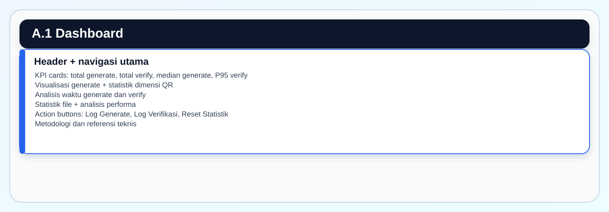

Gambar di atas adalah versi grafis dari rancangan `A.1 Dashboard`; blok wireframe teks telah diganti agar dokumen Word menampilkan layout visual.

### A.2 Scanner Workspace

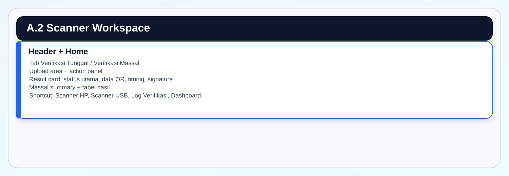

Gambar di atas adalah versi grafis dari rancangan `A.2 Scanner Workspace`; blok wireframe teks telah diganti agar dokumen Word menampilkan layout visual.

### A.3 Scanner HP

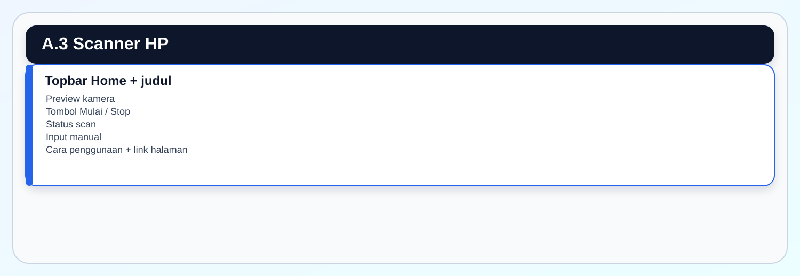

Gambar di atas adalah versi grafis dari rancangan `A.3 Scanner HP`; blok wireframe teks telah diganti agar dokumen Word menampilkan layout visual.

## Lampiran B - Pernyataan Siap Pakai untuk Laporan

Desain antarmuka QR Code Security System menggunakan pendekatan operasional berbasis dashboard dan scanner workspace. Dashboard dirancang untuk memberikan ringkasan statistik generate, verifikasi, performa, dan file storage secara cepat, sedangkan scanner workspace dirancang untuk mendukung beberapa metode verifikasi QR, yaitu upload file tunggal, upload massal, kamera HP, dan scanner USB.

Wireframe dashboard menempatkan KPI utama pada bagian atas halaman, dilanjutkan visualisasi performa, analisis waktu, statistik file, analisis performa, tombol aksi, dan metodologi perhitungan. Wireframe scanner workspace menempatkan pilihan mode verifikasi pada tab, upload area besar, panel aksi, result card, dan shortcut ke metode scanner lain. Pada scanner HP, preview kamera ditempatkan di bagian atas untuk memenuhi kebutuhan mobile-first, diikuti tombol kontrol, status scan, input manual, dan cara penggunaan.

Pendekatan UX sistem menekankan kecepatan kerja operator, kejelasan status keamanan, dan konsistensi navigasi. Status hasil verifikasi dibedakan secara eksplisit menjadi valid, replay attack, data palsu, signature invalid, expired, dan error proses. Dengan demikian, pengguna dapat memahami hasil verifikasi tanpa perlu menafsirkan detail teknis terlebih dahulu.
