# Dokumen Desain Sistem (System Design Document/SDD)

## DFD, Flowchart Sistem Verifikasi 2-Lapis, dan ERD

**Sistem:** QR Code Security System RSA-PSS  
**Domain implementasi:** `https://rsa-pss.com`  
**Lokasi kode:** `/opt/qrcode`  
**Tanggal penyusunan:** 16 Juni 2026  
**Tujuan dokumen:** Menjelaskan desain sistem secara menyeluruh, termasuk arsitektur aplikasi, Data Flow Diagram (DFD), flowchart verifikasi 2-lapis, Entity Relationship Diagram (ERD), data dictionary, dan rancangan modul utama.

---

## 1. Ringkasan Eksekutif

QR Code Security System RSA-PSS adalah aplikasi web untuk membuat dan memverifikasi QR Code bertanda tangan digital. Sistem mendukung generate QR tunggal, generate massal dari CSV, verifikasi QR tunggal, verifikasi massal, verifikasi melalui kamera HP, verifikasi melalui scanner USB/webcam, monitoring dashboard, log generate, log verifikasi, audit log, dan stress testing.

Desain sistem menggunakan arsitektur web monolitik berbasis Flask dengan storage hybrid:

- File PNG untuk artefak QR Code.
- File JSON untuk data QR original, payload URL pendek, task result, dan metadata task.
- CSV untuk log generate, log verifikasi, dan audit log.
- SQLite untuk replay-state nonce.
- In-memory task registry untuk proses massal yang sedang berjalan.

Verifikasi QR menggunakan desain **2-lapis**:

1. **Lapis Kriptograf:** decode QR, ekstraksi payload, canonical serialization, hashing SHA-256, dan verifikasi digital signature RSA-PSS/ECDSA.
2. **Lapis State dan Validasi Bisnis:** pencarian data original, perbandingan payload dengan data original, validasi nonce, validasi timestamp, pencatatan nonce atomik, klasifikasi replay attack/data palsu/valid, logging, dan rendering hasil.

Desain 2-lapis ini penting karena digital signature hanya membuktikan integritas dan autentisitas payload, tetapi tidak cukup untuk mencegah penggunaan ulang QR. Pencegahan replay attack membutuhkan state tambahan berupa `nonce_state`.

---

## 2. Ruang Lingkup Dokumen

### 2.1 Cakupan

Dokumen ini mencakup:

- Arsitektur sistem tingkat tinggi.
- Dekomposisi modul aplikasi.
- DFD Level 0, Level 1, dan Level 2.
- Flowchart generate QR.
- Flowchart verifikasi QR 2-lapis.
- Flowchart verifikasi massal.
- Flowchart kamera HP dan scanner USB.
- ERD logis dan pemetaan ke storage fisik.
- Data dictionary entitas utama.
- Rancangan interface route/API.
- Mekanisme keamanan dan logging.
- Acceptance criteria desain sistem.

### 2.2 Batasan

Dokumen ini tidak membahas:

- Desain visual detail per pixel.
- Deployment server, Nginx, SSL, dan konfigurasi OS secara lengkap.
- Implementasi ISO/IEC 20248 penuh dengan envelope DigSig resmi.
- Implementasi PKI/X.509 penuh.
- Implementasi database relasional penuh untuk seluruh log, karena sistem saat ini masih memakai CSV/JSON untuk beberapa storage.

### 2.3 File Gambar Diagram

Diagram utama pada SDD ini tersedia sebagai gambar grafis vektor SVG, sehingga dapat dibuka langsung di browser, disisipkan ke laporan, atau dikonversi ke format lain jika diperlukan.

| Gambar | File |
|---|---|
| Arsitektur sistem tingkat tinggi | `dokumen/Gambar-Asli/sdd_system_architecture.png` |
| DFD Level 0 - Context Diagram | `dokumen/Gambar-Asli/dfd_level_0.png` |
| DFD Level 1 - Proses Utama | `dokumen/Gambar-Asli/dfd_level_1.png` |
| DFD Level 2 - Generate QR | `dokumen/Gambar-Asli/sdd_dfd_level_2_generate.png` |
| DFD Level 2 - Verifikasi QR | `dokumen/Gambar-Asli/sdd_dfd_level_2_verify.png` |
| DFD Level 2 - Dashboard dan Log | `dokumen/Gambar-Asli/sdd_dfd_level_2_dashboard_log.png` |
| Flowchart generate QR | `dokumen/Gambar-Asli/sdd_flowchart_generate_qr.png` |
| Flowchart Verifikasi 2-Lapis | `dokumen/Gambar-Asli/flowchart_verifikasi_2_lapis.png` |
| Flowchart klasifikasi replay/data palsu | `dokumen/Gambar-Asli/sdd_flowchart_replay_classification.png` |
| Flowchart verifikasi massal | `dokumen/Gambar-Asli/sdd_flowchart_verify_massal.png` |
| Flowchart kamera HP | `dokumen/Gambar-Asli/sdd_flowchart_mobile_scanner.png` |
| Flowchart scanner USB | `dokumen/Gambar-Asli/sdd_flowchart_usb_scanner.png` |
| ERD Logis Sistem | `dokumen/Gambar-Asli/erd_logis.png` |
| ERD fisik SQLite | `dokumen/Gambar-Asli/sdd_erd_sqlite.png` |

---

## 3. Gambaran Sistem

### 3.1 Tujuan Sistem

Sistem dirancang untuk:

| Tujuan | Penjelasan |
|---|---|
| Generate QR aman | Membuat QR berisi data, nonce, timestamp, metadata, dan digital signature. |
| Verifikasi autentisitas | Memastikan QR dibuat oleh private key sistem. |
| Verifikasi integritas | Memastikan payload QR tidak berubah. |
| Deteksi replay attack | Menolak penggunaan ulang QR yang sama setelah verifikasi pertama. |
| Deteksi data palsu | Mengklasifikasikan QR yang datanya berubah dari data original. |
| Audit dan monitoring | Menyimpan log generate, verifikasi, audit, dan performa. |
| Operasi massal | Mendukung generate dan verifikasi banyak QR. |

### 3.2 Aktor Sistem

| Aktor | Peran |
|---|---|
| Admin | Login, generate QR, monitoring dashboard, melihat log, mengelola data. |
| Operator Verifikasi | Memverifikasi QR tunggal/massal melalui scanner workspace. |
| Petugas Lapangan | Memindai QR melalui kamera HP di `/mobile_scan`. |
| Auditor | Membaca log generate, log verifikasi, dan audit log. |
| Sistem Background Task | Memproses generate/verifikasi massal dan menyimpan snapshot. |
| Storage Lokal | Menyediakan file PNG, JSON, CSV, SQLite, dan log aplikasi. |

### 3.3 Komponen Utama

| Komponen | Implementasi | Fungsi |
|---|---|---|
| Web Application | Flask `app.py` | Routing, controller, verifikasi, generate, dashboard. |
| Template UI | `templates/*.html` | Antarmuka dashboard, scanner, log, hasil. |
| Static Assets | `static/*` | CSS, JS, QR PNG, data JSON, upload. |
| Crypto Engine | PyCryptodome RSA/ECDSA | Signing dan verification. |
| QR Engine | `qrcode`, OpenCV, pyzbar/html5-qrcode | Render dan decode QR. |
| Replay State DB | `logs/security_state.db` | Menyimpan nonce dan usage count. |
| Event Logs | CSV files | Log generate/verifikasi/audit. |
| Task Store | JSON + in-memory dict | Progress dan hasil task massal. |

---

## 4. Arsitektur Sistem Tingkat Tinggi

### 4.1 Diagram Arsitektur

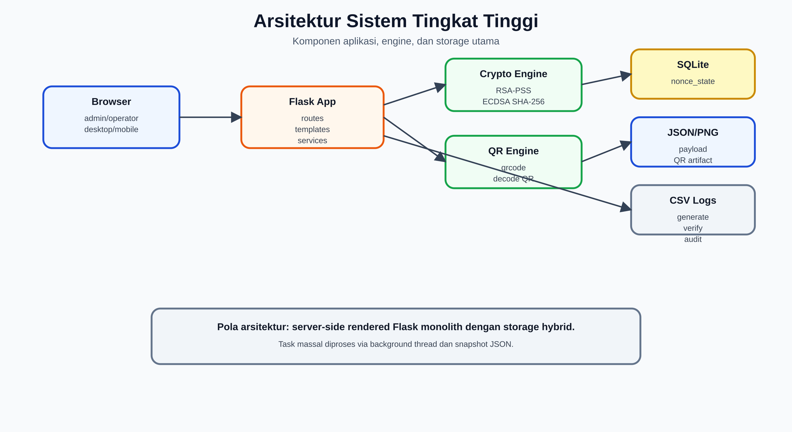

Gambar di atas memperlihatkan relasi browser, Flask application, engine kriptograf, QR engine, dan storage utama.


### 4.2 Pola Arsitektur

Sistem memakai pola **server-side rendered web application**:

1. Browser mengirim request ke Flask route.
2. Controller melakukan validasi input.
3. Service logic menjalankan generate/verifikasi/logging.
4. Data disimpan ke file, CSV, JSON, atau SQLite.
5. Template HTML dirender kembali ke browser.

Untuk proses massal, sistem memakai pola **background thread task**:

1. Request upload massal diterima.
2. File disimpan sementara.
3. Task ID dibuat.
4. Background thread memproses file.
5. Progress dibaca melalui API polling.
6. Hasil disimpan sebagai JSON snapshot.

---

## 5. Modul Sistem

### 5.1 Modul Generate QR

| Submodul | Fungsi |
|---|---|
| Input validation | Memastikan nama dan ID terisi. |
| Data builder | Membentuk data QR: nama, ID, timestamp, nonce. |
| QR sizing | Menghitung QR version dan modules. |
| Signature service | Membuat signature RSA-PSS/ECDSA atas hash data. |
| Payload builder | Membuat payload berisi data, signature, alg, metadata. |
| URL builder | Membuat URL verifikasi pendek `/v/<token>` atau URL encoded. |
| QR renderer | Membuat file PNG QR. |
| Data persistence | Menyimpan data original JSON dan payload token. |
| Generate logger | Menulis `logs/log_generate.csv`. |

### 5.2 Modul Verifikasi QR

| Submodul | Fungsi |
|---|---|
| Upload handler | Menerima file QR tunggal/massal. |
| QR decoder | Membaca payload dari gambar QR. |
| Payload extractor | Mengambil payload dari URL pendek, URL encoded, atau JSON payload. |
| Signature verifier | Memverifikasi RSA-PSS/ECDSA. |
| Original data matcher | Mencari data original di `static/data/*.json`. |
| Change detector | Mencari field yang berubah. |
| Replay detector | Mencatat dan menghitung nonce di SQLite. |
| Classifier | Menghasilkan status valid, replay, data palsu, invalid, atau not found. |
| Verify logger | Menulis `logs/log_verifikasi.csv`. |

### 5.3 Modul Scanner HP

| Submodul | Fungsi |
|---|---|
| Camera UI | Menampilkan preview kamera dan scan guide. |
| Scan target resolver | API `/api/resolve_scan_target` untuk mengubah QR string menjadi target URL internal. |
| Short token verifier | Endpoint `/v/<token>` untuk memuat payload dan memverifikasi. |
| Manual input fallback | Input URL/data QR jika kamera gagal. |
| Result renderer | Menampilkan `verify_result.html`. |

### 5.4 Modul Dashboard dan Log

| Submodul | Fungsi |
|---|---|
| Dashboard summary | Membaca log dan menghitung total, median, P95, P99, grade. |
| Generate log viewer | Menampilkan dan mengekspor `log_generate.csv`. |
| Verify log viewer | Menampilkan dan mengekspor `log_verifikasi.csv`. |
| Audit log viewer | Menampilkan `audit_log.csv`. |
| Stats file | Menyimpan ringkasan di `logs/qr_stats.json`. |

---

## 6. Data Flow Diagram (DFD)

### 6.1 Notasi DFD

| Notasi | Makna |
|---|---|
| External Entity | Pengguna atau sistem luar. |
| Process | Proses aplikasi. |
| Data Store | Penyimpanan data. |
| Data Flow | Aliran data antar komponen. |

### 6.2 DFD Level 0 - Context Diagram

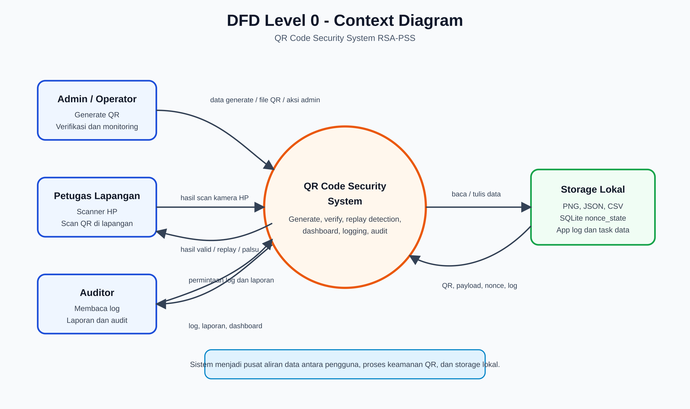

Gambar di atas menunjukkan konteks sistem secara menyeluruh: admin/operator, petugas lapangan, dan auditor berinteraksi dengan QR Code Security System, sedangkan sistem membaca dan menulis data ke storage lokal.


Penjelasan:

- Sistem menerima input generate dan verifikasi dari admin/operator.
- Petugas lapangan memakai kamera HP untuk memindai QR dan menerima hasil verifikasi.
- Auditor membaca log dan laporan.
- Semua proses utama bergantung pada storage lokal.

### 6.3 DFD Level 1 - Proses Utama

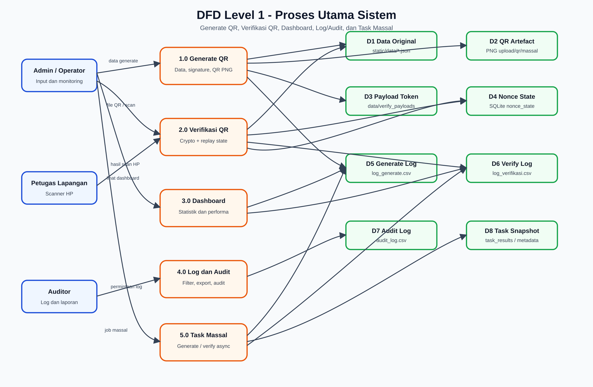

Gambar di atas memecah sistem menjadi lima proses utama dan delapan data store utama yang dipakai aplikasi.


### 6.4 DFD Level 2 - Generate QR

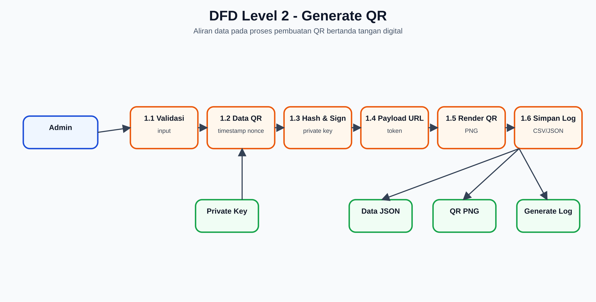

Gambar di atas memperlihatkan aliran data internal pada proses generate QR, mulai dari input admin sampai data, QR PNG, payload token, dan log tersimpan.


### 6.5 DFD Level 2 - Verifikasi QR 2-Lapis

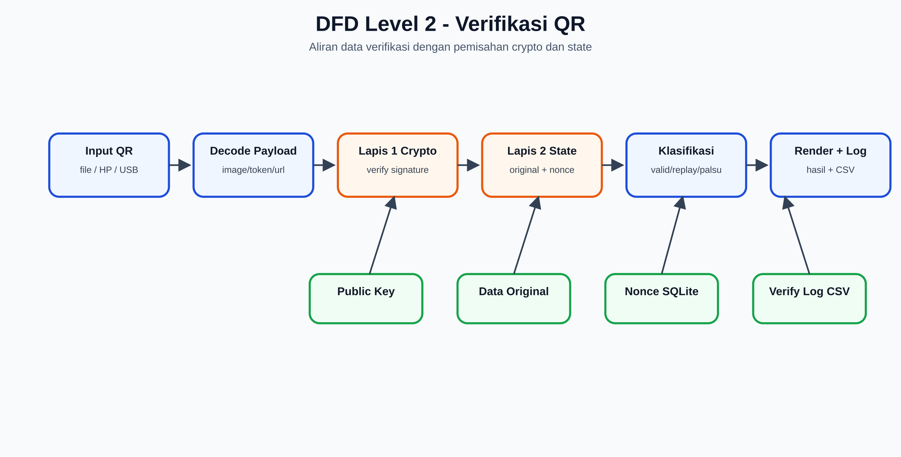

Gambar di atas menunjukkan aliran data verifikasi QR dari input, decode payload, lapis kriptograf, lapis state, klasifikasi, hingga logging.


### 6.6 DFD Level 2 - Dashboard dan Log

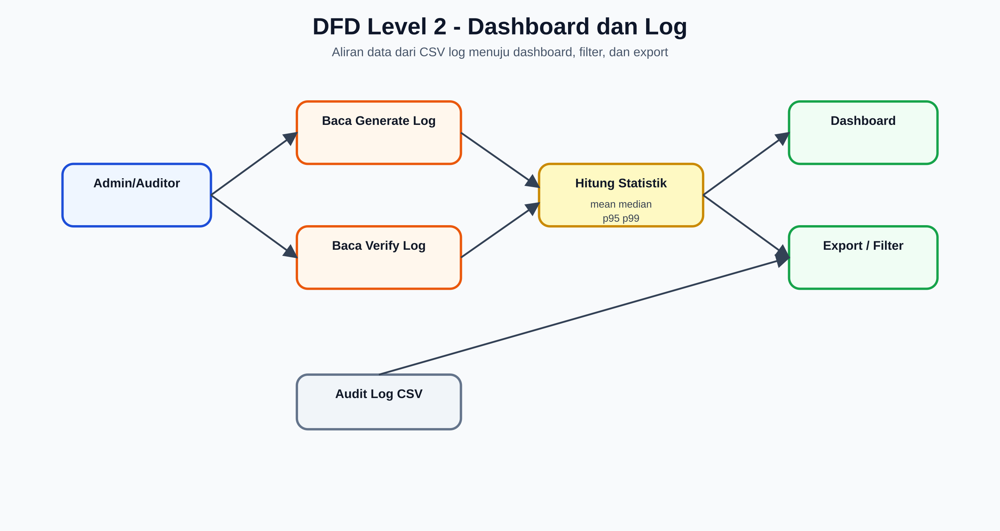

Gambar di atas memperlihatkan bagaimana log generate, log verifikasi, dan audit log menjadi sumber dashboard, filter, dan export laporan.


---

## 7. Flowchart Sistem Generate QR

### 7.1 Flowchart Generate QR Tunggal

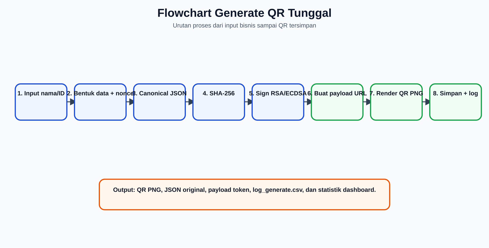

Gambar di atas memperlihatkan urutan proses generate QR dari input nama/ID sampai QR, payload, data original, dan log tersimpan.


### 7.2 Output Generate

| Output | Storage | Fungsi |
|---|---|---|
| QR PNG | `static/qr` atau `static/qr_massal` | Artefak QR yang bisa discan. |
| Data original | `static/data/*.json` | Basis pembanding verifikasi. |
| Payload token | `data/verify_payloads/<shard>/<token>.json` | Payload untuk URL pendek `/v/<token>`. |
| Generate log | `logs/log_generate.csv` | Audit dan performa generate. |
| Stats summary | `logs/qr_stats.json` | Ringkasan dashboard. |

---

## 8. Flowchart Sistem Verifikasi 2-Lapis

### 8.1 Definisi 2-Lapis

| Lapis | Nama | Fungsi | Output |
|---|---|---|---|
| 1 | Lapis Kriptograf | Membuktikan signature dan integritas payload. | `signature_valid`, `sig_error`, `alg`. |
| 2 | Lapis State dan Validasi Bisnis | Membandingkan data original, mengecek nonce, timestamp, replay, dan klasifikasi akhir. | `valid`, `is_replay`, `changed_fields`, `message`. |

### 8.2 Flowchart Umum Verifikasi 2-Lapis

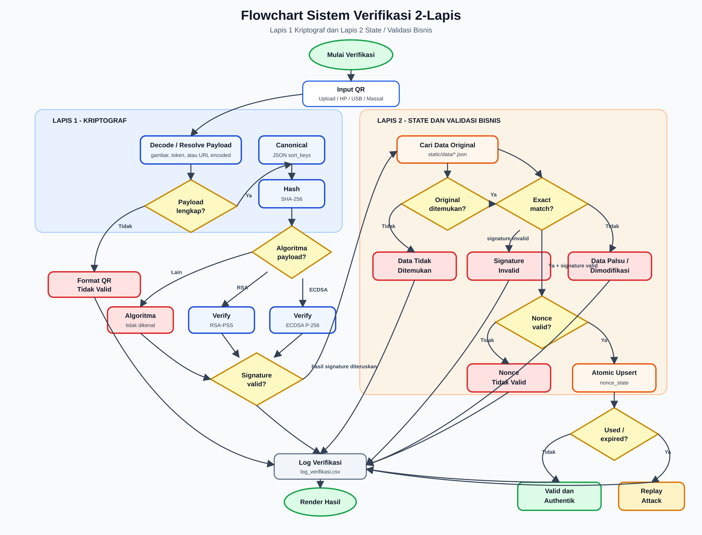

Gambar di atas memperlihatkan pemisahan lapis kriptograf dan lapis state/validasi bisnis. Pemisahan ini mencegah status data palsu salah diklasifikasikan sebagai replay attack.


### 8.3 Prinsip Penting Flowchart 2-Lapis

| Prinsip | Penjelasan |
|---|---|
| Signature bukan satu-satunya status | Signature valid belum tentu QR valid, karena bisa replay atau expired. |
| Replay hanya untuk payload asli | Replay dihitung hanya jika data persis sama dengan original dan signature valid. |
| Data palsu diprioritaskan sebelum replay | Jika payload berubah, sistem menampilkan data palsu/modifikasi, bukan replay. |
| Nonce dicatat atomik | Scan pertama valid, scan kedua langsung replay tanpa jeda waktu. |
| Log selalu dicatat | Hasil valid, replay, data palsu, dan error masuk `log_verifikasi.csv`. |

### 8.4 Decision Table Verifikasi

| Data original | Exact match | Signature valid | Nonce valid | Usage count sebelum | Expired | Status akhir |
|---|---|---|---|---:|---|---|
| Tidak ada | - | Tidak | - | - | - | Data Palsu signature tidak cocok |
| Tidak ada | - | Ya | - | - | - | Data Tidak Ditemukan di Database |
| Ada | Tidak | Tidak/Ya | - | - | - | Data Telah Dimodifikasi / Data Palsu |
| Ada | Ya | Tidak | - | - | - | Signature Invalid |
| Ada | Ya | Ya | Tidak | - | - | Nonce tidak valid |
| Ada | Ya | Ya | Ya | 0 | Tidak | Valid dan Authentik |
| Ada | Ya | Ya | Ya | >= 1 | Tidak/Ya | Replay Attack |
| Ada | Ya | Ya | Ya | 0 | Ya | Replay Attack / expired usage |

Catatan: pada implementasi saat ini, payload expired masuk ke cabang replay karena QR tidak lagi boleh dipakai sebagai verifikasi pertama yang valid setelah melewati batas waktu.

### 8.5 Flowchart Klasifikasi Replay dan Data Palsu

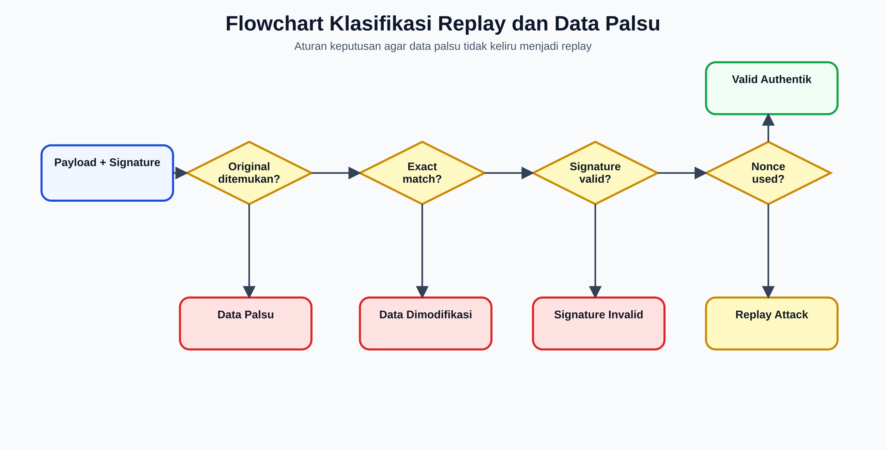

Gambar di atas menegaskan aturan bahwa payload yang berubah diklasifikasikan sebagai data palsu/dimodifikasi sebelum diperiksa sebagai replay.


---

## 9. Flowchart Verifikasi Massal

### 9.1 Verifikasi Massal Langsung dan Async

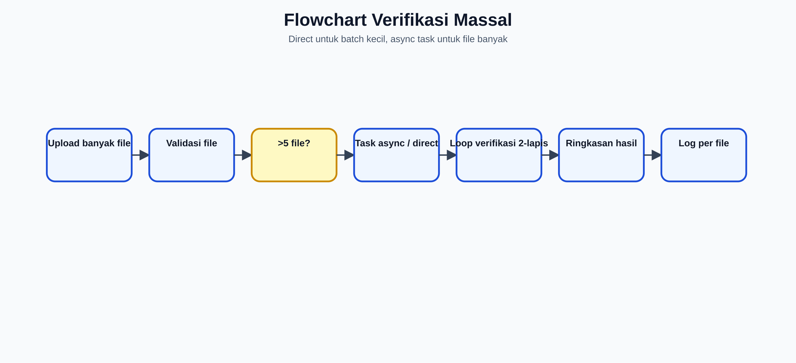

Gambar di atas memperlihatkan keputusan direct processing untuk batch kecil dan async task untuk jumlah file yang lebih besar.


### 9.2 Output Verifikasi Massal

| Output | Isi |
|---|---|
| Ringkasan | total file, berhasil, error, replay count, success rate. |
| Timing | total load, decode, verify, DB, rata-rata, min, max. |
| Detail per file | filename, status, data, perubahan, signature, total time. |
| Log | Satu baris `log_verifikasi.csv` per file. |
| Task snapshot | JSON hasil dan metadata jika async. |

---

## 10. Flowchart Kamera HP dan Scanner USB

### 10.1 Kamera HP

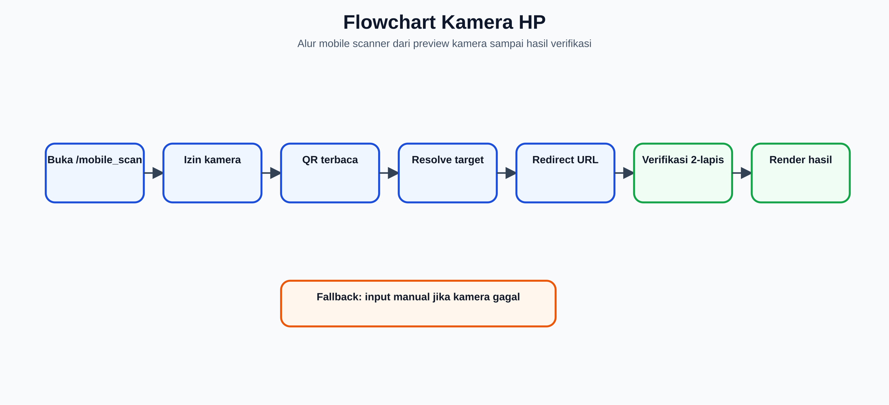

Gambar di atas menjelaskan alur mobile scanner dari izin kamera, QR terbaca, resolve target, redirect, sampai hasil verifikasi.


### 10.2 Scanner USB / Direct Scanner

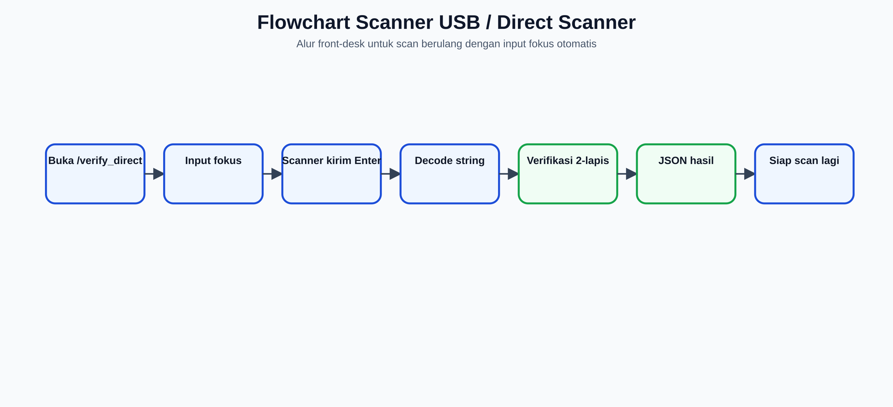

Gambar di atas menjelaskan alur scanner USB/front-desk dengan input fokus otomatis untuk scan berulang.


---

## 11. Entity Relationship Diagram (ERD)

### 11.1 Catatan ERD

Sistem saat ini tidak memakai satu database relasional untuk seluruh data. Karena itu ERD berikut adalah **ERD logis**, yaitu representasi relasi antar-entitas data walaupun storage fisiknya berupa SQLite, CSV, JSON, dan file PNG.

Pemetaan storage:

| Entitas Logis | Storage Fisik |
|---|---|
| QRData | `static/data/*.json` |
| QRArtifact | `static/qr`, `static/qr_massal`, `static/uploads`, `static/qr_fake` |
| VerifyPayload | `data/verify_payloads/<shard>/<token>.json` |
| NonceState | `logs/security_state.db` tabel `nonce_state` |
| SecurityMetadata | `logs/security_state.db` tabel `security_metadata` |
| GenerateLog | `logs/log_generate.csv` |
| VerifyLog | `logs/log_verifikasi.csv` |
| AuditLog | `logs/audit_log.csv` |
| TaskMetadata | `data/task_metadata/*.json` |
| TaskResult | `data/task_results/*.json` |
| QRStats | `logs/qr_stats.json` |

### 11.2 ERD Logis Sistem

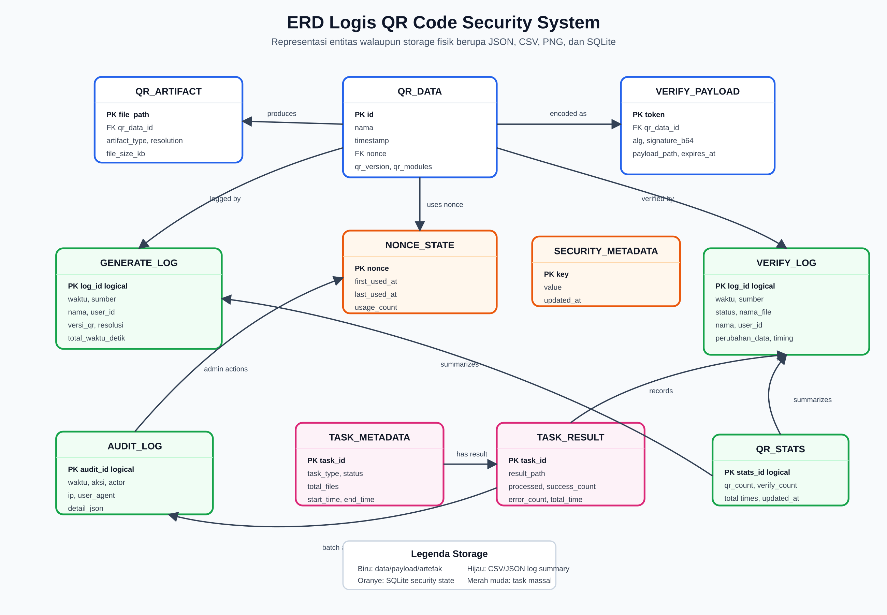

Gambar di atas adalah ERD logis yang menggambarkan relasi data utama walaupun storage fisik sistem masih berbentuk hybrid: JSON, CSV, PNG, dan SQLite.


### 11.3 ERD Fisik SQLite Saat Ini

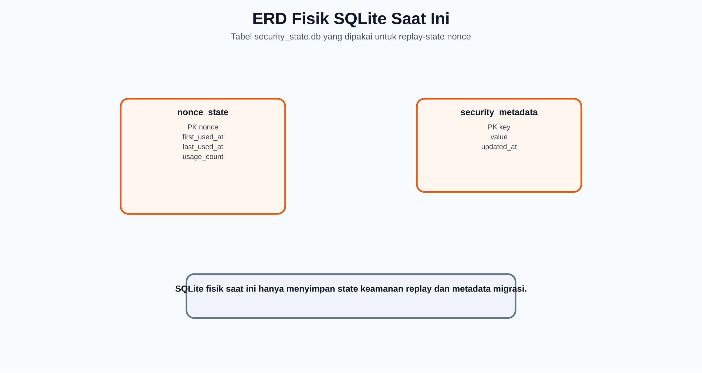

Gambar di atas memperlihatkan dua tabel fisik SQLite yang saat ini dipakai untuk replay-state dan metadata keamanan.

SQLite saat ini hanya menyimpan replay-state dan metadata keamanan.


DDL aktual:

```sql
CREATE TABLE IF NOT EXISTS nonce_state (
    nonce TEXT PRIMARY KEY,
    first_used_at TEXT NOT NULL,
    last_used_at TEXT NOT NULL,
    usage_count INTEGER NOT NULL DEFAULT 1
);

CREATE INDEX IF NOT EXISTS idx_nonce_last_used
ON nonce_state(last_used_at);

CREATE TABLE IF NOT EXISTS security_metadata (
    key TEXT PRIMARY KEY,
    value TEXT NOT NULL,
    updated_at TEXT NOT NULL
);
```

---

## 12. Data Dictionary

### 12.1 QR_DATA

| Field | Tipe | Keterangan |
|---|---|---|
| `id` | string | ID user/peserta pada QR. |
| `nama` | string | Nama user/peserta. |
| `timestamp` | datetime ISO-8601 | Waktu QR dibuat. |
| `nonce` | string hex | Nonce unik 8 karakter hex. |
| `qr_version` | integer | Versi QR hasil render. |
| `qr_modules` | integer | Jumlah modul QR. |
| `data_file_path` | string | Lokasi JSON original. |

### 12.2 VERIFY_PAYLOAD

| Field | Tipe | Keterangan |
|---|---|---|
| `token` | string | Token URL pendek `/v/<token>`. |
| `data` | object | Data QR original. |
| `signature` | string base64 | Signature digital. |
| `alg` | string | RSA atau ECDSA. |
| `metadata` | object | Algorithm, key_size, hash, salt, MGF. |
| `payload_path` | string | Lokasi JSON payload token. |

### 12.3 NONCE_STATE

| Field | Tipe | Keterangan |
|---|---|---|
| `nonce` | TEXT | Primary key nonce. |
| `first_used_at` | TEXT ISO-8601 UTC | Waktu pertama nonce diverifikasi. |
| `last_used_at` | TEXT ISO-8601 UTC | Waktu terakhir nonce diverifikasi. |
| `usage_count` | INTEGER | Jumlah penggunaan/verifikasi nonce. |

### 12.4 GENERATE_LOG

| Field | Keterangan |
|---|---|
| `Sumber` | Tunggal, Massal, atau sumber generate lain. |
| `Waktu` | Timestamp UTC. |
| `Nama` | Nama pada QR. |
| `ID` | ID pada QR. |
| `Versi QR` | QR version. |
| `Modul` | Jumlah modul QR. |
| `Resolusi` | Resolusi PNG. |
| `Ukuran File (KB)` | Ukuran file QR. |
| `Panjang Signature` | Panjang signature base64. |
| `Waktu Data (detik)` | Durasi persiapan data. |
| `Waktu Sign (detik)` | Durasi signing. |
| `Waktu QR (detik)` | Durasi render QR. |
| `Waktu Save (detik)` | Durasi simpan file. |
| `Total Waktu (detik)` | Total durasi generate. |

### 12.5 VERIFY_LOG

| Field | Keterangan |
|---|---|
| `Sumber` | Tunggal, Massal, Kamera HP, Direct/Scanner. |
| `Waktu` | Timestamp UTC. |
| `Nama File` | Nama file atau sumber scan. |
| `Status` | Valid, Replay, Data Palsu, Error, dan sejenisnya. |
| `Nama` | Nama dari payload jika ada. |
| `ID` | ID dari payload jika ada. |
| `Perubahan Data` | JSON field yang berubah. |
| `Waktu Load (detik)` | Durasi load file. |
| `Waktu Decode (detik)` | Durasi decode QR. |
| `Waktu Verify (detik)` | Durasi verifikasi signature. |
| `Waktu DB (detik)` | Durasi pencarian data dan nonce state. |
| `Total Waktu (detik)` | Total durasi verifikasi. |

### 12.6 AUDIT_LOG

| Field | Keterangan |
|---|---|
| `Waktu` | Timestamp UTC. |
| `Aksi` | Nama aksi admin/operator. |
| `Actor` | Aktor, default admin. |
| `IP` | IP request. |
| `User Agent` | Browser/client. |
| `Detail` | Detail JSON aksi. |

---

## 13. Rancangan Interface Route dan API

### 13.1 Route Halaman Utama

| Route | Method | Fungsi |
|---|---|---|
| `/` atau `/index` | GET | Home/index sistem. |
| `/generate_qr` | POST | Generate QR tunggal. |
| `/scanner` | GET | Scanner workspace upload tunggal/massal. |
| `/verify_qr` | POST | Verifikasi QR tunggal dari file. |
| `/verify_qr_massal` | POST | Verifikasi QR massal. |
| `/mobile_scan` | GET | Scanner kamera HP. |
| `/verify_direct` | GET | Scanner USB/webcam. |
| `/v/<token>` | GET/HEAD | Verifikasi URL pendek. |
| `/verify/<encoded_data>` | GET/HEAD | Verifikasi payload encoded. |
| `/dashboard` | GET | Dashboard statistik. |
| `/log` | GET | Log generate. |
| `/log_verifikasi` | GET | Log verifikasi. |
| `/audit_log` | GET | Audit log. |
| `/jobs` | GET | Job massal. |

### 13.2 API Pendukung

| API | Method | Fungsi |
|---|---|---|
| `/api/resolve_scan_target` | POST | Mengubah QR string hasil kamera HP menjadi URL verifikasi internal. |
| `/api/decode_qr_string` | POST | Decode dan verifikasi string QR dari scanner/direct. |
| `/api/generate_progress_status` | GET | Polling progress generate massal. |
| `/api/start_generate_process` | POST | Mulai generate massal. |
| `/api/stop_generate_process` | POST | Hentikan generate massal. |
| `/api/get_generate_results` | GET | Ambil hasil generate massal. |
| `/api/verify_massal_progress_status` | GET | Polling progress verifikasi massal. |
| `/api/start_verify_massal_process` | POST | Mulai verifikasi massal async. |
| `/api/get_verify_massal_results` | GET | Ambil hasil verifikasi massal. |
| `/api/auto_recalculate_stats` | GET | Hitung ulang statistik dari log jika diperlukan. |

---

## 14. Desain Keamanan

### 14.1 Mekanisme Kriptograf

| Komponen | Desain Saat Ini |
|---|---|
| Hash | SHA-256 atas canonical JSON `sort_keys=True`. |
| Signature utama | RSA-PSS 2048-bit dengan salt 8 byte. |
| Signature alternatif | ECDSA P-256. |
| Key file | `rsa_key.pem`, `ecdsa_key.pem`. |
| Payload metadata | algorithm, key_size, hash_function, salt_length, mgf. |

### 14.2 Mekanisme Anti-Replay

| Komponen | Desain |
|---|---|
| Nonce | 4 byte random, 8 hex character. |
| State utama | SQLite `nonce_state`. |
| Atomic update | `INSERT ... ON CONFLICT DO UPDATE`. |
| Counter | `usage_count`. |
| Backup | `logs/used_nonces.txt`. |
| Fallback lock | File `.lock` untuk file nonce. |

### 14.3 Validasi Klasifikasi

Urutan klasifikasi keamanan:

1. Decode payload.
2. Verifikasi signature.
3. Cari data original.
4. Jika data berubah, tampilkan data palsu/modifikasi.
5. Jika data original persis dan signature valid, cek nonce dan timestamp.
6. Jika nonce belum pernah dipakai dan belum expired, status valid.
7. Jika nonce sudah tercatat atau expired, status replay attack.

### 14.4 Logging Keamanan

| Log | Fungsi Keamanan |
|---|---|
| Generate log | Jejak QR yang dibuat. |
| Verify log | Jejak QR yang diverifikasi dan statusnya. |
| Audit log | Jejak aksi admin/operator. |
| App log | Debug, error, warning, dan operasi sistem. |
| Nonce backup | Jejak nonce yang pernah digunakan. |

---

## 15. Desain Error Handling

### 15.1 Error Generate

| Kondisi | Respons |
|---|---|
| Nama/ID kosong | Flash warning dan kembali ke index. |
| Gagal signing | Log error dan tampilkan error generate. |
| Gagal simpan QR/data | Log error dan tampilkan error generate. |

### 15.2 Error Verifikasi

| Kondisi | Respons |
|---|---|
| File tidak ada | Flash warning. |
| Format file tidak diizinkan | Flash danger. |
| Gambar tidak valid | Result card error. |
| QR tidak terbaca | Result card warning. |
| Payload tidak lengkap | Result card error. |
| Signature base64 rusak | Result card signature tidak valid. |
| Token QR tidak ditemukan | Halaman hasil Kamera HP dengan error. |
| Exception umum | Log error dan tampilkan pesan error. |

### 15.3 Error Storage

| Kondisi | Strategi |
|---|---|
| SQLite nonce gagal | Fallback ke file nonce dengan file-lock. |
| CSV log gagal dibaca | Dashboard tetap render data yang tersedia. |
| Payload token hilang | Status token tidak ditemukan. |
| Task result hilang | Tampilkan error task/result tidak tersedia. |

---

## 16. Non-Functional Requirement Design

### 16.1 Performance

| Requirement | Desain |
|---|---|
| Pengukuran durasi detail | Timer `time.perf_counter()` untuk generate/verifikasi. |
| Dashboard metrik | Median, mean, P95, P99, outlier, throughput estimasi. |
| Massal besar | Background thread untuk file lebih dari 5. |
| Payload URL pendek | Token storage agar QR lebih kecil dan mudah discan kamera HP. |

### 16.2 Reliability

| Requirement | Desain |
|---|---|
| Replay state tahan paralel | SQLite WAL + lock aplikasi. |
| Task durable | Snapshot JSON task result/metadata. |
| Log tetap tersedia | CSV append-only. |
| App log rotasi | Rotating file 1 MB, 10 backup. |

### 16.3 Maintainability

| Requirement | Desain |
|---|---|
| Route jelas | Route dibagi berdasarkan generate, scanner, log, dashboard, testing. |
| Template terpisah | HTML per halaman. |
| Storage sederhana | File/CSV/JSON mudah dibaca admin. |
| Dokumentasi | Dokumen kebutuhan, storage, UI/UX, dan SDD. |

### 16.4 Security

| Requirement | Desain |
|---|---|
| Session security | Session lifetime, HttpOnly, SameSite, optional Secure cookie. |
| Rate limiting | Flask-Limiter untuk route tertentu. |
| Input validation | Validasi ekstensi, ukuran upload, filename sanitization. |
| Signature verification | RSA-PSS/ECDSA dengan SHA-256. |
| Replay protection | Nonce state SQLite. |

---

## 17. Rekomendasi Penguatan Desain

### 17.1 Database dan Storage

| Rekomendasi | Alasan |
|---|---|
| Migrasi log generate/verifikasi/audit ke SQLite/PostgreSQL | Query lebih kuat, concurrency lebih aman. |
| Tambahkan `event_id` pada semua log | Audit dan deduplikasi lebih mudah. |
| Tambahkan `status_code` terstruktur | Statistik status lebih akurat. |
| Tambahkan hash chain untuk audit log | Membuat log tamper-evident. |
| Tambahkan stale-lock recovery | Mencegah lock file sisa crash. |

### 17.2 Kriptograf dan Kepatuhan

| Rekomendasi | Alasan |
|---|---|
| Tambahkan `key_id` pada payload | Mendukung rotasi key. |
| Tambahkan certificate chain X.509 | Menuju verifikasi offline dan PKI. |
| Tambahkan envelope DigSig | Mendekatkan sistem ke ISO/IEC 20248. |
| Perbesar nonce menjadi minimal 128-bit | Mengurangi risiko collision. |
| Pisahkan mode QR online dan offline | Replay online dan verifikasi offline punya kebutuhan berbeda. |

### 17.3 UI/UX dan Operasional

| Rekomendasi | Alasan |
|---|---|
| Komponen status verifikasi reusable | Konsistensi label valid/replay/palsu. |
| Filter cepat status di log verifikasi | Audit lebih cepat. |
| Role-based dashboard | Admin/operator/auditor melihat data relevan. |
| Health check storage | Deteksi masalah CSV/SQLite/payload token. |

---

## 18. Acceptance Criteria SDD

| ID | Kriteria |
|---|---|
| SDD-01 | DFD Level 0 menjelaskan hubungan sistem dengan admin, petugas, auditor, dan storage. |
| SDD-02 | DFD Level 1 memecah proses generate, verifikasi, dashboard, log, dan task massal. |
| SDD-03 | DFD Level 2 menjelaskan generate QR dan verifikasi QR. |
| SDD-04 | Flowchart verifikasi memisahkan lapis kriptograf dan lapis state/database. |
| SDD-05 | Flowchart menjelaskan kondisi valid, replay, data palsu, signature invalid, dan data tidak ditemukan. |
| SDD-06 | ERD membedakan entitas logis dan storage fisik. |
| SDD-07 | ERD fisik SQLite mencantumkan `nonce_state` dan `security_metadata`. |
| SDD-08 | Data dictionary mencakup QR data, payload, nonce, generate log, verify log, dan audit log. |
| SDD-09 | Route/API utama didokumentasikan. |
| SDD-10 | Rekomendasi penguatan desain dicantumkan untuk pengembangan berikutnya. |

---

## 19. Kesimpulan

Desain sistem QR Code Security System RSA-PSS menggunakan arsitektur web monolitik yang cukup efektif untuk kebutuhan generate, verifikasi, audit, dashboard, dan operasi massal. Sistem menggabungkan Flask sebagai aplikasi utama, engine kriptograf RSA-PSS/ECDSA, QR engine, storage file/JSON/CSV, dan SQLite untuk replay-state nonce.

Bagian paling penting dari desain adalah **sistem verifikasi 2-lapis**. Lapis pertama memverifikasi autentisitas dan integritas payload melalui signature digital. Lapis kedua memverifikasi konteks aplikasi: apakah data cocok dengan data original, apakah nonce valid, apakah nonce sudah pernah digunakan, apakah timestamp masih berlaku, dan bagaimana hasil akhir harus diklasifikasikan. Pemisahan dua lapis ini membuat sistem lebih akurat dalam membedakan QR valid, replay attack, data palsu, signature invalid, dan data tidak ditemukan.

DFD menunjukkan bahwa sistem memiliki lima proses utama: generate QR, verifikasi QR, monitoring dashboard, manajemen log/audit, dan task massal. ERD logis menunjukkan hubungan antara data QR, artefak QR, payload token, nonce state, log generate, log verifikasi, audit log, task result, dan statistik. Walaupun storage fisik masih hybrid, struktur entitasnya sudah cukup jelas untuk dikembangkan menjadi database relasional penuh pada tahap produksi berikutnya.

---

## Lampiran A - Ringkasan Diagram Siap Pakai

### A.1 DFD Level 0

```text
Admin/Operator -> QR Code Security System -> QR, hasil verifikasi, dashboard
Petugas HP     -> QR Code Security System -> hasil verifikasi
Auditor        -> QR Code Security System -> log dan laporan
System         <-> Storage lokal PNG/JSON/CSV/SQLite
```

### A.2 DFD Level 1

```text
1.0 Generate QR
2.0 Verifikasi QR
3.0 Monitoring Dashboard
4.0 Manajemen Log dan Audit
5.0 Task Massal
```

### A.3 Flowchart Verifikasi 2-Lapis

```text
Input QR
  -> decode / resolve payload
  -> Lapis 1 Kriptograf
       -> canonical JSON
       -> SHA-256
       -> verify RSA-PSS/ECDSA
  -> Lapis 2 State dan Validasi Bisnis
       -> cari original data
       -> bandingkan field
       -> validasi nonce
       -> atomic upsert nonce_state
       -> cek replay / expired
  -> klasifikasi hasil
  -> log verifikasi
  -> tampilkan hasil
```

### A.4 ERD Utama

```text
QR_DATA
  -> QR_ARTIFACT
  -> VERIFY_PAYLOAD
  -> GENERATE_LOG
  -> VERIFY_LOG
  -> NONCE_STATE

TASK_METADATA
  -> TASK_RESULT
  -> QR_ARTIFACT / VERIFY_LOG

ADMIN_ACTOR
  -> AUDIT_LOG / GENERATE_LOG / VERIFY_LOG
```

## Lampiran B - Pernyataan Siap Pakai untuk Laporan

Dokumen Desain Sistem (SDD) QR Code Security System RSA-PSS menjelaskan rancangan sistem berbasis aplikasi web Flask dengan storage hybrid. Sistem menyimpan artefak QR dalam file PNG, data original dan payload token dalam JSON, log operasional dalam CSV, serta replay-state nonce dalam SQLite. Arsitektur ini mendukung generate QR tunggal, generate massal, verifikasi tunggal, verifikasi massal, kamera HP, scanner USB, dashboard, dan audit log.

Proses verifikasi dirancang menggunakan model 2-lapis. Lapis pertama adalah lapis kriptograf yang melakukan decoding payload, canonical serialization, hashing SHA-256, dan verifikasi signature RSA-PSS/ECDSA. Lapis kedua adalah lapis state dan validasi bisnis yang melakukan pencocokan data original, deteksi perubahan field, validasi nonce, pencatatan nonce secara atomik, pengecekan replay attack, validasi timestamp, logging, dan klasifikasi status akhir.

DFD Level 0, Level 1, dan Level 2 menggambarkan aliran data dari admin, operator, petugas lapangan, dan auditor ke proses generate, verifikasi, dashboard, manajemen log, dan task massal. ERD logis menggambarkan hubungan antara QR data, QR artifact, verify payload, nonce state, generate log, verify log, audit log, task result, dan statistik. Dengan rancangan ini, sistem memiliki dasar desain yang jelas untuk operasi saat ini dan pengembangan menuju database relasional penuh pada tahap produksi.
