# Dokumen UI/UX dan Rancangan Layout Terbaru

**Sistem:** QR Code Security System RSA-PSS  
**Domain implementasi:** `https://rsa-pss.com`  
**Lokasi kode:** `/opt/qrcode`  
**Tanggal update:** 18 Juni 2026  
**Sumber pembaruan:** implementasi halaman Flask terkini dan lampiran screenshot pada folder `Screenshoot/`  
**Tujuan dokumen:** Menjelaskan desain UI/UX terbaru, peta halaman, rancangan layout masing-masing halaman, state tampilan, serta daftar lampiran gambar untuk laporan.

---

## 1. Ringkasan Pembaruan

Dokumen UI/UX sebelumnya berfokus pada Dashboard dan Scanner Workspace. Setelah perubahan sistem, cakupan antarmuka bertambah dan kini mencakup halaman autentikasi, generator QR, generator CSV, modifikasi QR, job massal, security profile, audit log, benchmark, verifikasi massal asynchronous, dan modul automated testing.

Pembaruan utama yang didokumentasikan:

| Area | Perubahan UI/UX |
|---|---|
| Navigasi utama | Home menjadi pusat akses fitur, dengan shortcut ke generator, scanner, dashboard, log, audit, job, dan testing. |
| Dashboard | KPI operasional, performa generate, performa verifikasi, statistik file, analisis performa, dan metodologi ditampilkan dalam satu halaman monitoring. |
| Scanner | Workspace verifikasi kini memuat upload tunggal, upload massal, shortcut scanner HP, scanner USB, log verifikasi, dan dashboard. |
| Generator | QR Generator mendukung tab generate tunggal dan generate massal dari CSV. |
| CSV Generator | Halaman khusus membuat template CSV dan konfigurasi data massal. |
| Log | Log Generate dan Log Verifikasi memakai ringkasan statistik, filter, tabel lebar, pagination, dan export. |
| Admin dan audit | Security Profile, Audit Log, dan Jobs Massal memberi kontrol administrasi dan bukti aktivitas. |
| Testing | Modul Automated Testing memiliki dashboard, konfigurasi test, history, comprehensive test, dan calibration page. |

---

## 2. Prinsip Desain UI/UX Terbaru

### 2.1 Prinsip Operasional

Antarmuka dirancang sebagai aplikasi kerja admin/operator, bukan landing page promosi. Halaman menggunakan pola yang konsisten:

1. Header halaman dengan judul, deskripsi singkat, dan tombol kembali.
2. Area aksi utama di viewport awal.
3. Ringkasan status atau statistik di bagian atas.
4. Detail teknis, tabel, metodologi, atau riwayat di bagian bawah.
5. Tombol aksi sekunder ditempatkan dekat konteksnya.

### 2.2 Prinsip Navigasi

| Elemen | Aturan terbaru |
|---|---|
| Home | Mengarah ke `/` sebagai pusat fitur. |
| Dashboard | Dipakai untuk monitoring statistik, bukan tempat input data. |
| Scanner | Menjadi workspace semua metode verifikasi QR. |
| Log | Dibedakan antara Log Generate dan Log Verifikasi. |
| Testing | Berada pada namespace `/testing/` dan memakai layout testing dengan sidebar. |
| Error page | Menampilkan kode error dan pesan singkat untuk kondisi route tidak valid. |

### 2.3 Prinsip Status Visual

| Status | Tampilan | Makna UX |
|---|---|---|
| Valid | Badge hijau | QR asli dan verifikasi berhasil. |
| Replay | Badge kuning atau info | QR asli tetapi nonce sudah pernah digunakan. |
| Invalid | Badge merah | Data tidak valid, signature gagal, atau QR tidak sesuai. |
| Processing | Progress bar atau status biru | Proses batch sedang berjalan. |
| Empty state | Pesan kosong atau tabel tanpa data | Belum ada aktivitas atau job aktif. |
| Error | Halaman error atau alert merah | Proses tidak dapat dilanjutkan. |

### 2.4 Prinsip Responsif

| Viewport | Pola layout |
|---|---|
| Desktop | Container tengah, grid kartu 2 sampai 4 kolom, tabel horizontal, full-page screenshot untuk laporan. |
| Tablet | Kartu berpindah ke 2 kolom, tombol tetap mudah ditekan. |
| Mobile | Panel stack vertikal, tombol full-width, scanner HP memprioritaskan kamera dan status scan. |

---

## 3. Peta Informasi Sistem

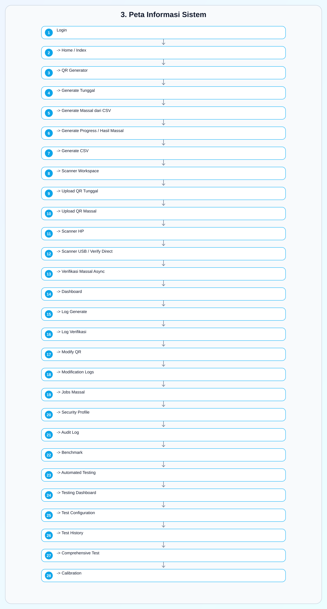

Gambar di atas adalah versi grafis dari rancangan `3. Peta Informasi Sistem`; blok wireframe teks telah diganti agar dokumen Word menampilkan layout visual.

---

## 4. Daftar Halaman dan Lampiran Screenshot

| No | Halaman | Route | Screenshot | Fungsi |
|---|---|---|---|---|
| 00 | Login | `/login` | `../Screenshoot/00_login.jpg` | Autentikasi awal. |
| 01 | Home / Index | `/` | `../Screenshoot/01_home_index.jpg` | Pusat navigasi fitur. |
| 02 | Dashboard | `/dashboard` | `../Screenshoot/02_dashboard.jpg` | Monitoring statistik dan performa. |
| 03 | QR Generator | `/qr_generator` | `../Screenshoot/03_qr_generator.jpg` | Generate QR tunggal dan massal. |
| 04 | Generate CSV | `/generate_csv` | `../Screenshoot/04_generate_csv.jpg` | Membuat template/data CSV. |
| 05 | Scanner Workspace | `/scanner` | `../Screenshoot/05_scanner_workspace.jpg` | Verifikasi QR file tunggal dan massal. |
| 06 | Scanner HP | `/scan_hp` | `../Screenshoot/06_scanner_hp_mobile.jpg` | Scan QR melalui kamera HP. |
| 07 | Scanner USB | `/verify_direct` | `../Screenshoot/07_scanner_usb_verify_direct.jpg` | Input scanner USB/webcam/manual. |
| 08 | Modify QR | `/modify_qr_page` | `../Screenshoot/08_modify_qr.jpg` | Simulasi perubahan/pemalsuan QR. |
| 09 | Modification Logs | `/modification_logs` | `../Screenshoot/09_modification_logs.jpg` | Riwayat modifikasi QR. |
| 10 | Jobs Massal | `/jobs` | `../Screenshoot/10_jobs_massal.jpg` | Daftar pekerjaan batch. |
| 11 | Security Profile | `/security_profile` | `../Screenshoot/11_security_profile.jpg` | Status teknis keamanan. |
| 12 | Audit Log | `/audit_log` | `../Screenshoot/12_audit_log.jpg` | Audit aktivitas admin/operator. |
| 13 | Log Generate | `/log` | `../Screenshoot/13_log_generate.jpg` | Riwayat generate QR. |
| 14 | Log Verifikasi | `/log_verifikasi` | `../Screenshoot/14_log_verifikasi.jpg` | Riwayat verifikasi QR. |
| 15 | Benchmark | `/benchmark` | `../Screenshoot/15_benchmark.jpg` | Pengujian performa algoritma. |
| 16 | Verifikasi Massal Async | `/verify_massal_async` | `../Screenshoot/16_verify_massal_async.jpg` | Upload batch dengan progress. |
| 17 | Testing Dashboard | `/testing/` | `../Screenshoot/17_testing_dashboard.jpg` | Dashboard automated testing. |
| 18 | Config Normal Operations | `/testing/test_config/normal_operations` | `../Screenshoot/18_testing_config_normal_operations.jpg` | Konfigurasi test operasi normal. |
| 19 | Config Replay Attack | `/testing/test_config/replay_attack` | `../Screenshoot/19_testing_config_replay_attack.jpg` | Konfigurasi simulasi replay. |
| 20 | Config Data Tampering | `/testing/test_config/data_tampering` | `../Screenshoot/20_testing_config_data_tampering.jpg` | Konfigurasi deteksi perubahan data. |
| 21 | Config Signature Forgery | `/testing/test_config/signature_forgery` | `../Screenshoot/21_testing_config_signature_forgery.jpg` | Konfigurasi percobaan signature palsu. |
| 22 | Config Stress Test | `/testing/test_config/stress_test` | `../Screenshoot/22_testing_config_stress_test.jpg` | Konfigurasi stress test simulasi. |
| 23 | Config Real HTTP Stress Test | `/testing/test_config/real_http_stress_test` | `../Screenshoot/23_testing_config_real_http_stress_test.jpg` | Konfigurasi stress test endpoint nyata. |
| 24 | Testing History | `/testing/history` | `../Screenshoot/24_testing_history.jpg` | Riwayat sesi testing. |
| 25 | Comprehensive Test | `/testing/comprehensive_test` | `../Screenshoot/25_testing_comprehensive_test.jpg` | Runner test komprehensif. |
| 26 | Calibration | `/testing/calibration` | `../Screenshoot/26_testing_calibration.jpg` | Kalibrasi performa sistem. |
| 27 | Error 404 | route tidak tersedia | `../Screenshoot/27_error_404.jpg` | Tampilan halaman tidak ditemukan. |

---

## 5. Rancangan Layout Per Halaman

### 5.1 Login

**Tujuan:** Memberikan gerbang autentikasi sederhana sebelum pengguna masuk ke sistem.

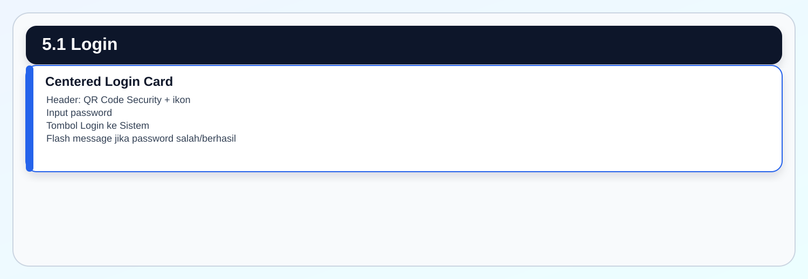

Gambar di atas adalah versi grafis dari rancangan `5.1 Login`; blok wireframe teks telah diganti agar dokumen Word menampilkan layout visual.

**Komponen utama:** login card, password field, tombol submit, alert.  
**Catatan UX:** form berada di tengah viewport sehingga fokus pengguna langsung ke aksi login.

### 5.2 Home / Index

**Tujuan:** Menjadi pusat navigasi semua fitur operasional.

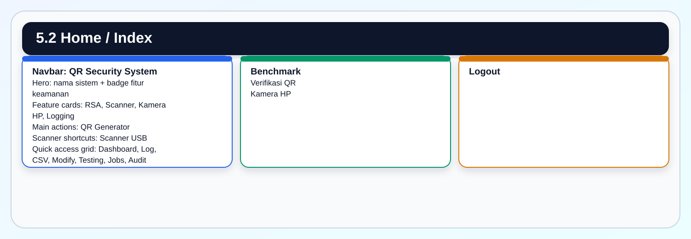

Gambar di atas adalah versi grafis dari rancangan `5.2 Home / Index`; blok wireframe teks telah diganti agar dokumen Word menampilkan layout visual.

**Komponen utama:** navbar, hero visual, kartu fitur, action cards, shortcut grid.  
**Catatan UX:** halaman ini mengutamakan pemilihan fitur, bukan input data.

### 5.3 Dashboard

**Tujuan:** Monitoring statistik generate, verifikasi, performa, file, dan kualitas response time.

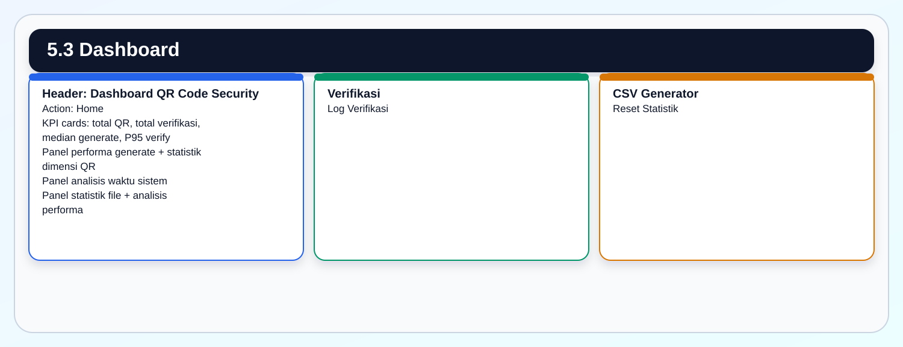

Gambar di atas adalah versi grafis dari rancangan `5.3 Dashboard`; blok wireframe teks telah diganti agar dokumen Word menampilkan layout visual.

**Komponen utama:** KPI card, progress bar, metric panel, action button, metodologi.  
**Catatan UX:** metrik operasional dan metrik performa dipisahkan agar pembaca laporan tidak salah menafsirkan data.

### 5.4 QR Generator

**Tujuan:** Membuat QR Code bertanda tangan digital secara tunggal atau massal.

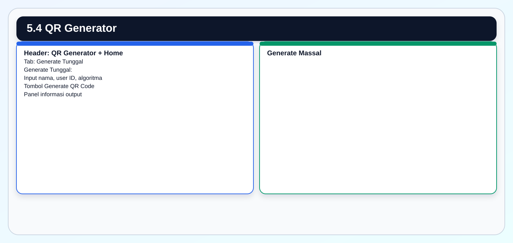

Gambar di atas adalah versi grafis dari rancangan `5.4 QR Generator`; blok wireframe teks telah diganti agar dokumen Word menampilkan layout visual.

**Komponen utama:** tab, form input, upload area, radio/select algoritma, info panel.  
**Catatan UX:** mode tunggal dan massal dipisahkan dalam tab supaya operator tidak salah memilih workflow.

### 5.5 Generate CSV

**Tujuan:** Membantu pengguna menyiapkan data CSV untuk generate QR massal.

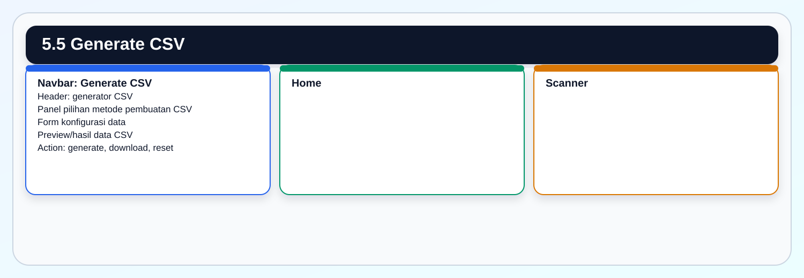

Gambar di atas adalah versi grafis dari rancangan `5.5 Generate CSV`; blok wireframe teks telah diganti agar dokumen Word menampilkan layout visual.

**Komponen utama:** navbar, form konfigurasi, tabel/preview, tombol download.  
**Catatan UX:** halaman ini menjadi pendukung workflow massal sebelum masuk ke QR Generator.

### 5.6 Scanner Workspace

**Tujuan:** Menjadi workspace verifikasi QR berbasis upload file.

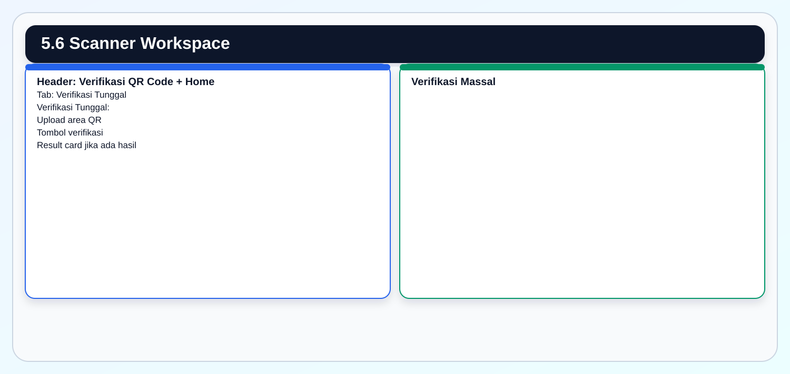

Gambar di atas adalah versi grafis dari rancangan `5.6 Scanner Workspace`; blok wireframe teks telah diganti agar dokumen Word menampilkan layout visual.

**Komponen utama:** upload file, tab mode, hasil valid/invalid/replay, shortcut.  
**Catatan UX:** status hasil harus tampil lebih dominan daripada detail teknis.

### 5.7 Scanner HP

**Tujuan:** Memfasilitasi scan QR melalui kamera HP.

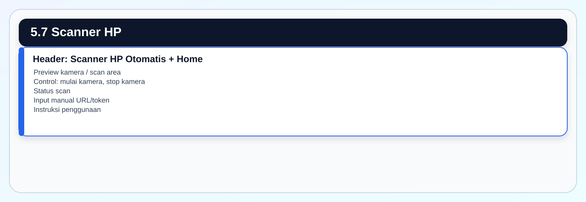

Gambar di atas adalah versi grafis dari rancangan `5.7 Scanner HP`; blok wireframe teks telah diganti agar dokumen Word menampilkan layout visual.

**Komponen utama:** camera preview, tombol kontrol, status text, manual input.  
**Catatan UX:** untuk mobile, kamera dan status berada di atas agar pengguna lapangan tidak perlu scroll panjang.

### 5.8 Scanner USB / Verify Direct

**Tujuan:** Memverifikasi QR dari barcode scanner USB, webcam, atau input langsung.

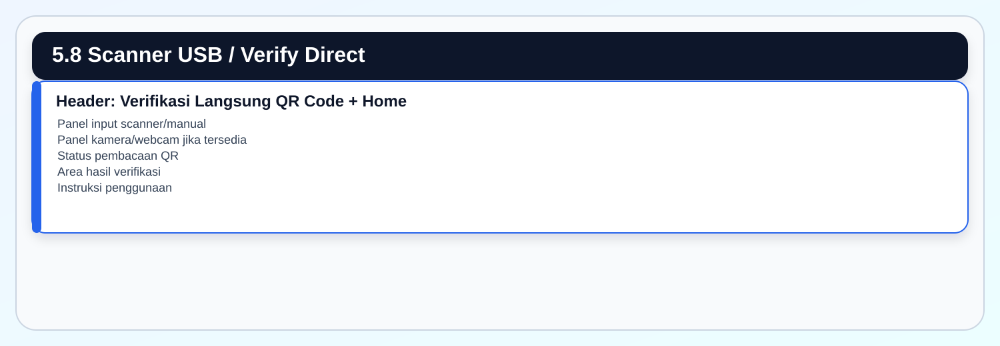

Gambar di atas adalah versi grafis dari rancangan `5.8 Scanner USB / Verify Direct`; blok wireframe teks telah diganti agar dokumen Word menampilkan layout visual.

**Komponen utama:** input text, tombol verifikasi, status scanner, result card.  
**Catatan UX:** halaman ini cocok untuk loket/operator karena fokus pada input cepat.

### 5.9 Modify QR

**Tujuan:** Menyediakan alat uji untuk membuat perubahan data QR dan melihat dampaknya terhadap verifikasi.

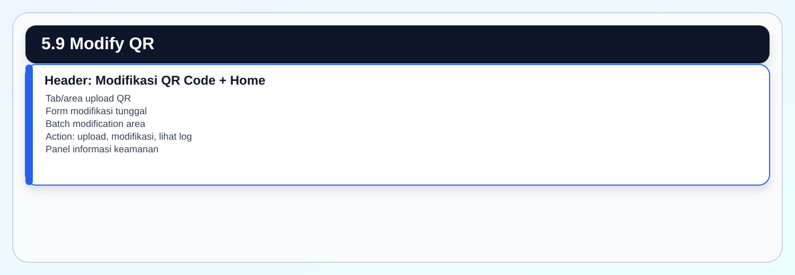

Gambar di atas adalah versi grafis dari rancangan `5.9 Modify QR`; blok wireframe teks telah diganti agar dokumen Word menampilkan layout visual.

**Komponen utama:** upload QR, form perubahan data, batch upload, link logs.  
**Catatan UX:** fungsi ini bersifat testing/security, sehingga tombol dan konteks harus jelas agar tidak disalahgunakan dalam operasi normal.

### 5.10 Modification Logs

**Tujuan:** Menampilkan riwayat modifikasi QR tunggal dan batch.

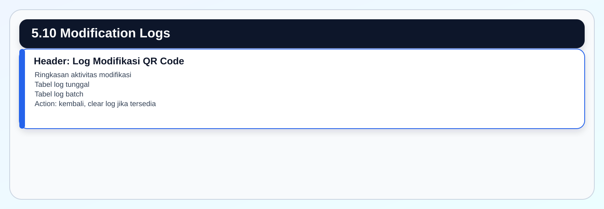

Gambar di atas adalah versi grafis dari rancangan `5.10 Modification Logs`; blok wireframe teks telah diganti agar dokumen Word menampilkan layout visual.

**Komponen utama:** tabel log, badge status, detail perubahan.  
**Catatan UX:** riwayat modifikasi membantu membedakan data palsu hasil uji dari data operasional.

### 5.11 Jobs Massal

**Tujuan:** Menampilkan daftar pekerjaan batch generate/verifikasi.

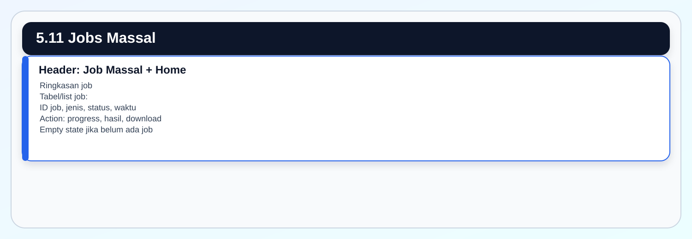

Gambar di atas adalah versi grafis dari rancangan `5.11 Jobs Massal`; blok wireframe teks telah diganti agar dokumen Word menampilkan layout visual.

**Komponen utama:** list job, badge status, tombol progress/result/download.  
**Catatan UX:** job batch harus mudah dilacak tanpa harus mengingat task ID.

### 5.12 Security Profile

**Tujuan:** Menampilkan konfigurasi dan status teknis keamanan.

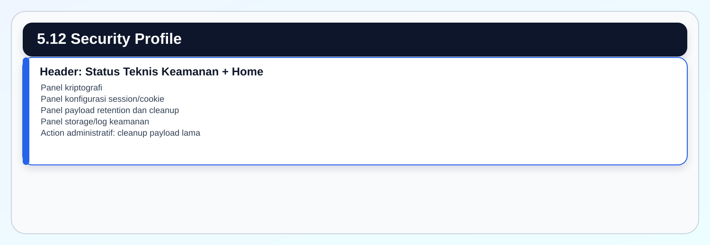

Gambar di atas adalah versi grafis dari rancangan `5.12 Security Profile`; blok wireframe teks telah diganti agar dokumen Word menampilkan layout visual.

**Komponen utama:** kartu status, checklist konfigurasi, tombol cleanup.  
**Catatan UX:** halaman ini dirancang untuk admin teknis dan auditor, bukan operator harian.

### 5.13 Audit Log

**Tujuan:** Menampilkan riwayat aktivitas admin/operator.

Gambar di atas adalah versi grafis dari rancangan `5.13 Audit Log`; blok wireframe teks telah diganti agar dokumen Word menampilkan layout visual.

**Komponen utama:** tabel audit, filter page/per page, pagination.  
**Catatan UX:** detail panjang seperti user agent perlu tetap bisa dibaca tanpa merusak layout tabel.

### 5.14 Log Generate

**Tujuan:** Menampilkan riwayat generate QR dan metrik waktu.

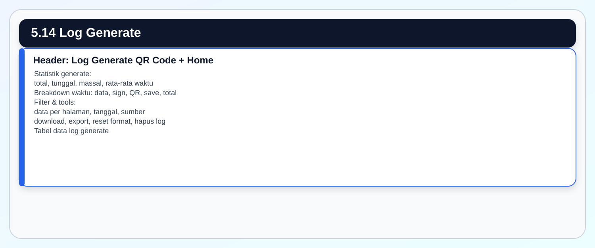

Gambar di atas adalah versi grafis dari rancangan `5.14 Log Generate`; blok wireframe teks telah diganti agar dokumen Word menampilkan layout visual.

**Komponen utama:** stat cards, filter, tool buttons, tabel horizontal, QR preview.  
**Catatan UX:** tabel dibuat lebar dan dapat digeser karena kolom teknis cukup banyak.

### 5.15 Log Verifikasi

**Tujuan:** Menampilkan riwayat verifikasi QR dan klasifikasi status.

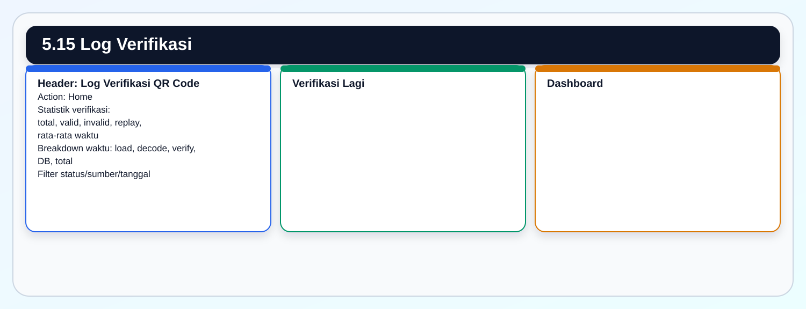

Gambar di atas adalah versi grafis dari rancangan `5.15 Log Verifikasi`; blok wireframe teks telah diganti agar dokumen Word menampilkan layout visual.

**Komponen utama:** stat cards, status badge, filter, table, export.  
**Catatan UX:** status valid/replay/invalid harus selalu terlihat eksplisit sebagai label teks, bukan hanya warna.

### 5.16 Benchmark

**Tujuan:** Menjalankan dan menampilkan benchmarking algoritma.

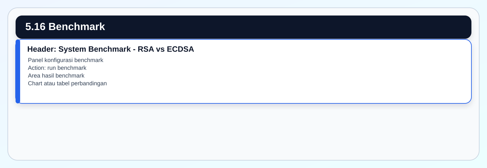

Gambar di atas adalah versi grafis dari rancangan `5.16 Benchmark`; blok wireframe teks telah diganti agar dokumen Word menampilkan layout visual.

**Komponen utama:** form benchmark, tombol run, hasil metrik.  
**Catatan UX:** halaman ini bersifat teknis sehingga dapat memakai label metrik lebih detail.

### 5.17 Verifikasi Massal Async

**Tujuan:** Memulai verifikasi massal dengan progress tracking.

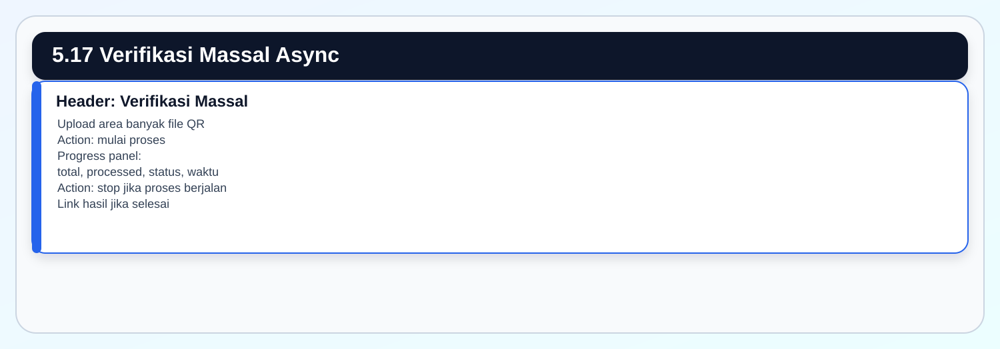

Gambar di atas adalah versi grafis dari rancangan `5.17 Verifikasi Massal Async`; blok wireframe teks telah diganti agar dokumen Word menampilkan layout visual.

**Komponen utama:** multi-file upload, progress bar, status polling, tombol stop.  
**Catatan UX:** pengguna perlu melihat status real-time agar proses batch tidak terasa macet.

### 5.18 Testing Dashboard

**Tujuan:** Menjadi pusat automated testing.

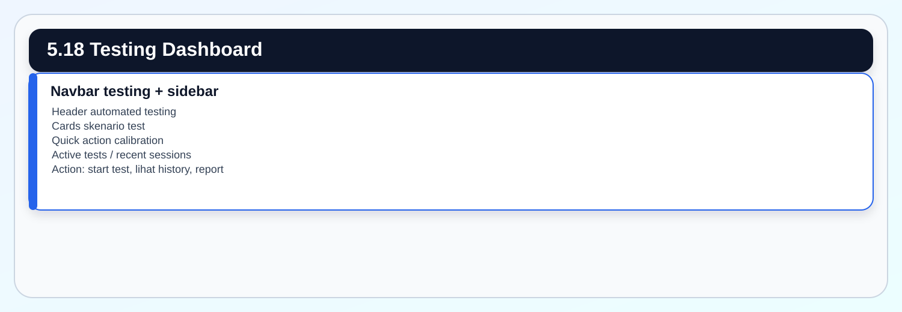

Gambar di atas adalah versi grafis dari rancangan `5.18 Testing Dashboard`; blok wireframe teks telah diganti agar dokumen Word menampilkan layout visual.

**Komponen utama:** sidebar, cards test, active tests, recent sessions.  
**Catatan UX:** modul testing memakai layout berbeda dari aplikasi utama karena kebutuhan navigasi antar test lebih padat.

### 5.19 Testing Configuration Pages

**Tujuan:** Mengatur parameter setiap skenario test sebelum dijalankan.

Skenario yang memiliki layout sama:

| Route | Fokus test |
|---|---|
| `/testing/test_config/normal_operations` | Signing dan verification normal. |
| `/testing/test_config/replay_attack` | Simulasi replay attack. |
| `/testing/test_config/data_tampering` | Deteksi perubahan data. |
| `/testing/test_config/signature_forgery` | Percobaan pemalsuan signature. |
| `/testing/test_config/stress_test` | Stress test simulasi. |
| `/testing/test_config/real_http_stress_test` | Stress test endpoint HTTP nyata. |

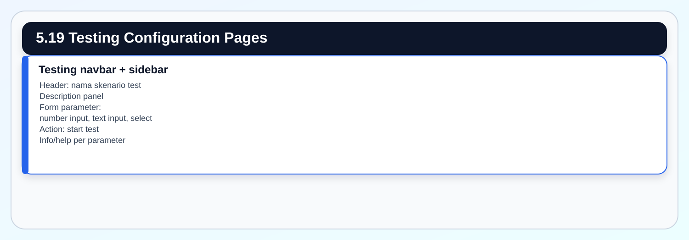

Gambar di atas adalah versi grafis dari rancangan `5.19 Testing Configuration Pages`; blok wireframe teks telah diganti agar dokumen Word menampilkan layout visual.

**Komponen utama:** form konfigurasi, default value, help text, tombol start.  
**Catatan UX:** setiap parameter perlu memiliki batas nilai agar penguji tidak menjalankan beban tidak sengaja.

### 5.20 Testing History

**Tujuan:** Melihat riwayat semua sesi automated testing.

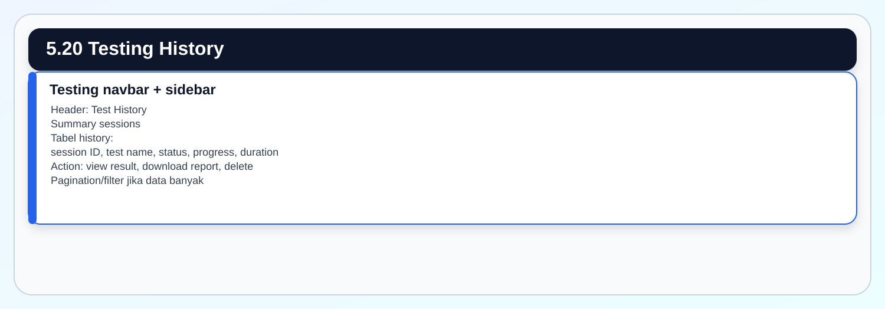

Gambar di atas adalah versi grafis dari rancangan `5.20 Testing History`; blok wireframe teks telah diganti agar dokumen Word menampilkan layout visual.

**Komponen utama:** tabel history, status badge, action button.  
**Catatan UX:** sesi lama harus tetap dapat diaudit tanpa membuka database manual.

### 5.21 Comprehensive Test

**Tujuan:** Menjalankan test suite komprehensif untuk validasi sistem.

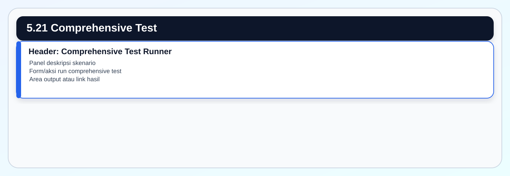

Gambar di atas adalah versi grafis dari rancangan `5.21 Comprehensive Test`; blok wireframe teks telah diganti agar dokumen Word menampilkan layout visual.

**Komponen utama:** runner panel, start button, output area.  
**Catatan UX:** halaman harus menjelaskan ringkas skenario yang akan dijalankan sebelum penguji menekan start.

### 5.22 Calibration

**Tujuan:** Mengukur dan menyimpan kalibrasi performa kriptografi.

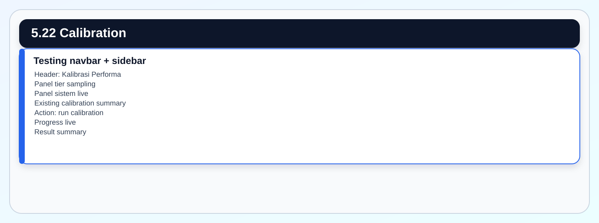

Gambar di atas adalah versi grafis dari rancangan `5.22 Calibration`; blok wireframe teks telah diganti agar dokumen Word menampilkan layout visual.

**Komponen utama:** tier cards, system info, progress, calibration result.  
**Catatan UX:** estimasi runtime harus terlihat sebelum kalibrasi dimulai karena proses dapat memakan waktu.

### 5.23 Error 404

**Tujuan:** Memberikan feedback ketika pengguna membuka route tidak tersedia.

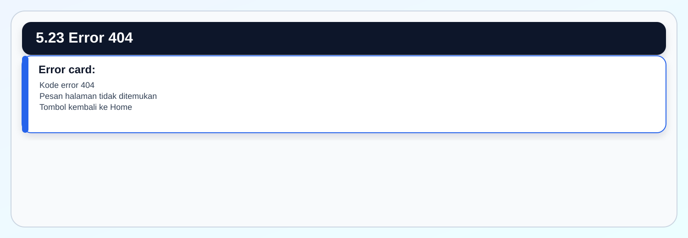

Gambar di atas adalah versi grafis dari rancangan `5.23 Error 404`; blok wireframe teks telah diganti agar dokumen Word menampilkan layout visual.

**Komponen utama:** kode error, pesan, tombol navigasi.  
**Catatan UX:** error page harus membantu pengguna kembali ke alur kerja, bukan hanya menampilkan kesalahan.

---

## 6. Pola Komponen UI

| Komponen | Penggunaan |
|---|---|
| Card | Ringkasan statistik, panel aksi, form, dan informasi teknis. |
| Badge | Status valid, invalid, replay, sumber data, versi QR, dan dimensi. |
| Tabs | Memisahkan mode tunggal dan massal. |
| Progress bar | Proses batch, dashboard metric, calibration, testing progress. |
| Table responsive | Log generate, log verifikasi, audit log, testing history. |
| Upload area | QR Generator massal, Scanner, Verify Massal Async, Modify QR. |
| Alert | Flash message, error input, informasi proses. |
| Sidebar testing | Navigasi khusus modul automated testing. |

---

## 7. State Tampilan

| State | Halaman terkait | Ekspektasi UI |
|---|---|---|
| Belum login | Semua halaman protected | Redirect ke Login dan tampilkan flash message. |
| Data kosong | Jobs, Audit, Logs, Testing History | Tampilkan empty state yang jelas. |
| Sedang proses | Generate massal, verify massal, testing, calibration | Progress bar dan status teks aktif. |
| Selesai proses | Generate/verify massal | Link hasil, download, dan ringkasan statistik. |
| Error upload | Scanner, Generator, Modify QR | Alert merah dan tetap berada di halaman yang sama. |
| Route tidak ditemukan | Error 404 | Card error dan tombol kembali. |

---

## 8. Rekomendasi Konsistensi Lanjutan

1. Samakan label tombol kembali menjadi `Home` pada semua halaman utama.
2. Pertahankan tab untuk workflow yang memiliki mode tunggal dan massal.
3. Gunakan badge teks untuk status keamanan agar tidak bergantung pada warna.
4. Pertahankan tabel log dengan horizontal scroll dan hint keyboard.
5. Tambahkan empty state eksplisit pada halaman Jobs, Logs, dan Audit ketika data tidak tersedia.
6. Pastikan tombol aksi destruktif seperti hapus log dan reset statistik memakai konfirmasi.
7. Untuk laporan, gunakan screenshot JPG dari folder `Screenshoot/` sebagai lampiran visual.

---

## 9. Checklist Review UI/UX

| Item | Ekspektasi |
|---|---|
| Login | Password field fokus dan tombol login jelas. |
| Home | Semua fitur utama bisa dicapai dalam satu halaman. |
| Dashboard | KPI, performa, dan metodologi terlihat berurutan. |
| Generator | Mode tunggal dan massal tidak bercampur. |
| Scanner | Status hasil tampil sebelum detail teknis. |
| Scanner HP | Preview kamera dan status berada di bagian atas. |
| Logs | Filter, tabel, pagination, dan export tersedia. |
| Audit | Detail aksi admin dapat ditelusuri. |
| Testing | Setiap skenario memiliki parameter dan action yang jelas. |
| Error | Pengguna dapat kembali ke Home. |

---

## 10. Pernyataan Siap Pakai untuk Laporan

Desain UI/UX terbaru QR Code Security System RSA-PSS menggunakan pola aplikasi operasional berbasis dashboard, workspace, log, dan modul testing. Home berfungsi sebagai pusat navigasi fitur, Dashboard berfungsi sebagai pusat monitoring statistik dan performa, sedangkan Scanner Workspace menjadi pusat verifikasi QR melalui upload file, verifikasi massal, scanner USB, dan kamera HP.

Setiap halaman disusun dengan hierarki yang konsisten: judul dan navigasi berada di bagian atas, aksi utama muncul pada viewport awal, status proses atau statistik ditampilkan sebelum detail teknis, dan tabel riwayat disediakan dengan filter serta pagination. Status keamanan seperti valid, replay attack, invalid, dan error ditampilkan menggunakan badge teks dan warna agar mudah dibaca oleh operator maupun auditor.

Lampiran screenshot JPG pada folder `Screenshoot/` menjadi bukti visual implementasi UI terbaru. Screenshot tersebut dapat digunakan sebagai lampiran laporan untuk menunjukkan tampilan aktual masing-masing halaman sistem.
