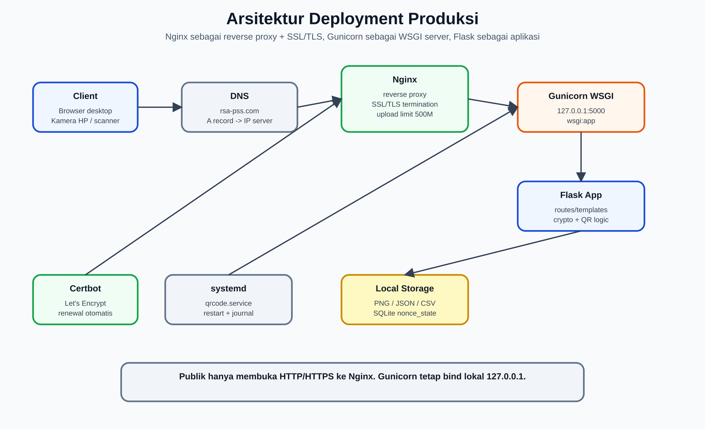
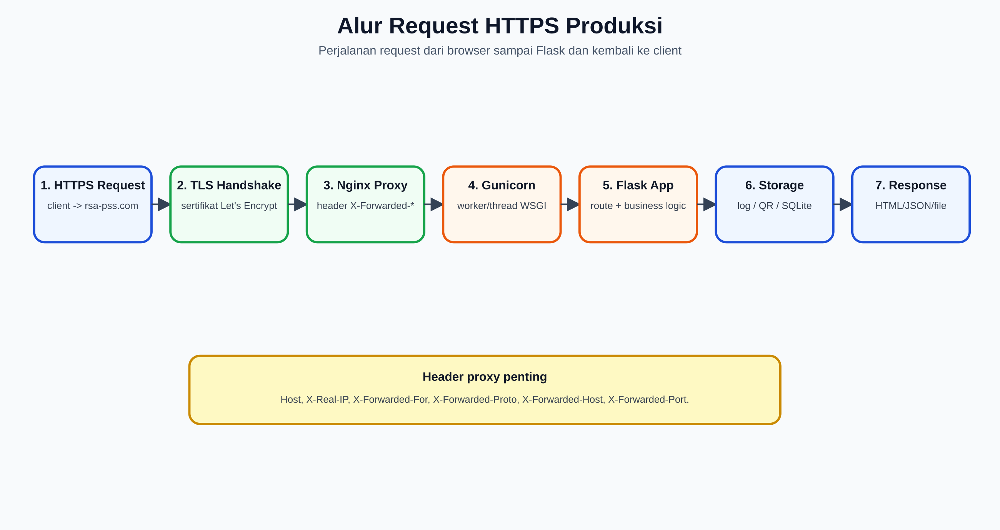
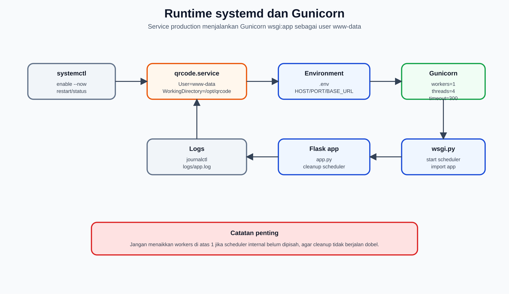
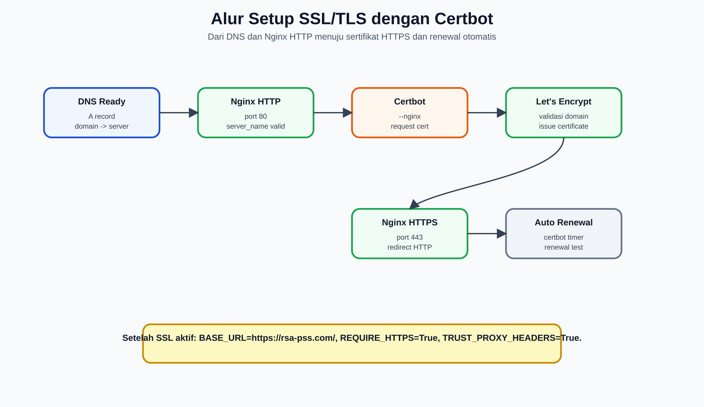
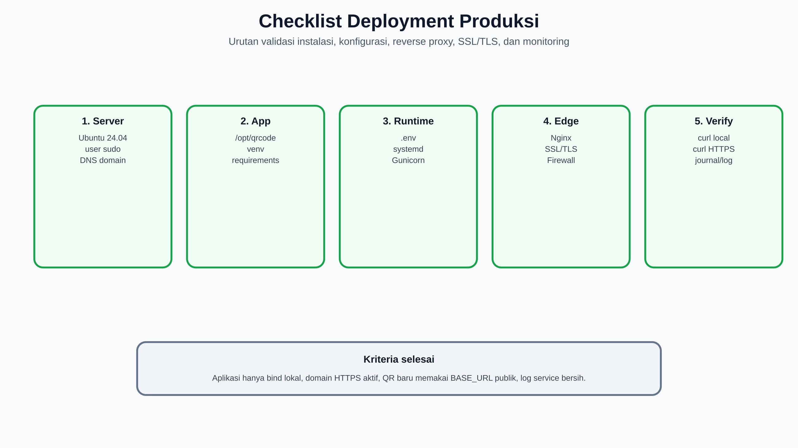

# Instalasi, Konfigurasi, dan Deployment ke Server Produksi

## Setup Web Server Nginx, Gunicorn WSGI, dan SSL/TLS

**Sistem:** QR Code Security System RSA-PSS  
**Domain implementasi:** `https://rsa-pss.com`  
**Lokasi kode:** `/opt/qrcode`  
**Tanggal penyusunan:** 16 Juni 2026  
**Tujuan dokumen:** Menjelaskan prosedur instalasi, konfigurasi, deployment produksi, reverse proxy Nginx, Gunicorn WSGI, systemd service, SSL/TLS, validasi, monitoring, backup, rollback, dan troubleshooting.

---

## 1. Ringkasan Eksekutif

QR Code Security System RSA-PSS adalah aplikasi Flask yang pada mode produksi disarankan berjalan di belakang reverse proxy. Arsitektur deployment yang digunakan adalah:

1. **Nginx** sebagai web server publik, reverse proxy, dan terminasi SSL/TLS.
2. **Gunicorn** sebagai WSGI application server yang menjalankan Flask app melalui `wsgi:app`.
3. **systemd** sebagai process manager agar service otomatis aktif setelah reboot dan restart jika gagal.
4. **Certbot/Let's Encrypt** untuk penerbitan dan pembaruan sertifikat SSL/TLS.
5. **Redis** untuk backend rate limiting Flask-Limiter.
6. **Storage lokal** untuk QR PNG, payload JSON, CSV log, SQLite nonce state, dan application log.

Repositori saat ini sudah menyediakan file pendukung deployment:

| File | Fungsi |
|---|---|
| `wsgi.py` | Entry point Gunicorn, import `app` dan menjalankan scheduler internal. |
| `run_app.sh` | Runner manual/development berbasis `python app.py`. |
| `deploy/systemd/qrcode.service` | Unit systemd produksi dengan Gunicorn. |
| `deploy/nginx/rsa-pss.com.conf` | Konfigurasi Nginx reverse proxy ke `127.0.0.1:5000`. |
| `.env.production.rsa-pss.example` | Contoh environment production. |
| `README_UBUNTU_24_04.md` | Panduan deployment Ubuntu yang sudah ada. |
| `requirements.txt` | Dependency Python, termasuk `gunicorn==23.0.0`. |

Kesimpulan desain deployment:

- Gunicorn tidak dibuka langsung ke internet; cukup bind lokal `127.0.0.1:5000`.
- Nginx menjadi endpoint publik untuk HTTP/HTTPS.
- SSL/TLS dipasang di Nginx.
- `.env` harus mengaktifkan `BASE_URL=https://rsa-pss.com/`, `REQUIRE_HTTPS=True`, dan `TRUST_PROXY_HEADERS=True`.
- `GUNICORN_WORKERS` sebaiknya tetap `1` selama scheduler internal masih aktif di `wsgi.py`, agar scheduler tidak berjalan dobel.

### 1.1 Gambar Pendukung

| Gambar | File |
|---|---|
| Arsitektur deployment produksi | `dokumen/Gambar-Asli/deployment_architecture_nginx_gunicorn_ssl.png` |
| Alur request HTTPS produksi | `dokumen/Gambar-Asli/deployment_request_flow_ssl.png` |
| Runtime systemd dan Gunicorn | `dokumen/Gambar-Asli/deployment_systemd_gunicorn_runtime.png` |
| Alur setup SSL/TLS Certbot | `dokumen/Gambar-Asli/deployment_ssl_tls_certbot_flow.png` |
| Checklist deployment produksi | `dokumen/Gambar-Asli/deployment_production_checklist.png` |

---

## 2. Arsitektur Deployment Produksi



Gambar di atas memperlihatkan struktur produksi yang disarankan. Client hanya berkomunikasi dengan Nginx melalui HTTP/HTTPS. Nginx meneruskan request ke Gunicorn yang bind lokal. Gunicorn menjalankan Flask melalui `wsgi:app`, sedangkan Flask membaca/menulis storage lokal.

### 2.1 Komponen Arsitektur

| Komponen | Fungsi | Port/Path |
|---|---|---|
| Client browser | Mengakses aplikasi, scanner HP, dashboard, log. | `https://rsa-pss.com` |
| DNS | Mengarahkan domain ke IP server. | A/AAAA record |
| Nginx | Reverse proxy, upload limit, buffering, SSL/TLS. | `80`, `443` |
| Gunicorn | WSGI server untuk Flask. | `127.0.0.1:5000` |
| Flask app | Logic generate, verifikasi, dashboard, logging. | `wsgi:app` |
| Redis | Backend rate limit. | `127.0.0.1:6379` |
| File storage | QR PNG, upload, JSON payload, log. | `/opt/qrcode` |
| SQLite | Replay-state nonce. | `logs/security_state.db` |

### 2.2 Alasan Memakai Nginx + Gunicorn

| Alasan | Penjelasan |
|---|---|
| Flask development server tidak untuk produksi | Flask sendiri memperingatkan agar development server/debugger tidak dipakai di production. |
| Gunicorn adalah WSGI server produksi | Gunicorn menjalankan aplikasi Python WSGI dengan worker/thread. |
| Nginx melindungi backend | Nginx menangani koneksi publik, buffering, TLS, header forwarding, dan upload limit. |
| SSL/TLS lebih tepat di edge | Sertifikat dan redirect HTTPS dikelola di Nginx. |
| systemd menjaga availability | Service otomatis restart jika crash dan aktif saat boot. |

Referensi resmi Gunicorn merekomendasikan menjalankan Gunicorn di belakang proxy server, dan dokumentasi Gunicorn juga memberi contoh Nginx sebagai reverse proxy. Dokumentasi Nginx menjelaskan `proxy_pass` dan pengaturan header request untuk meneruskan request ke upstream.

---

## 3. Alur Request Produksi



Alur request produksi:

1. Client membuka `https://rsa-pss.com`.
2. TLS handshake dilakukan antara client dan Nginx.
3. Nginx menerima request HTTPS dan meneruskan ke Gunicorn di `127.0.0.1:5000`.
4. Nginx mengirim header proxy seperti `Host`, `X-Real-IP`, `X-Forwarded-For`, dan `X-Forwarded-Proto`.
5. Gunicorn menjalankan `wsgi:app`.
6. Flask memproses route, menjalankan logic generate/verifikasi, lalu membaca/menulis file, CSV, JSON, atau SQLite.
7. Response dikirim kembali melalui Gunicorn ke Nginx, lalu ke client.

### 3.1 Header Proxy yang Penting

| Header | Fungsi |
|---|---|
| `Host` | Menjaga domain asli request. |
| `X-Real-IP` | Meneruskan IP client asli ke aplikasi. |
| `X-Forwarded-For` | Chain IP client/proxy. |
| `X-Forwarded-Proto` | Memberi tahu aplikasi apakah request asli `http` atau `https`. |
| `X-Forwarded-Host` | Host publik yang digunakan client. |
| `X-Forwarded-Port` | Port publik yang digunakan client. |

Karena aplikasi memiliki opsi `TRUST_PROXY_HEADERS=True` dan memakai `ProxyFix`, header ini penting agar Flask memahami request publik sebagai HTTPS dan domain `rsa-pss.com`, bukan `127.0.0.1:5000`.

---

## 4. Prasyarat Server

### 4.1 Spesifikasi Minimum

| Komponen | Minimum | Rekomendasi |
|---|---:|---:|
| OS | Ubuntu 22.04/24.04 LTS | Ubuntu 24.04 LTS |
| CPU | 2 vCPU | 4 vCPU atau lebih |
| RAM | 2 GB | 4 GB atau lebih |
| Disk | 20 GB | 40 GB atau lebih |
| Python | 3.10+ | 3.12 pada Ubuntu 24.04 |
| Network | Public IPv4 | Public IPv4 + DNS domain |

### 4.2 Paket Sistem

Paket yang dibutuhkan:

```bash
sudo apt update
sudo apt install -y \
  python3 python3-venv python3-pip python3-dev \
  build-essential pkg-config \
  libzbar0 libgl1 libglib2.0-0 \
  redis-server nginx \
  curl git rsync ufw
```

Keterangan:

| Paket | Fungsi |
|---|---|
| `python3-venv` | Membuat virtual environment Python. |
| `libzbar0` | Dependency `pyzbar` untuk decode QR. |
| `libgl1`, `libglib2.0-0` | Dependency umum OpenCV/headless image processing. |
| `redis-server` | Backend rate limiting. |
| `nginx` | Reverse proxy dan SSL/TLS endpoint. |
| `ufw` | Firewall host sederhana. |

---

## 5. Persiapan DNS dan Domain

Sebelum SSL/TLS dipasang, domain harus mengarah ke IP server.

Contoh DNS record:

```text
rsa-pss.com      A      <IP_SERVER>
www.rsa-pss.com  A      <IP_SERVER>
```

Validasi DNS:

```bash
dig +short rsa-pss.com
dig +short www.rsa-pss.com
```

Jika `dig` belum tersedia:

```bash
sudo apt install -y dnsutils
```

Kriteria siap:

- `rsa-pss.com` mengarah ke IP publik server.
- Port 80 dapat diakses dari internet untuk validasi HTTP-01 Certbot.
- Port 443 dibuka untuk HTTPS.

---

## 6. Instalasi Aplikasi ke `/opt/qrcode`

### 6.1 Membuat Direktori Aplikasi

```bash
sudo mkdir -p /opt/qrcode
sudo chown -R "$USER:$USER" /opt/qrcode
```

### 6.2 Menyalin Kode Aplikasi

Jika dari folder lokal:

```bash
rsync -a --delete ./ /opt/qrcode/
cd /opt/qrcode
```

Jika dari repository Git:

```bash
git clone <URL_REPOSITORY> /opt/qrcode
cd /opt/qrcode
```

### 6.3 Menjalankan Setup Ubuntu yang Sudah Ada

Repositori sudah menyediakan `setup_ubuntu.sh`.

```bash
chmod +x setup_ubuntu.sh run_app.sh create_folders.sh
./setup_ubuntu.sh
```

Jika setup manual diperlukan:

```bash
cd /opt/qrcode
python3 -m venv venv
venv/bin/pip install --upgrade pip wheel setuptools
venv/bin/pip install -r requirements.txt
./create_folders.sh
```

Validasi dependency Python:

```bash
venv/bin/python - <<'PY'
import flask, cv2, pyzbar, pandas, psutil, gunicorn
from Crypto.Signature import pss
print('Dependency OK')
PY
```

---

## 7. Konfigurasi Environment `.env`

### 7.1 Membuat File `.env`

```bash
cd /opt/qrcode
cp .env.production.rsa-pss.example .env
nano .env
```

Contoh konfigurasi produksi:

```bash
SECRET_KEY=change-this-to-a-long-random-secret
AUTH_PASSWORD=change-this-password
REQUIRE_HTTPS=True
DEBUG=False
TRUST_PROXY_HEADERS=True
REDIS_URL=redis://localhost:6379
HOST=127.0.0.1
PORT=5000
BASE_URL=https://rsa-pss.com/
ENABLE_INTERNAL_SCHEDULER=True
GUNICORN_WORKERS=1
GUNICORN_THREADS=4
```

### 7.2 Membuat Secret yang Aman

```bash
python3 - <<'PY'
import secrets
print(secrets.token_hex(32))
PY
```

Gunakan hasilnya untuk `SECRET_KEY`.

### 7.3 Penjelasan Variabel Penting

| Variabel | Nilai Produksi | Fungsi |
|---|---|---|
| `SECRET_KEY` | Random panjang | Signing session Flask. |
| `AUTH_PASSWORD` | Password kuat | Password login admin. |
| `REQUIRE_HTTPS` | `True` | Cookie secure jika HTTPS aktif. |
| `DEBUG` | `False` | Mematikan debug mode. |
| `TRUST_PROXY_HEADERS` | `True` | Mengaktifkan ProxyFix untuk header Nginx. |
| `REDIS_URL` | `redis://localhost:6379` | Backend rate limit. |
| `HOST` | `127.0.0.1` | Gunicorn bind lokal. |
| `PORT` | `5000` | Port upstream lokal. |
| `BASE_URL` | `https://rsa-pss.com/` | URL publik yang dimasukkan ke QR. |
| `ENABLE_INTERNAL_SCHEDULER` | `True` | Menjalankan cleanup scheduler di `wsgi.py`. |
| `GUNICORN_WORKERS` | `1` | Worker Gunicorn. Tetap 1 jika scheduler internal aktif. |
| `GUNICORN_THREADS` | `4` | Thread concurrent dalam satu worker. |

### 7.4 Catatan Scheduler Internal

`wsgi.py` menjalankan:

- `cleanup_old_files()` saat startup.
- `run_scheduler()` dalam daemon thread.

Karena itu, jika `GUNICORN_WORKERS` dinaikkan menjadi lebih dari 1, setiap worker dapat menjalankan scheduler sendiri. Untuk produksi skala lebih besar, pisahkan scheduler menjadi service terpisah, lalu set:

```bash
ENABLE_INTERNAL_SCHEDULER=False
```

---

## 8. Pengaturan Permission dan Ownership

### 8.1 Ownership Produksi

Service systemd berjalan sebagai `www-data`, sehingga folder yang ditulis aplikasi perlu dapat ditulis oleh `www-data`.

```bash
sudo chown -R www-data:www-data /opt/qrcode
```

Jika ingin source code tetap dimiliki admin dan hanya folder data/log yang writable:

```bash
sudo chown -R root:root /opt/qrcode
sudo chown -R www-data:www-data \
  /opt/qrcode/logs \
  /opt/qrcode/static/qr \
  /opt/qrcode/static/qr_massal \
  /opt/qrcode/static/qr_fake \
  /opt/qrcode/static/uploads \
  /opt/qrcode/static/data \
  /opt/qrcode/data
```

### 8.2 Permission Private Key

Private key tidak boleh world-readable.

```bash
sudo chown www-data:www-data /opt/qrcode/rsa_key.pem /opt/qrcode/ecdsa_key.pem
sudo chmod 640 /opt/qrcode/rsa_key.pem /opt/qrcode/ecdsa_key.pem
```

Catatan: file key saat ini sudah terlihat dimiliki `root:www-data` dengan mode terbatas. Prinsipnya, user service harus bisa membaca key, tetapi user lain tidak.

---

## 9. Konfigurasi Gunicorn WSGI



Gunicorn menjalankan Flask melalui entry point:

```text
wsgi:app
```

File `wsgi.py` sudah tersedia dan mengimpor `app` dari `app.py`.

### 9.1 Uji Gunicorn Manual

```bash
cd /opt/qrcode
sudo -u www-data /opt/qrcode/venv/bin/gunicorn \
  --workers 1 \
  --threads 4 \
  --timeout 300 \
  --bind 127.0.0.1:5000 \
  wsgi:app
```

Dari terminal lain:

```bash
curl -I http://127.0.0.1:5000/
```

Jika sudah OK, hentikan proses manual dengan `Ctrl+C` dan lanjutkan systemd.

### 9.2 Alasan Parameter Gunicorn

| Parameter | Nilai | Alasan |
|---|---|---|
| `--workers` | `1` | Menghindari scheduler internal berjalan dobel. |
| `--threads` | `4` | Memberi concurrency ringan tanpa multi-worker. |
| `--timeout` | `300` | Mendukung proses upload/generate/verifikasi yang dapat lama. |
| `--bind` | `127.0.0.1:5000` | Backend tidak terbuka langsung ke internet. |
| `wsgi:app` | entry point | Menggunakan WSGI entry yang sudah tersedia. |

---

## 10. Konfigurasi systemd Service

Repositori sudah menyediakan:

```text
deploy/systemd/qrcode.service
```

Isi utama service:

```ini
[Unit]
Description=QR Code Security System
After=network.target redis-server.service
Wants=redis-server.service

[Service]
Type=simple
WorkingDirectory=/opt/qrcode
Environment=HOST=127.0.0.1
Environment=PORT=5000
Environment=GUNICORN_WORKERS=1
Environment=GUNICORN_THREADS=4
Environment=ENABLE_INTERNAL_SCHEDULER=True
EnvironmentFile=-/opt/qrcode/.env
ExecStart=/opt/qrcode/venv/bin/gunicorn --workers ${GUNICORN_WORKERS} --threads ${GUNICORN_THREADS} --timeout 300 --bind ${HOST}:${PORT} wsgi:app
Restart=always
RestartSec=5
User=www-data
Group=www-data

[Install]
WantedBy=multi-user.target
```

Install service:

```bash
sudo cp /opt/qrcode/deploy/systemd/qrcode.service /etc/systemd/system/qrcode.service
sudo systemctl daemon-reload
sudo systemctl enable --now qrcode
```

Validasi service:

```bash
sudo systemctl status qrcode --no-pager
sudo journalctl -u qrcode -n 100 --no-pager
curl -I http://127.0.0.1:5000/
```

Perintah operasional:

```bash
sudo systemctl restart qrcode
sudo systemctl stop qrcode
sudo systemctl start qrcode
sudo journalctl -u qrcode -f
```

---

## 11. Konfigurasi Nginx Reverse Proxy

Repositori sudah menyediakan:

```text
deploy/nginx/rsa-pss.com.conf
```

Konfigurasi ini:

- Listen di port `80`.
- Menerima `rsa-pss.com` dan `www.rsa-pss.com`.
- Meneruskan request ke `http://127.0.0.1:5000`.
- Mengatur `client_max_body_size 500M` untuk upload massal.
- Mengatur proxy timeout 300 detik.
- Mengirim header reverse proxy.

Install Nginx config:

```bash
sudo cp /opt/qrcode/deploy/nginx/rsa-pss.com.conf /etc/nginx/sites-available/rsa-pss.com
sudo ln -sf /etc/nginx/sites-available/rsa-pss.com /etc/nginx/sites-enabled/rsa-pss.com
sudo nginx -t
sudo systemctl reload nginx
```

### 11.1 Contoh Server Block HTTP

```nginx
server {
    listen 80;
    listen [::]:80;
    server_name rsa-pss.com www.rsa-pss.com;

    client_max_body_size 500M;
    large_client_header_buffers 4 64k;

    location / {
        proxy_pass http://127.0.0.1:5000;
        proxy_http_version 1.1;
        proxy_set_header Host $host;
        proxy_set_header X-Real-IP $remote_addr;
        proxy_set_header X-Forwarded-For $proxy_add_x_forwarded_for;
        proxy_set_header X-Forwarded-Proto $scheme;
        proxy_set_header X-Forwarded-Host $host;
        proxy_set_header X-Forwarded-Port $server_port;
        proxy_read_timeout 300;
        proxy_send_timeout 300;
        proxy_buffer_size 256k;
        proxy_buffers 8 256k;
        proxy_busy_buffers_size 512k;
    }
}
```

### 11.2 Catatan untuk Upload Besar

Aplikasi mendukung upload massal dengan batas request besar. Karena itu Nginx perlu:

```nginx
client_max_body_size 500M;
proxy_read_timeout 300;
proxy_send_timeout 300;
```

Tanpa ini, upload massal dapat gagal dengan `413 Request Entity Too Large` atau timeout.

---

## 12. Setup SSL/TLS dengan Certbot



SSL/TLS dipasang di Nginx. Setelah sertifikat aktif, Nginx melayani HTTPS dan meneruskan request ke Gunicorn lokal.

### 12.1 Opsi A - Certbot via APT

Opsi ini sesuai dengan panduan yang sudah ada di `README_UBUNTU_24_04.md`.

```bash
sudo apt install -y certbot python3-certbot-nginx
sudo certbot --nginx -d rsa-pss.com -d www.rsa-pss.com
```

### 12.2 Opsi B - Certbot via Snap

Dokumentasi resmi Certbot umumnya merekomendasikan instalasi melalui snap untuk banyak distro.

```bash
sudo apt install -y snapd
sudo snap install core
sudo snap refresh core
sudo snap install --classic certbot
sudo ln -sf /snap/bin/certbot /usr/bin/certbot
sudo certbot --nginx -d rsa-pss.com -d www.rsa-pss.com
```

Pilih salah satu metode saja. Jangan mencampur instalasi Certbot APT dan Snap tanpa kebutuhan jelas.

### 12.3 Validasi Sertifikat

```bash
sudo nginx -t
sudo systemctl reload nginx
curl -I https://rsa-pss.com/
```

Tes renewal:

```bash
sudo certbot renew --dry-run
```

Setelah SSL aktif, pastikan `.env`:

```bash
BASE_URL=https://rsa-pss.com/
REQUIRE_HTTPS=True
TRUST_PROXY_HEADERS=True
DEBUG=False
```

Restart service:

```bash
sudo systemctl restart qrcode
```

---

## 13. Firewall dan Exposure Port

Port publik yang diperlukan:

| Port | Service | Exposure |
|---:|---|---|
| 22 | SSH | Terbatas/admin only. |
| 80 | HTTP | Publik, untuk redirect dan Certbot. |
| 443 | HTTPS | Publik. |
| 5000 | Gunicorn | Lokal saja, tidak dibuka publik. |
| 6379 | Redis | Lokal saja, tidak dibuka publik. |

Konfigurasi UFW:

```bash
sudo ufw allow OpenSSH
sudo ufw allow 'Nginx Full'
sudo ufw enable
sudo ufw status verbose
```

Pastikan Gunicorn hanya bind lokal:

```bash
ss -ltnp | grep ':5000'
```

Output yang diharapkan mengarah ke `127.0.0.1:5000`, bukan `0.0.0.0:5000`.

---

## 14. Checklist Deployment Produksi



Checklist ringkas:

| Tahap | Validasi |
|---|---|
| DNS | `rsa-pss.com` mengarah ke IP server. |
| Paket OS | Python, Redis, Nginx, libzbar, dependency OpenCV tersedia. |
| Virtualenv | `venv/bin/python` dan `venv/bin/gunicorn` tersedia. |
| Environment | `.env` berisi secret, password, HTTPS, BASE_URL publik. |
| Permission | `www-data` bisa menulis folder log, static output, dan data. |
| Gunicorn | `curl -I http://127.0.0.1:5000/` berhasil. |
| systemd | `qrcode.service` aktif dan auto-start. |
| Nginx | `nginx -t` sukses dan proxy berjalan. |
| SSL/TLS | `curl -I https://rsa-pss.com/` berhasil. |
| QR publik | QR baru berisi `https://rsa-pss.com/...`, bukan localhost. |
| Log | `journalctl -u qrcode` dan `logs/app.log` tidak berisi error kritis. |

---

## 15. Validasi Setelah Deployment

### 15.1 Health Check Lokal

```bash
curl -I http://127.0.0.1:5000/
```

### 15.2 Health Check HTTPS

```bash
curl -I https://rsa-pss.com/
```

### 15.3 Cek Service

```bash
sudo systemctl status qrcode --no-pager
sudo systemctl status nginx --no-pager
sudo systemctl status redis-server --no-pager
```

### 15.4 Cek Log

```bash
sudo journalctl -u qrcode -n 100 --no-pager
tail -100 /opt/qrcode/logs/app.log
tail -20 /opt/qrcode/logs/log_generate.csv
tail -20 /opt/qrcode/logs/log_verifikasi.csv
```

### 15.5 Cek QR dari HP

1. Buka `https://rsa-pss.com`.
2. Generate QR baru.
3. Pastikan URL QR memakai domain publik.
4. Scan dari HP melalui `/mobile_scan`.
5. Verifikasi pertama harus valid jika QR asli dan belum dipakai.
6. Verifikasi kedua harus langsung replay.

---

## 16. Backup dan Recovery

### 16.1 Folder yang Perlu Dibackup

| Path | Alasan |
|---|---|
| `/opt/qrcode/rsa_key.pem` | Private key RSA. |
| `/opt/qrcode/ecdsa_key.pem` | Private key ECDSA. |
| `/opt/qrcode/.env` | Secret, password, BASE_URL. |
| `/opt/qrcode/logs` | CSV log, SQLite nonce, app log. |
| `/opt/qrcode/static/data` | Data original QR. |
| `/opt/qrcode/static/qr` | QR tunggal. |
| `/opt/qrcode/static/qr_massal` | QR massal. |
| `/opt/qrcode/data` | Payload token, task results, metadata. |
| `/etc/nginx/sites-available/rsa-pss.com` | Konfigurasi Nginx. |
| `/etc/systemd/system/qrcode.service` | Unit service. |

### 16.2 Contoh Backup Harian

```bash
sudo mkdir -p /var/backups/qrcode
sudo tar -czf /var/backups/qrcode/qrcode_$(date +%Y%m%d_%H%M%S).tar.gz \
  /opt/qrcode/.env \
  /opt/qrcode/rsa_key.pem \
  /opt/qrcode/ecdsa_key.pem \
  /opt/qrcode/logs \
  /opt/qrcode/static/data \
  /opt/qrcode/static/qr \
  /opt/qrcode/static/qr_massal \
  /opt/qrcode/data \
  /etc/nginx/sites-available/rsa-pss.com \
  /etc/systemd/system/qrcode.service
```

### 16.3 Recovery Ringkas

1. Install paket OS dan dependency Python.
2. Restore `/opt/qrcode`.
3. Restore `.env` dan private key.
4. Restore `logs/security_state.db` agar replay-state tidak hilang.
5. Restore Nginx config dan systemd service.
6. Jalankan `systemctl daemon-reload`.
7. Restart `qrcode` dan `nginx`.
8. Validasi HTTPS dan scan QR.

---

## 17. Rollback Deployment

Sebelum update aplikasi:

```bash
cd /opt
sudo tar -czf /var/backups/qrcode/predeploy_$(date +%Y%m%d_%H%M%S).tar.gz qrcode
```

Rollback:

```bash
sudo systemctl stop qrcode
cd /opt
sudo rm -rf qrcode
sudo tar -xzf /var/backups/qrcode/predeploy_YYYYMMDD_HHMMSS.tar.gz
sudo systemctl start qrcode
sudo systemctl reload nginx
```

Validasi:

```bash
sudo systemctl status qrcode --no-pager
curl -I https://rsa-pss.com/
```

---

## 18. Hardening Produksi

### 18.1 Aplikasi

| Kontrol | Rekomendasi |
|---|---|
| Debug mode | `DEBUG=False`. |
| HTTPS cookie | `REQUIRE_HTTPS=True`. |
| Proxy headers | `TRUST_PROXY_HEADERS=True` hanya jika di belakang Nginx terpercaya. |
| Admin password | Ganti default `AUTH_PASSWORD`. |
| Secret key | Pakai random 32 byte atau lebih. |
| Upload size | Sinkronkan Flask `MAX_CONTENT_LENGTH` dan Nginx `client_max_body_size`. |
| Private key | Mode `640`, hanya service user/group yang dapat membaca. |

### 18.2 Nginx

| Kontrol | Rekomendasi |
|---|---|
| TLS | Gunakan sertifikat valid dan renewal otomatis. |
| HTTP redirect | Redirect HTTP ke HTTPS setelah sertifikat aktif. |
| Security headers | Tambahkan HSTS setelah yakin HTTPS stabil. |
| Body size | `client_max_body_size 500M` sesuai kebutuhan upload massal. |
| Timeout | `proxy_read_timeout 300` untuk proses panjang. |
| Access log | Aktifkan untuk audit traffic. |

Contoh tambahan security headers setelah HTTPS stabil:

```nginx
add_header Strict-Transport-Security "max-age=31536000; includeSubDomains" always;
add_header X-Content-Type-Options "nosniff" always;
add_header X-Frame-Options "SAMEORIGIN" always;
add_header Referrer-Policy "strict-origin-when-cross-origin" always;
```

Catatan: aktifkan HSTS hanya jika yakin domain dan subdomain memang akan selalu memakai HTTPS.

### 18.3 Systemd Hardening Tambahan

Unit saat ini sederhana dan fungsional. Untuk hardening lanjutan, dapat ditambahkan secara bertahap setelah diuji:

```ini
NoNewPrivileges=true
PrivateTmp=true
ProtectSystem=full
ReadWritePaths=/opt/qrcode/logs /opt/qrcode/static /opt/qrcode/data
```

Uji dengan hati-hati karena aplikasi perlu menulis banyak folder output.

---

## 19. Monitoring Operasional

### 19.1 Command Monitoring

```bash
sudo systemctl status qrcode --no-pager
sudo journalctl -u qrcode -f
tail -f /opt/qrcode/logs/app.log
tail -f /var/log/nginx/access.log
tail -f /var/log/nginx/error.log
```

### 19.2 Metrik yang Dipantau

| Metrik | Sumber |
|---|---|
| Status service | systemd `qrcode`, `nginx`, `redis-server`. |
| Error aplikasi | `logs/app.log` dan `journalctl`. |
| Traffic HTTP | Nginx access log. |
| Error proxy | Nginx error log. |
| Generate/verifikasi | CSV log aplikasi. |
| Replay-state | SQLite `logs/security_state.db`. |
| Disk usage | `du -sh /opt/qrcode/*`. |

### 19.3 Cek Disk Usage

```bash
du -sh /opt/qrcode/logs /opt/qrcode/static /opt/qrcode/data
df -h
```

---

## 20. Troubleshooting

### 20.1 502 Bad Gateway

Kemungkinan penyebab:

- `qrcode.service` tidak berjalan.
- Gunicorn bind ke port berbeda.
- Nginx `proxy_pass` salah.

Pemeriksaan:

```bash
sudo systemctl status qrcode --no-pager
ss -ltnp | grep ':5000'
curl -I http://127.0.0.1:5000/
sudo tail -100 /var/log/nginx/error.log
```

### 20.2 413 Request Entity Too Large

Penyebab: upload melewati batas Nginx.

Solusi:

```nginx
client_max_body_size 500M;
```

Lalu:

```bash
sudo nginx -t
sudo systemctl reload nginx
```

### 20.3 QR Berisi Localhost

Penyebab: `BASE_URL` belum memakai domain publik saat QR dibuat.

Solusi:

```bash
grep BASE_URL /opt/qrcode/.env
sudo systemctl restart qrcode
```

Generate ulang QR setelah `BASE_URL=https://rsa-pss.com/` aktif.

### 20.4 Kamera HP Tidak Bisa Membuka Hasil

Penyebab umum:

- QR lama masih berisi URL lokal.
- HTTPS belum valid.
- Token payload sudah hilang/expired.
- Browser HP tidak bisa mengakses domain.

Validasi:

```bash
curl -I https://rsa-pss.com/mobile_scan
curl -I https://rsa-pss.com/
```

### 20.5 Certbot Gagal Validasi

Penyebab umum:

- DNS belum mengarah ke server.
- Port 80 tertutup firewall/security group.
- Nginx config `server_name` salah.

Validasi:

```bash
dig +short rsa-pss.com
sudo ufw status
sudo nginx -t
curl -I http://rsa-pss.com/
```

### 20.6 Permission Denied saat Generate/Verify

Penyebab: user `www-data` tidak bisa menulis folder output/log.

Solusi:

```bash
sudo chown -R www-data:www-data /opt/qrcode/logs /opt/qrcode/static /opt/qrcode/data
sudo systemctl restart qrcode
```

---

## 21. Rekomendasi Pengembangan Deployment Lanjutan

| Area | Rekomendasi |
|---|---|
| Scheduler | Pisahkan cleanup scheduler menjadi service/cron terpisah agar Gunicorn bisa multi-worker. |
| Storage | Pindahkan log event ke SQLite/PostgreSQL. |
| Secrets | Simpan secret di secret manager atau file root-only. |
| Observability | Tambahkan Prometheus/Grafana atau exporter systemd/nginx. |
| Backup | Buat cron backup harian terenkripsi. |
| CI/CD | Tambahkan pipeline test, backup, deploy, smoke test, rollback. |
| TLS | Tambahkan monitoring expiry certificate. |
| Nginx | Tambahkan rate limit edge untuk endpoint sensitif jika traffic publik meningkat. |

---

## 22. Acceptance Criteria Deployment

| ID | Kriteria |
|---|---|
| DEP-01 | Aplikasi berjalan melalui Gunicorn `wsgi:app`, bukan Flask development server. |
| DEP-02 | Gunicorn bind ke `127.0.0.1:5000`. |
| DEP-03 | Nginx reverse proxy aktif untuk `rsa-pss.com`. |
| DEP-04 | SSL/TLS aktif di `https://rsa-pss.com`. |
| DEP-05 | `.env` memakai `BASE_URL=https://rsa-pss.com/`. |
| DEP-06 | `REQUIRE_HTTPS=True` dan `TRUST_PROXY_HEADERS=True`. |
| DEP-07 | `qrcode.service` enabled dan running. |
| DEP-08 | Redis running atau fallback rate limiter tercatat jelas. |
| DEP-09 | QR baru dapat discan dari HP melalui domain publik. |
| DEP-10 | Verifikasi pertama valid dan verifikasi kedua replay untuk QR yang sama. |
| DEP-11 | Nginx dan aplikasi tidak mencatat error kritis setelah smoke test. |
| DEP-12 | Backup private key, `.env`, logs, data, dan config sudah tersedia. |

---

## 23. Kesimpulan

Deployment produksi QR Code Security System RSA-PSS paling tepat menggunakan Nginx sebagai reverse proxy dan terminasi SSL/TLS, Gunicorn sebagai WSGI server, systemd sebagai process manager, dan Certbot/Let's Encrypt sebagai penyedia sertifikat. Struktur ini memisahkan endpoint publik dari backend aplikasi, menjaga Gunicorn tetap bind lokal, dan membuat konfigurasi HTTPS berada di layer Nginx.

Repo saat ini sudah siap untuk pola deployment tersebut karena telah memiliki `wsgi.py`, `deploy/systemd/qrcode.service`, `deploy/nginx/rsa-pss.com.conf`, `.env.production.rsa-pss.example`, dan dependency Gunicorn. Hal terpenting pada produksi adalah memastikan `.env` benar, permission folder sesuai user `www-data`, domain dan SSL aktif, serta QR baru memakai `BASE_URL=https://rsa-pss.com/` agar verifikasi kamera HP berjalan dari jaringan publik.

---

## 24. Referensi Resmi

1. Gunicorn Deployment Documentation: https://gunicorn.org/deploy/
2. NGINX Reverse Proxy Documentation: https://docs.nginx.com/nginx/admin-guide/web-server/reverse-proxy/
3. NGINX `ngx_http_proxy_module`: https://nginx.org/en/docs/http/ngx_http_proxy_module.html
4. Certbot Nginx Instructions: https://certbot.eff.org/instructions?ws=nginx
5. Flask Debugging in Production: https://flask.palletsprojects.com/en/stable/debugging/
6. Flask Security Considerations: https://flask.palletsprojects.com/en/stable/web-security/

---

## Lampiran A - Command Ringkas Deployment

```bash
# 1. Masuk folder aplikasi
cd /opt/qrcode

# 2. Setup dependency
chmod +x setup_ubuntu.sh run_app.sh create_folders.sh
./setup_ubuntu.sh

# 3. Konfigurasi environment
cp .env.production.rsa-pss.example .env
nano .env

# 4. Permission produksi
sudo chown -R www-data:www-data /opt/qrcode
sudo chmod 640 /opt/qrcode/rsa_key.pem /opt/qrcode/ecdsa_key.pem

# 5. systemd service
sudo cp deploy/systemd/qrcode.service /etc/systemd/system/qrcode.service
sudo systemctl daemon-reload
sudo systemctl enable --now qrcode

# 6. Nginx
sudo cp deploy/nginx/rsa-pss.com.conf /etc/nginx/sites-available/rsa-pss.com
sudo ln -sf /etc/nginx/sites-available/rsa-pss.com /etc/nginx/sites-enabled/rsa-pss.com
sudo nginx -t
sudo systemctl reload nginx

# 7. SSL/TLS
sudo certbot --nginx -d rsa-pss.com -d www.rsa-pss.com

# 8. Validasi
curl -I http://127.0.0.1:5000/
curl -I https://rsa-pss.com/
sudo journalctl -u qrcode -n 100 --no-pager
```

## Lampiran B - Pernyataan Siap Pakai untuk Laporan

Deployment produksi QR Code Security System RSA-PSS dirancang menggunakan arsitektur Nginx, Gunicorn WSGI, dan SSL/TLS. Nginx bertindak sebagai reverse proxy publik dan terminasi HTTPS, sedangkan Gunicorn menjalankan aplikasi Flask secara lokal melalui entry point `wsgi:app`. Service aplikasi dikendalikan systemd agar dapat otomatis berjalan setelah reboot dan restart jika terjadi kegagalan.

Konfigurasi produksi mengharuskan Gunicorn hanya bind pada `127.0.0.1:5000`, sementara akses publik hanya melalui Nginx pada port 80 dan 443. Sertifikat SSL/TLS dikelola menggunakan Certbot/Let's Encrypt. Environment produksi harus mengatur `BASE_URL=https://rsa-pss.com/`, `REQUIRE_HTTPS=True`, `TRUST_PROXY_HEADERS=True`, dan `DEBUG=False` agar URL QR, cookie, dan header proxy sesuai dengan domain publik.

Dengan pola deployment ini, sistem memiliki pemisahan tanggung jawab yang jelas: Nginx menangani koneksi publik, TLS, proxy, dan upload limit; Gunicorn menangani eksekusi WSGI; Flask menangani logika generate/verifikasi QR; dan storage lokal menyimpan artefak QR, payload JSON, CSV log, serta SQLite replay-state nonce.
