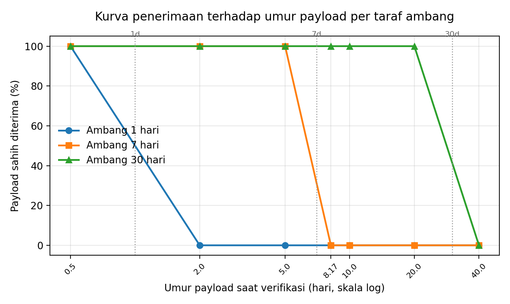

# Justifikasi Ambang Kedaluwarsa Payload QR dan Rancangan Evaluasi Sensitivitasnya

Dokumen pendukung metodologi untuk sistem verifikasi QR Code berbasis RSA-PSS.

---

## 1. Posisi Masalah

Sistem menerapkan pemeriksaan umur payload pada tahap verifikasi: sebuah QR Code
ditolak apabila selisih antara waktu verifikasi dan `timestamp` yang tercantum di
dalam payload bertanda tangan melampaui ambang `QR_PAYLOAD_MAX_AGE_SECONDS`,
yang secara bawaan bernilai 604.800 detik (7 hari).

Implementasi kontrol ini berada pada:

- `app.py:79` — deklarasi parameter konfigurasi beserta nilai bawaan.
- `app.py:880` — fungsi `is_payload_expired()`, yang menghitung selisih waktu
  terhadap `datetime.now(timezone.utc)` dan menerapkan pola *fail-closed*
  (timestamp yang tidak dapat diurai diperlakukan sebagai kedaluwarsa).
- `app.py:971` — titik pemanggilan di dalam `classify_qr_verification()`.
- `app.py:2546` — pemaparan kebijakan ini pada endpoint profil keamanan.

Pertanyaan metodologis yang perlu dijawab dalam naskah adalah: **atas dasar apa
angka 7 hari ditetapkan, dan apakah terdapat standar internasional yang
mengaturnya?**

---

## 2. Landasan Normatif

### 2.1 Temuan utama

Penelusuran terhadap korpus standar yang relevan menunjukkan bahwa **tidak
terdapat standar internasional yang menetapkan nilai numerik batas kedaluwarsa**
bagi payload QR Code bertanda tangan digital. Yang distandarkan adalah
*mekanisme* — yaitu cara menyatakan, mengangkut, dan memeriksa masa berlaku —
sedangkan penetapan nilainya secara konsisten diserahkan kepada kebijakan
penerbit berdasarkan analisis risiko domain masing-masing.

### 2.2 Standar yang mengatur mekanisme

| Standar | Cakupan yang relevan |
|---|---|
| RFC 7519 (JWT) | Klaim `exp`, `nbf`, `iat`. Verifier wajib menolak token yang melewati `exp`; besaran nilainya tidak ditentukan. |
| RFC 8392 (CWT) | Padanan RFC 7519 untuk representasi CBOR, lazim dipakai pada kredensial berbasis QR karena lebih ringkas. |
| ETSI EN 319 102-1 | Prosedur pembuatan dan validasi tanda tangan elektronik. Memperkenalkan konsep *validation time* dan *proof of existence*: keabsahan dinilai pada satu titik waktu tertentu, bukan melalui gagasan "umur maksimum". |
| RFC 3161 (TSP) | Protokol *time-stamp* tepercaya sebagai bukti eksistensi; menjadi dasar validitas jangka panjang (LTV). |
| ISO/IEC 18013-5 | Mobile driving licence. Struktur `validityInfo` pada *Mobile Security Object* memuat `signed`, `validFrom`, `validUntil`, dan `expectedUpdate`; rentangnya ditetapkan penerbit. |
| W3C VC Data Model 2.0 | Properti `validFrom` dan `validUntil` pada Verifiable Credential; tanpa nilai yang diwajibkan. |
| ICAO Doc 9303 Part 13 | *Visible Digital Seal*. Tidak menyediakan medan kedaluwarsa tersendiri; keabsahan bersandar pada masa berlaku sertifikat penanda tangan. |
| ISO/IEC 18004 | Simbologi QR Code: encoding, penampakan, dan koreksi galat. **Tidak menyentuh semantik maupun keamanan payload.** |

Baris terakhir perlu ditegaskan karena ISO/IEC 18004 kerap dikutip keliru dalam
literatur keamanan QR seolah-olah standar tersebut mengatur aspek kriptografis.

### 2.3 Nilai numerik yang memang terstandardisasi

Beberapa standar memang mencantumkan angka, namun seluruhnya terikat pada model
ancaman domainnya sendiri dan tidak dapat dipindahkan begitu saja:

- **RFC 6238 (TOTP)** — *time step* bawaan 30 detik, dengan toleransi validasi
  yang disarankan tidak melebihi satu langkah waktu. Berlaku untuk *one-time
  password*, bukan dokumen.
- **NIST SP 800-63B** — rahasia autentikator *out-of-band* berlaku maksimum 10
  menit. Relevan sebagai preseden normatif bahwa *verifier* menolak berdasarkan
  umur, bukan sebagai angka yang dapat dipinjam.
- **EU Digital COVID Certificate** (Regulasi (EU) 2021/953 beserta amandemennya)
  — analogi terdekat dengan sistem ini: QR bertanda tangan, dokumen personal,
  aturan penerimaan berbasis umur. Prinsip yang dapat dikutip adalah bahwa
  *kelas dokumen yang berbeda diberi jendela keberlakuan yang berbeda* — hasil
  uji laboratorium berumur jam, sertifikat vaksinasi berumur bulan.
- **EMVCo QR Code Specification** — QR dinamis *consumer-presented* berumur
  sangat pendek, namun EMVCo tidak mematok angka; penetapannya diserahkan kepada
  *issuer*.

> **Catatan verifikasi rujukan.** Sebelum dikutip dalam naskah, nilai numerik
> pada EU DCC harus diambil langsung dari teks regulasi versi terkini, karena
> angka-angka tersebut mengalami beberapa kali amandemen. Identitas dan cakupan
> standar pada Tabel 2.2 bersifat stabil dan aman dikutip.

### 2.4 Konsekuensi bagi penulisan

Dua rumusan berikut menandai batas antara klaim yang dapat dipertahankan dan
yang tidak:

- **Tidak dapat dipertahankan:** "Ambang 7 hari ditetapkan sesuai standar X."
  Tidak ada X yang mendukung pernyataan ini.
- **Dapat dipertahankan:** "Mekanisme pemeriksaan umur payload terhadap
  timestamp bertanda tangan setara secara semantik dengan klaim `exp` pada RFC
  7519/8392 dan properti `validUntil` pada ISO/IEC 18013-5. Nilai ambangnya
  merupakan parameter kebijakan berbasis risiko yang dapat dikonfigurasi."

---

## 3. Justifikasi Ambang Bawaan 7 Hari

### 3.1 Pemisahan kontrol: kedaluwarsa bukan mekanisme anti-replay

Poin ini merupakan argumen terkuat dalam justifikasi, dan perlu dinyatakan
eksplisit karena mudah disalahpahami.

Sistem menerapkan dua kontrol yang berdiri sendiri:

1. **Anti-replay** — melalui nonce acak dan pencatatan penggunaan pada
   `record_nonce_usage_and_get_count()`. Verifikasi kedua atas payload yang sama
   diklasifikasikan sebagai *replay attack* tanpa memandang umur payload
   (`app.py:967`).
2. **Kedaluwarsa payload** — membatasi rentang waktu suatu QR sah dapat
   diverifikasi (`app.py:971`).

Urutan evaluasi pada `classify_qr_verification()` memeriksa replay terlebih
dahulu, baru kedaluwarsa. Dengan demikian ambang 7 hari **tidak** berperan
sebagai pertahanan terhadap penggunaan ulang; perannya adalah membatasi
*window of exposure*, yaitu rentang waktu ketika sebuah QR asli yang tersalin
tanpa sepengetahuan pemiliknya masih dapat diverifikasi sebelum sempat
digunakan oleh pemilik sahnya. Ini merupakan kontrol kompensatoris dalam
kerangka *defense-in-depth*, bukan kontrol primer.

### 3.2 Argumen penetapan nilai

Penetapan 7 hari bertumpu pada tiga pertimbangan:

- **Proporsionalitas terhadap risiko.** Payload tidak memuat kewenangan
  finansial maupun hak akses; dampak penyalahgunaan terbatas pada pengakuan
  keaslian dokumen. Jendela berukuran jam — sebagaimana pada OTP atau QR
  pembayaran — tidak proporsional terhadap profil ancaman ini.
- **Kesesuaian dengan siklus operasional.** Ambang harus melampaui jeda wajar
  antara penerbitan dan verifikasi dokumen dalam praktik administratif, agar
  kontrol keamanan tidak berubah menjadi sumber penolakan palsu.
- **Konsistensi dengan kebijakan retensi.** Parameter `VERIFY_PAYLOAD_RETENTION_DAYS`
  bernilai 30 hari (`app.py:78`). Ambang kedaluwarsa yang lebih pendek dari masa
  retensi memastikan setiap payload yang masih tersimpan selalu memiliki
  keputusan klasifikasi yang terdefinisi.

### 3.3 Bukti empiris bahwa kontrol berfungsi

Verifikasi massal dengan `task_id` `56d7146d-8ec1-42e1-aa88-932286f0fbe9`
memberikan kasus uji alami:

| Besaran | Nilai |
|---|---|
| Jumlah berkas | 528 |
| Rentang timestamp payload | 2026-07-21T07:34:25 s.d. 07:34:42 (+07:00) |
| Waktu verifikasi | 2026-07-29T11:30 |
| Umur payload | 8,17 hari |
| Tanda tangan RSA-PSS sahih | 528 / 528 |
| Kecocokan data terhadap basis data | 528 / 528 |
| Replay terdeteksi | 0 |
| Diklasifikasikan kedaluwarsa | 528 / 528 |

Seluruh berkas memiliki tanda tangan yang sahih dan data yang identik dengan
rekaman asli, namun ditolak semata-mata karena melampaui ambang umur sebesar
1,17 hari. Kasus ini menunjukkan bahwa kontrol kedaluwarsa beroperasi secara
independen dari verifikasi kriptografis — sebuah pemisahan yang justru
diinginkan.

---

## 4. Rancangan Evaluasi Sensitivitas Ambang

Bagian ini mengubah angka 7 hari dari asumsi rancangan menjadi temuan
eksperimental. Rancangan telah dieksekusi; hasilnya dilaporkan pada §5.

### 4.1 Rumusan

- **Variabel bebas:** `QR_PAYLOAD_MAX_AGE_SECONDS` pada tiga taraf — 1 hari
  (86.400), 7 hari (604.800), dan 30 hari (2.592.000).
- **Variabel terikat:**
  - Distribusi klasifikasi: valid, kedaluwarsa, replay, dimodifikasi, palsu.
  - *False rejection rate* — proporsi payload sahih dan belum pernah
    diverifikasi yang ditolak karena umur.
  - *Window of exposure* — nilai ambang itu sendiri, sebagai proksi paparan
    risiko.
  - Kinerja: `verify_time` dan `total_time` per berkas.
- **Variabel kontrol:** korpus uji, algoritma (RSA-PSS 2048/SHA-256), panjang
  nonce, perangkat keras, dan konfigurasi Gunicorn.

### 4.2 Hipotesis

- **H1.** Taraf ambang berpengaruh signifikan terhadap distribusi klasifikasi.
- **H2.** Taraf ambang tidak berpengaruh signifikan terhadap waktu verifikasi,
  karena `is_payload_expired()` merupakan operasi aritmetika waktu berkompleksitas
  konstan yang tidak melibatkan I/O.

H2 penting untuk dilaporkan: hasil yang mendukungnya menegaskan bahwa penguatan
kebijakan keamanan pada dimensi ini tidak menimbulkan biaya kinerja, sehingga
pemilihan ambang murni merupakan trade-off keamanan versus kegunaan.

### 4.3 Korpus uji

Korpus perlu memuat payload dengan umur terkendali yang mengapit ketiga ambang.
Disarankan enam strata umur — 0,5; 2; 5; 10; 20; dan 40 hari — dengan jumlah
berkas seimbang per strata. Strata di sekitar batas (5 dan 10 hari terhadap
ambang 7 hari) merupakan yang paling informatif karena di sanalah keputusan
klasifikasi berubah.

Korpus yang telah tersedia dari `task_id` `56d7146d` dapat dipakai sebagai satu
strata (8,17 hari) tanpa perlu dibangkitkan ulang.

### 4.4 Prosedur

Eksperimen dijalankan pada **sandbox terisolasi**, bukan pada instans produksi.
Keputusan ini diambil karena protokol menuntut pengosongan penyimpanan
penggunaan nonce di antara taraf, sedangkan pada produksi tabel `nonce_state`
memuat riwayat autentik yang menjadi dasar deteksi replay. Menghapusnya akan
melumpuhkan kontrol anti-replay atas seluruh QR yang pernah diterbitkan —
kerusakan permanen yang tidak sebanding dengan manfaat eksperimen.

Seluruh lintasan berkas pada sistem bersifat relatif terhadap direktori kerja
(`static/data`, `logs/security_state.db`, `logs/used_nonces.txt`). Isolasi
karenanya dicapai dengan menyalin kode ke direktori terpisah dan menjalankannya
di sana, sehingga logika yang diuji identik dengan produksi sementara seluruh
keadaannya terpisah.

Prosedur yang dijalankan:

1. Salin kode aplikasi ke sandbox; bangkitkan korpus uji sekali dan pakai
   korpus yang sama untuk seluruh taraf.
2. Tanda tangani setiap payload dengan RSA-PSS 2048/SHA-256, salt 8 bita,
   memakai kunci produksi — identik dengan jalur `app.py:2918`.
3. Untuk setiap taraf ambang:
   - Kosongkan tabel `nonce_state` dan berkas `used_nonces.txt` sandbox. Tanpa
     langkah ini, taraf kedua dan seterusnya akan melaporkan seluruh payload
     sebagai replay dan menutupi efek yang diamati.
   - Setel `app.config['QR_PAYLOAD_MAX_AGE_SECONDS']` ke taraf bersangkutan.
   - Verifikasi tanda tangan, lalu panggil `classify_qr_verification()` untuk
     setiap payload; catat kategori hasil dan waktu tempuhnya.
4. Agregasikan menjadi tabel kontingensi taraf × kategori dan kurva penerimaan
   per strata umur.

Apabila replikasi pada instans utuh dikehendaki, jalur yang setara adalah
menyetel `QR_PAYLOAD_MAX_AGE_SECONDS` pada berkas unit `qrcode.service` lalu
menjalankan `systemctl daemon-reload && systemctl restart qrcode`. Restart
bersifat wajib karena nilai dibaca dari `app.config` saat verifikasi. Konfigurasi
yang sedang aktif dapat diperiksa melalui endpoint profil keamanan
(`app.py:2546`).

Berkas pelaksana dan luaran mentah diarsipkan pada:

- `data-penelitian/run_sensitivity_ambang.py` — skrip eksperimen.
- `data-penelitian/hasil_sensitivitas_ambang.json` — luaran numerik.
- `data-penelitian/kurva_penerimaan_ambang.png` — kurva penerimaan.

### 4.5 Analisis

- **H1:** uji khi-kuadrat atas tabel kontingensi taraf ambang × kategori
  klasifikasi.
- **H2:** ANOVA satu arah atas `verify_time` antar taraf; laporkan pula ukuran
  efeknya, sebab pada n yang besar perbedaan yang tidak bermakna secara praktis
  tetap dapat mencapai signifikansi statistik.
- Sajikan kurva penerimaan: proporsi payload diterima sebagai fungsi umur, satu
  kurva per taraf ambang. Grafik ini memperlihatkan trade-off inti secara
  langsung.

### 4.6 Ancaman terhadap validitas

- **Konstruk.** *Window of exposure* diukur sebagai nilai ambang itu sendiri,
  bukan sebagai kerugian aktual. Tidak tersedia estimasi empiris atas laju
  penyalinan QR, sehingga sumbu risiko bersifat ordinal, bukan kardinal.
- **Eksternal.** Ambang optimal bergantung pada siklus operasional
  organisasi pengguna. Temuan berlaku untuk profil administratif yang
  diasumsikan pada §3.2 dan tidak dapat digeneralisasi ke domain bernilai
  tinggi.
- **Internal.** Pergeseran jam sistem antara penerbitan dan verifikasi
  berpengaruh langsung terhadap perhitungan umur. Sinkronisasi NTP perlu
  dipastikan dan dilaporkan sebagai kondisi eksperimen.

---

## 5. Hasil Evaluasi Sensitivitas

Korpus terdiri atas 840 payload — 700 sahih, 70 dimodifikasi, dan 70 replay —
tersebar merata pada tujuh strata umur, menghasilkan 2.520 klasifikasi untuk
tiga taraf ambang.

### 5.1 Distribusi klasifikasi

| Taraf ambang | Valid | Kedaluwarsa | Replay | Dimodifikasi |
|---|---:|---:|---:|---:|
| 1 hari | 100 | 600 | 70 | 70 |
| 7 hari | 300 | 400 | 70 | 70 |
| 30 hari | 600 | 100 | 70 | 70 |

Uji khi-kuadrat atas tabel di atas menghasilkan χ²(6) = 725,45; p < 0,001;
Cramér's V = 0,379. Dibatasi pada arm sahih (tabel 3×2 valid versus
kedaluwarsa), diperoleh χ²(2) = 725,45; p < 0,001; V = 0,588. **H1 didukung.**

Yang sama pentingnya adalah pola invariansinya: jumlah klasifikasi replay dan
dimodifikasi **tidak bergeser sama sekali** (70 pada setiap taraf). Ini
membuktikan secara empiris klaim §3.1 — ambang kedaluwarsa hanya menggeser
batas valid ↔ kedaluwarsa dan sama sekali tidak menyentuh kontrol anti-replay
maupun deteksi modifikasi. Ketiga kontrol beroperasi secara ortogonal.

### 5.2 Kurva penerimaan dan penolakan palsu

Proporsi payload sahih yang ditolak karena umur:

| Taraf ambang | False rejection rate |
|---|---:|
| 1 hari | 85,7 % |
| 7 hari | 57,1 % |
| 30 hari | 14,3 % |

Angka-angka ini **tidak boleh dibaca sebagai estimasi lapangan**. Nilainya
sepenuhnya merupakan fungsi dari distribusi umur korpus sintetis yang sengaja
dibuat merata di seluruh rentang; pada populasi nyata, umur payload akan
menumpuk pada rentang pendek sehingga FRR jauh lebih rendah. Yang bermakna
adalah *arah dan besaran relatif* antar taraf.

### 5.3 Dampak kinerja

| Taraf ambang | Waktu klasifikasi (ms) | Waktu verifikasi RSA-PSS (ms) |
|---|---:|---:|
| 1 hari | 19,731 ± 6,723 | 1,023 |
| 7 hari | 19,656 ± 6,506 | 1,048 |
| 30 hari | 19,481 ± 6,492 | 1,064 |

ANOVA satu arah atas waktu klasifikasi: F(2, 2517) = 0,319; p = 0,727;
η² = 0,00025. **H2 didukung** — taraf ambang tidak berpengaruh terhadap kinerja.
Mikrobenchmark menguatkan hal ini: satu panggilan `is_payload_expired()`
menghabiskan 2,14–2,26 µs, atau sekitar 0,011 % dari waktu klasifikasi.

### 5.4 Temuan metodologis: signifikansi tanpa kebermaknaan

Waktu verifikasi RSA-PSS justru menghasilkan F(2, 2517) = 8,52; p < 0,001.
Secara kausal hasil ini mustahil: verifikasi tanda tangan sama sekali tidak
membaca nilai ambang. Selisih antar taraf hanya 0,041 ms (sekitar 4 %) dan
monoton mengikuti urutan pelaksanaan, sehingga sumber yang paling masuk akal
adalah pergeseran keadaan mesin sepanjang eksekusi, bukan efek perlakuan.
Ukuran efeknya mengonfirmasi hal tersebut: η² = 0,0067, yakni kurang dari 1 %
variansi.

Temuan ini memvalidasi kehati-hatian yang dinyatakan pada §4.5 dan layak
dilaporkan apa adanya. Pada n = 840 per kelompok, nilai p sendiri tidak memadai
sebagai dasar kesimpulan; pelaporan ukuran efek bersifat wajib. Sebagai
konsekuensi, dukungan terhadap H2 pada §5.3 bertumpu pada η² yang sangat kecil,
bukan semata pada p yang tidak signifikan.

### 5.5 Batasan pelaksanaan

- **Resolusi batas.** Strata umur terdekat ke ambang berjarak 1,17 hari (8,17
  hari terhadap ambang 7 hari). Perilaku tepat di sekitar titik potong — misalnya
  6,9 versus 7,1 hari — belum terkarakterisasi, sehingga kurva penerimaan
  tampil sebagai fungsi tangga.
- **Skala korpus.** Sandbox memuat 840 rekaman, sedangkan `static/data`
  produksi memuat lebih dari 100.000 berkas JSON. Karena implementasi lama
  memindai seluruh direktori pada setiap verifikasi, waktu klasifikasi absolut
  pada produksi jauh lebih besar. Hal ini **tidak** mempengaruhi kesimpulan H2,
  yang menyangkut perbandingan antar taraf pada skala korpus yang sama. Isu
  tersebut ditangani secara terpisah dan didokumentasikan pada
  [pelaporan kinerja verifikasi](pelaporan_kinerja_verifikasi.md); waktu
  klasifikasi 19,7 ms pada §5.3 karenanya **tidak sebanding** dengan `db_time`
  produksi dan tidak boleh dikutip sebagai kinerja sistem.
- **Sumber ambang.** Nilai dibaca dari `app.config` di dalam proses, bukan dari
  variabel lingkungan pada tiap permintaan; replikasi pada instans produksi
  memerlukan restart layanan.

---

## 6. Ringkasan Klaim yang Dapat Dipertahankan

1. Tidak ada standar internasional yang menetapkan nilai batas kedaluwarsa bagi
   payload QR bertanda tangan; yang terstandardisasi adalah mekanismenya.
2. Mekanisme yang diterapkan sistem ini setara secara semantik dengan klaim
   `exp` (RFC 7519/8392) dan `validUntil` (ISO/IEC 18013-5).
3. Ambang 7 hari merupakan parameter kebijakan berbasis risiko, dapat
   dikonfigurasi, dan bukan merupakan kontrol anti-replay — fungsi tersebut
   telah ditangani mekanisme nonce yang terpisah.
4. Melalui evaluasi pada §4–§5, nilai ambang dilaporkan sebagai hasil kajian
   trade-off keamanan-kegunaan, bukan sebagai asumsi yang tidak diuji.
5. Secara empiris (§5.1), ambang kedaluwarsa terbukti ortogonal terhadap
   deteksi replay dan deteksi modifikasi: menggeser ambang hanya memindahkan
   batas valid ↔ kedaluwarsa, tanpa mengubah satu pun klasifikasi pada kedua
   kategori lainnya.
6. Penguatan kebijakan pada dimensi ini tidak berbiaya kinerja (§5.3), sehingga
   pemilihan ambang merupakan trade-off keamanan-kegunaan murni.

---

## 7. Daftar Rujukan

1. IETF RFC 7519 — *JSON Web Token (JWT)*.
2. IETF RFC 8392 — *CBOR Web Token (CWT)*.
3. IETF RFC 6238 — *TOTP: Time-Based One-Time Password Algorithm*.
4. IETF RFC 3161 — *Internet X.509 PKI Time-Stamp Protocol (TSP)*.
5. ETSI EN 319 102-1 — *Procedures for Creation and Validation of AdES Digital Signatures*.
6. ISO/IEC 18013-5 — *Personal identification — ISO-compliant driving licence — Part 5: Mobile driving licence (mDL) application*.
7. ISO/IEC 18004 — *Automatic identification and data capture techniques — QR Code bar code symbology specification*.
8. W3C — *Verifiable Credentials Data Model 2.0*.
9. ICAO Doc 9303 Part 13 — *Visible Digital Seals*.
10. NIST SP 800-63B — *Digital Identity Guidelines: Authentication and Authenticator Management*.
11. Regulasi (EU) 2021/953 beserta amandemennya — *EU Digital COVID Certificate*.
12. EMVCo — *QR Code Specification for Payment Systems*.
