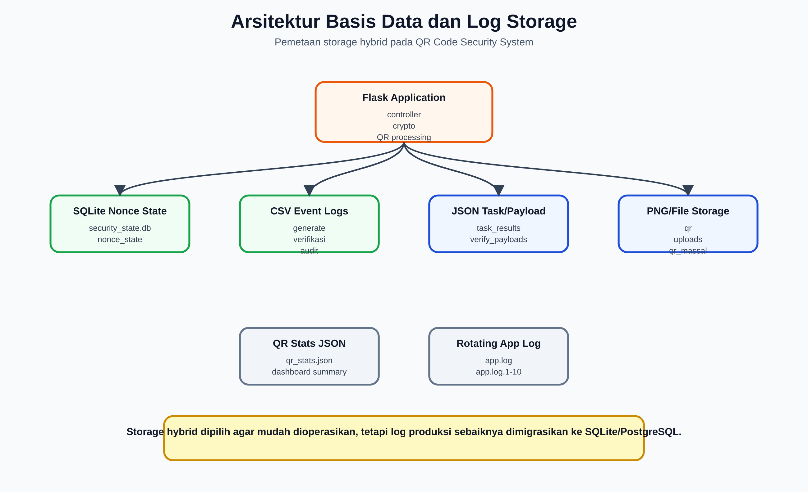
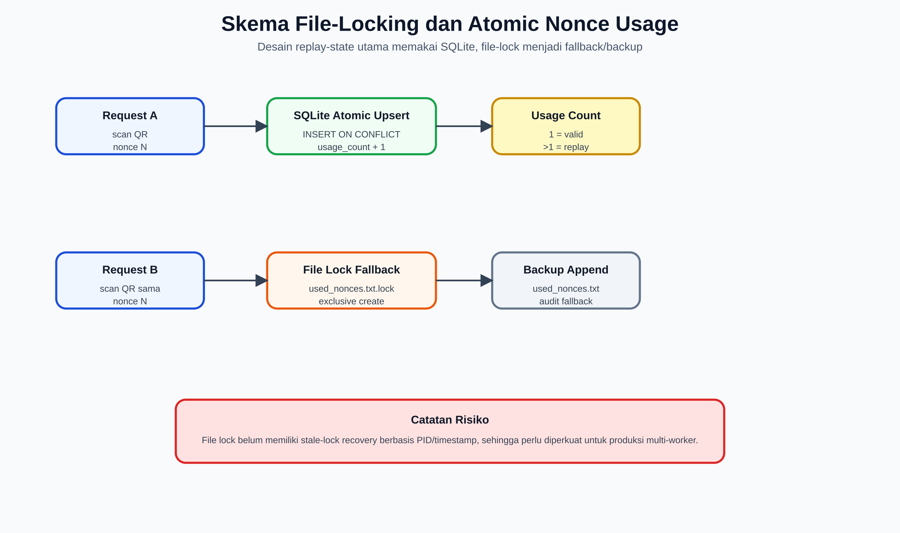
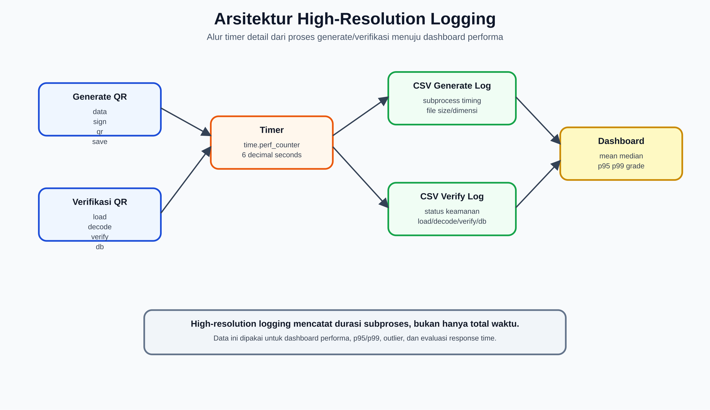
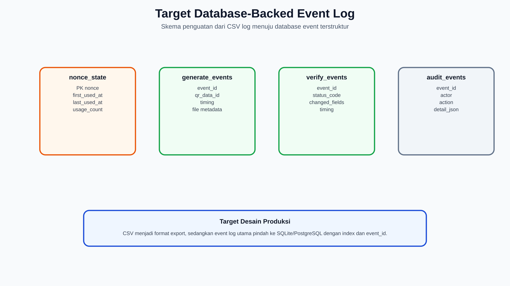

# Perancangan Arsitektur Basis Data dan Log Storage

## Skema File-Locking untuk Nonce dan Arsitektur High-Resolution Logging

**Sistem:** QR Code Security System RSA-PSS  
**Domain implementasi:** `https://rsa-pss.com`  
**Lokasi kode:** `/opt/qrcode`  
**Tanggal penyusunan:** 16 Juni 2026  
**Tujuan dokumen:** Bahan laporan perancangan basis data, nonce replay-state storage, file-locking, dan high-resolution logging pada sistem QR Code bertanda tangan digital.

---

## 1. Ringkasan Eksekutif

Sistem QR Code Security System menggunakan pendekatan storage hibrida. Data operasional dan artefak QR disimpan sebagai file, sedangkan state keamanan replay attack disimpan di SQLite. Log generate, log verifikasi, dan audit log disimpan dalam CSV agar mudah dibaca, difilter, dan diekspor ke Excel. Untuk pengukuran performa, sistem menggunakan timer berbasis `time.perf_counter()` sehingga durasi proses dapat dicatat sampai enam angka desimal dalam satuan detik.

Arsitektur saat ini terdiri dari:

- **SQLite replay-state database:** `logs/security_state.db`.
- **Nonce backup file:** `logs/used_nonces.txt`.
- **CSV generate log:** `logs/log_generate.csv`.
- **CSV verification log:** `logs/log_verifikasi.csv`.
- **CSV audit log:** `logs/audit_log.csv`.
- **JSON persistent stats:** `logs/qr_stats.json`.
- **Rotating application log:** `logs/app.log` sampai `logs/app.log.10`.
- **Task snapshot storage:** `data/task_results/*.json` dan `data/task_metadata/*.json`.
- **Payload token storage:** `data/verify_payloads/<shard>/<token>.json`.
- **QR artefact storage:** `static/qr`, `static/qr_massal`, `static/qr_fake`, dan `static/data`.

Secara desain, replay attack ditangani oleh **SQLite atomic upsert** pada tabel `nonce_state`. File-locking tetap digunakan sebagai fallback dan backup append-only sederhana. High-resolution logging mencatat waktu subproses seperti data preparation, signing, QR rendering, save, file load, QR decode, signature verification, database lookup, dan total time.

Kesimpulan utama:

- Arsitektur sudah cukup kuat untuk deployment single-process atau low-concurrency server.
- SQLite WAL dan `threading.Lock` membuat pencatatan nonce lebih aman daripada file-only logging.
- File-locking nonce sudah ada, tetapi masih sederhana dan belum memiliki stale-lock recovery berbasis PID/timestamp.
- CSV log belum memakai file-lock eksplisit, sehingga jika aplikasi dijalankan multi-worker, risiko interleaving write tetap ada.
- Untuk produksi yang lebih kuat, log event sebaiknya dipindahkan ke SQLite/PostgreSQL atau minimal memakai file lock dan structured event id.

### 1.1 Gambar Pendukung

| Gambar | File |
|---|---|
| Arsitektur storage hybrid | `dokumen/Gambar-Asli/storage_architecture_overview.png` |
| Skema file-locking nonce | `dokumen/Gambar-Asli/storage_nonce_file_locking.png` |
| Arsitektur high-resolution logging | `dokumen/Gambar-Asli/storage_high_resolution_logging.png` |
| Target database-backed event log | `dokumen/Gambar-Asli/storage_target_database_schema.png` |

---

## 2. Tujuan Desain Storage

### 2.1 Tujuan Bisnis

| Tujuan | Penjelasan |
|---|---|
| Traceability | Setiap generate dan verifikasi QR harus dapat ditelusuri. |
| Auditability | Aksi sensitif seperti login, download log, reset, cleanup, dan hapus log perlu tercatat. |
| Replay prevention | QR yang sudah pernah diverifikasi harus langsung terdeteksi saat dipakai ulang. |
| Performance analysis | Durasi tiap tahap generate/verifikasi harus tersedia untuk dashboard dan laporan. |
| Operational recovery | Log dan task snapshot harus tetap bisa dibaca setelah restart aplikasi. |
| Simplicity | Format storage harus mudah diakses admin tanpa tool kompleks. |

### 2.2 Tujuan Teknis

| Tujuan Teknis | Implementasi Saat Ini |
|---|---|
| Atomic replay state | SQLite `INSERT ... ON CONFLICT DO UPDATE`. |
| Backup replay state | Append nonce ke `logs/used_nonces.txt`. |
| File-lock fallback | Lock file `.lock` saat membaca/menulis nonce file. |
| Detailed timing | `Timer` memakai `time.perf_counter()`. |
| Log exportability | CSV log dapat dibaca pandas dan diekspor Excel. |
| Log rotation aplikasi | `RotatingFileHandler`, 1 MB per file, 10 backup. |
| Persistent dashboard stats | `logs/qr_stats.json`. |
| Task result durability | Snapshot JSON dengan write-to-temp lalu `os.replace`. |

---

## 3. Inventaris Storage Sistem



Gambar di atas memperlihatkan storage hybrid yang dipakai sistem: SQLite untuk replay-state, CSV untuk event log, JSON untuk task/payload/statistik, dan file PNG untuk artefak QR.

### 3.1 Storage Utama

| Path | Format | Fungsi | Sifat Data |
|---|---|---|---|
| `logs/security_state.db` | SQLite | State nonce untuk replay detection. | Security-critical, mutable. |
| `logs/used_nonces.txt` | Plain text append-only | Backup/fallback jejak nonce. | Security-supporting, append. |
| `logs/log_generate.csv` | CSV | Log aktivitas generate QR. | Audit/performance, append. |
| `logs/log_verifikasi.csv` | CSV | Log aktivitas verifikasi QR. | Audit/security/performance, append. |
| `logs/audit_log.csv` | CSV | Log aksi admin/operator. | Audit, append. |
| `logs/qr_stats.json` | JSON | Statistik agregat dashboard. | Derived summary, overwrite. |
| `logs/app.log*` | Text rotating log | Log aplikasi, warning, error, debug. | Operational log, rotating. |
| `static/data/*.json` | JSON | Data original QR untuk matching verifikasi. | Source-of-truth aplikasi. |
| `data/verify_payloads/*/*.json` | JSON sharded | Payload signed untuk URL pendek `/v/<token>`. | Token payload store. |
| `data/task_results/*.json` | JSON | Snapshot hasil task generate/verifikasi massal. | Result cache durable. |
| `data/task_metadata/*.json` | JSON | Metadata task. | Operational metadata. |
| `static/qr/*.png` | PNG | QR tunggal. | Artefak output. |
| `static/qr_massal/*.png` | PNG | QR hasil generate massal. | Artefak output. |
| `static/qr_fake/*.png` | PNG | QR hasil modifikasi/serangan simulasi. | Test artefact. |

### 3.2 Kondisi Storage Teramati

Snapshot per 16 Juni 2026:

| Komponen | Kondisi |
|---|---|
| `logs/security_state.db` | Ada, ukuran sekitar 1.2 MB. |
| `nonce_state` | 7.832 nonce unik, 7.907 total usage. |
| Rentang nonce state | `2026-06-11T06:07:07+00:00` sampai `2026-06-15T23:12:06+00:00`. |
| `logs/log_generate.csv` | 5.004 baris termasuk header, ukuran sekitar 640 KB. |
| `logs/log_verifikasi.csv` | 273 baris termasuk header, ukuran sekitar 56 KB. |
| `logs/audit_log.csv` | Ada, sekitar 5.7 KB. |
| `logs/used_nonces.txt` | Ada, sekitar 90 KB. |
| `logs/app.log` | Rotating file aktif, backup sampai `app.log.10`. |

---

## 4. Arsitektur Basis Data Nonce

### 4.1 Alasan Nonce Disimpan di Database

Digital signature hanya membuktikan bahwa data tidak dimodifikasi dan berasal dari pemegang private key. Signature tidak otomatis mencegah QR yang sama dipakai berkali-kali. Karena itu sistem membutuhkan state tambahan: apakah nonce QR sudah pernah diverifikasi.

State nonce harus memenuhi kebutuhan berikut:

| Kebutuhan | Penjelasan |
|---|---|
| Unique key | Satu nonce hanya memiliki satu record utama. |
| Atomic increment | Scan bersamaan tidak boleh sama-sama dianggap pertama. |
| Usage count | Jumlah verifikasi harus bertambah untuk laporan replay. |
| First/last timestamp | Sistem tahu kapan nonce pertama dan terakhir digunakan. |
| Recovery | Jika database gagal, sistem masih punya fallback file. |

### 4.2 Schema SQLite Saat Ini

Database: `logs/security_state.db`

```sql
CREATE TABLE nonce_state (
    nonce TEXT PRIMARY KEY,
    first_used_at TEXT NOT NULL,
    last_used_at TEXT NOT NULL,
    usage_count INTEGER NOT NULL DEFAULT 1
);

CREATE INDEX idx_nonce_last_used ON nonce_state(last_used_at);

CREATE TABLE security_metadata (
    key TEXT PRIMARY KEY,
    value TEXT NOT NULL,
    updated_at TEXT NOT NULL
);
```

### 4.3 Fungsi Tabel

#### `nonce_state`

| Kolom | Tipe | Fungsi |
|---|---|---|
| `nonce` | TEXT primary key | Identifier unik QR. |
| `first_used_at` | TEXT ISO-8601 UTC | Waktu pertama nonce dicatat. |
| `last_used_at` | TEXT ISO-8601 UTC | Waktu terakhir nonce diverifikasi. |
| `usage_count` | INTEGER | Jumlah penggunaan/verifikasi nonce. |

#### `security_metadata`

| Kolom | Tipe | Fungsi |
|---|---|---|
| `key` | TEXT primary key | Nama metadata. |
| `value` | TEXT | Nilai metadata. |
| `updated_at` | TEXT ISO-8601 UTC | Waktu metadata diperbarui. |

Contoh metadata saat ini:

| Key | Value | Makna |
|---|---|---|
| `nonce_file_migrated_v1` | `5633` | Jumlah nonce dari file lama yang sudah dimigrasikan ke SQLite. |

### 4.4 Konfigurasi SQLite

Saat inisialisasi, sistem menjalankan:

```sql
PRAGMA journal_mode=WAL;
PRAGMA synchronous=NORMAL;
```

Alasannya:

- **WAL (Write-Ahead Logging)** membantu operasi baca dan tulis berjalan lebih baik dibanding journal default.
- **synchronous=NORMAL** memberi kompromi antara performa dan durabilitas.
- Setiap operasi penting membuka koneksi SQLite dengan timeout 10 sampai 20 detik.
- Akses database dibungkus `threading.Lock` (`security_state_lock`) untuk menghindari race condition di dalam satu proses aplikasi.

### 4.5 Operasi Atomic Upsert Nonce

Saat QR diverifikasi, sistem memanggil `record_nonce_usage_and_get_count(nonce)`. Mekanismenya:

1. Ambil waktu UTC saat ini.
2. Buka koneksi SQLite.
3. Jalankan `INSERT ... ON CONFLICT(nonce) DO UPDATE`.
4. Jika nonce belum ada, buat record dengan `usage_count = 1`.
5. Jika nonce sudah ada, increment `usage_count = usage_count + 1` dan update `last_used_at`.
6. Baca ulang `usage_count`.
7. Commit transaksi.
8. Append nonce ke backup file.
9. Return `(previous_count, verification_count)`.

Pseudocode:

```text
function record_nonce_usage_and_get_count(nonce):
    now = utc_now_iso8601()
    begin sqlite operation under security_state_lock
        insert nonce with usage_count = 1
        on conflict update usage_count = usage_count + 1
        select usage_count
        commit
    append nonce to used_nonces.txt under file lock
    return usage_count - 1, usage_count
```

Implikasi:

- Scan pertama menghasilkan `previous_count = 0`, sehingga QR dapat dianggap valid jika signature dan data original cocok.
- Scan kedua menghasilkan `previous_count >= 1`, sehingga QR langsung diklasifikasikan replay.
- `verification_count` ditampilkan pada status replay untuk menunjukkan berapa kali QR sudah diverifikasi.

### 4.6 Migrasi dari File Nonce Lama

Sistem memiliki fungsi migrasi dari `logs/used_nonces.txt` ke SQLite:

1. Baca setiap baris nonce dari file lama.
2. Hitung frekuensi setiap nonce.
3. Insert/update ke `nonce_state`.
4. Simpan marker migrasi di `security_metadata` dengan key `nonce_file_migrated_v1`.

Desain ini mencegah migrasi ganda dan menjaga count historis.

---

## 5. Skema File-Locking untuk Nonce



Gambar di atas menjelaskan posisi SQLite atomic upsert sebagai source-of-truth replay-state, sedangkan file-lock dipakai sebagai fallback dan backup append-only.

### 5.1 Alasan File-Locking Masih Diperlukan

Walaupun SQLite menjadi storage utama nonce, file `logs/used_nonces.txt` tetap dipakai untuk:

- Backup audit sederhana.
- Fallback jika SQLite gagal diinisialisasi atau gagal ditulis.
- Compatibility dengan log/nonce historis sebelum migrasi SQLite.

Karena file text dapat diakses oleh beberapa request/thread, file-locking diperlukan agar operasi baca/tulis tidak saling tabrak.

### 5.2 Mekanisme Lock Saat Ini

Class `FileLock` bekerja dengan cara membuat file lock eksklusif:

```text
target file       : logs/used_nonces.txt
lock file         : logs/used_nonces.txt.lock
open mode         : x (exclusive create)
max retries       : 10
retry delay       : 0.1 detik
max wait approx   : 1 detik
release           : close handle lalu remove .lock
```

Alur lock:

```text
Request A ingin menulis nonce
  -> create logs/used_nonces.txt.lock berhasil
  -> append nonce
  -> hapus .lock

Request B datang saat A masih menulis
  -> create .lock gagal karena sudah ada
  -> sleep 0.1 detik
  -> retry sampai lock bebas atau timeout
```

### 5.3 Operasi yang Dilindungi Lock

| Operasi | Fungsi | Mode |
|---|---|---|
| Cek nonce file | `is_nonce_used()` | Read under lock. |
| Hitung usage file | `get_nonce_usage_count()` | Read under lock. |
| Append backup nonce | `append_nonce_backup_file()` | Append under lock. |
| Fallback record nonce | `record_nonce_usage_and_get_count()` fallback branch | Read count + append under lock. |

### 5.4 Kekuatan Desain File-Locking

| Kekuatan | Penjelasan |
|---|---|
| Cross-platform sederhana | Memakai exclusive file create, tidak bergantung `fcntl`. |
| Mudah dipahami | `.lock` file terlihat jelas saat ada proses menulis. |
| Melindungi read-modify-write fallback | Count dan append fallback dilakukan dalam satu lock. |
| Cocok untuk single host | Cukup untuk aplikasi di satu server filesystem lokal. |

### 5.5 Keterbatasan Desain File-Locking

| Keterbatasan | Dampak |
|---|---|
| Tidak ada stale-lock recovery | Jika proses mati setelah membuat `.lock`, request berikutnya bisa timeout. |
| Tidak ada PID/timestamp di lock file | Sulit membedakan lock aktif vs lock sisa crash. |
| Timeout hanya sekitar 1 detik | Pada beban tinggi fallback bisa gagal. |
| Tidak aman untuk shared network filesystem tertentu | Semantik exclusive create bisa berbeda pada NFS/FS remote. |
| Tidak menggantikan transaksi database | File text tidak ideal sebagai source-of-truth replay state. |

### 5.6 Rekomendasi Penguatan File-Locking

Untuk membuat sistem lebih kuat:

1. Isi lock file dengan metadata: PID, hostname, created_at.
2. Tambahkan stale-lock timeout, misalnya 30 detik.
3. Tambahkan exponential backoff untuk retry.
4. Tambahkan logging saat lock timeout.
5. Gunakan library locking yang matang, misalnya `portalocker` atau `filelock`, jika tetap memakai file.
6. Jadikan SQLite/PostgreSQL sebagai satu-satunya source-of-truth nonce; file nonce cukup sebagai audit backup.

Contoh desain lock yang disarankan:

```json
{
  "pid": 12345,
  "hostname": "rsa-pss-server",
  "created_at": "2026-06-16T10:00:00+00:00",
  "resource": "logs/used_nonces.txt"
}
```

---

## 6. Arsitektur High-Resolution Logging



Gambar di atas menunjukkan bagaimana timer detail pada proses generate dan verifikasi mengalir ke CSV log lalu digunakan dashboard untuk analisis performa.

### 6.1 Definisi

High-resolution logging dalam sistem ini berarti setiap operasi penting tidak hanya dicatat status akhirnya, tetapi juga dicatat durasi subprosesnya dalam satuan detik dengan presisi mikro-level format enam desimal.

Sistem memakai class `Timer`:

```python
class Timer:
    def start(self):
        self.start_time = time.perf_counter()
        return self

    def stop(self):
        self.end_time = time.perf_counter()
        self.duration = self.end_time - self.start_time
        return self.duration
```

`time.perf_counter()` cocok untuk durasi karena monotonic dan high-resolution. Timestamp event tetap memakai `datetime.now(timezone.utc).isoformat()` agar urutan log dapat dianalisis lintas proses dan lintas hari.

### 6.2 Prinsip Desain Logging

| Prinsip | Implementasi |
|---|---|
| Append-only | Log generate/verifikasi/audit ditulis append ke CSV. |
| Structured columns | Setiap CSV memiliki header tetap. |
| High-resolution duration | Durasi ditulis dengan format `%.6f` detik. |
| UTC event time | Kolom `Waktu` memakai ISO-8601 UTC. |
| Error-tolerant read | Pembacaan log memakai `errors='replace'`, `on_bad_lines='skip'`. |
| Export-friendly | CSV bisa dibaca pandas dan diekspor ke Excel. |
| Backup before reset/delete | File lama dibackup sebelum reset/hapus. |

### 6.3 Log Generate

File: `logs/log_generate.csv`

Header:

| Kolom | Makna |
|---|---|
| `Sumber` | Jenis generate: `Tunggal` atau `Massal`. |
| `Waktu` | Timestamp UTC ISO-8601 saat log ditulis. |
| `Nama` | Nama pemilik data QR. |
| `ID` | ID pemilik data QR. |
| `Versi QR` | QR version yang dihasilkan library. |
| `Modul` | Jumlah modul QR. |
| `Resolusi` | Dimensi PNG, misalnya `70x70`. |
| `Ukuran File (KB)` | Ukuran PNG dalam kilobyte. |
| `Panjang Signature` | Panjang signature base64. |
| `Waktu Data (detik)` | Durasi pembentukan data dan metadata QR. |
| `Waktu Sign (detik)` | Durasi hashing dan signing. |
| `Waktu QR (detik)` | Durasi render QR menjadi gambar. |
| `Waktu Save (detik)` | Durasi penyimpanan file/data. |
| `Total Waktu (detik)` | Durasi total proses generate satu QR. |

Alur timing generate tunggal:

```text
total_timer.start()
  data_timer.start()
    build data, calculate QR module/version
  data_time = data_timer.stop()

  sign_timer.start()
    SHA-256 hash + RSA-PSS/ECDSA sign
  sign_time = sign_timer.stop()

  qr_timer.start()
    create QR URL + render PNG
  qr_time = qr_timer.stop()

  save_timer.start()
    save JSON original data
  save_time = save_timer.stop()
total_time = total_timer.stop()

append log_generate.csv
```

### 6.4 Log Verifikasi

File: `logs/log_verifikasi.csv`

Header:

| Kolom | Makna |
|---|---|
| `Sumber` | `Tunggal`, `Massal`, `Massal_Async`, `Kamera HP`, atau sumber lain. |
| `Waktu` | Timestamp UTC ISO-8601 saat log ditulis. |
| `Nama File` | Nama file QR atau `url_scan` untuk kamera HP. |
| `Status` | Hasil verifikasi: valid, replay, data palsu, tidak ditemukan, error, dll. |
| `Nama` | Nama dalam payload jika tersedia. |
| `ID` | ID dalam payload jika tersedia. |
| `Perubahan Data` | JSON perubahan field jika ada data dimodifikasi. |
| `Waktu Load (detik)` | Durasi load/upload file. Untuk kamera HP bernilai 0. |
| `Waktu Decode (detik)` | Durasi decode QR dari image. Untuk URL scan bernilai 0. |
| `Waktu Verify (detik)` | Durasi verifikasi signature. |
| `Waktu DB (detik)` | Durasi pencarian data original dan update nonce state. |
| `Total Waktu (detik)` | Durasi total verifikasi. |

Alur timing verifikasi file:

```text
total_timer.start()
  load_timer.start()
    save/read uploaded QR image
  load_time = load_timer.stop()

  decode_timer.start()
    cv2 read + pyzbar decode
  decode_time = decode_timer.stop()

  verify_timer.start()
    decode signature + SHA-256 + RSA/ECDSA verify
  verify_time = verify_timer.stop()

  db_timer.start()
    find original data + classify + record nonce usage
  db_time = db_timer.stop()
total_time = total_timer.stop()

append log_verifikasi.csv
```

Alur timing verifikasi kamera HP:

```text
total_timer.start()
  load_time = 0
  decode_time = 0
  verify_timer.start()
    verify signature from payload token/encoded URL
  verify_time = verify_timer.stop()
  db_timer.start()
    classify + record nonce usage
  db_time = db_timer.stop()
total_time = total_timer.stop()

append log_verifikasi.csv with Sumber = Kamera HP
```

### 6.5 Audit Log

File: `logs/audit_log.csv`

Header:

| Kolom | Makna |
|---|---|
| `Waktu` | Timestamp UTC ISO-8601. |
| `Aksi` | Nama aksi, misalnya `login_success`, `download_audit_log`, `reset_stats`. |
| `Actor` | Aktor, default `admin`. |
| `IP` | IP dari `X-Forwarded-For` atau `request.remote_addr`. |
| `User Agent` | User-Agent request. |
| `Detail` | JSON detail tambahan. |

Audit log sengaja dipisahkan dari log generate/verifikasi agar aktivitas operator tidak tercampur dengan hasil verifikasi QR.

### 6.6 Application Log

File: `logs/app.log` dan backup `logs/app.log.1` sampai `logs/app.log.10`.

Konfigurasi:

```text
handler        : RotatingFileHandler
maxBytes       : 1 MB
backupCount    : 10
format         : timestamp, level, message, pathname, lineno
level          : INFO
```

Application log menyimpan:

- Startup aplikasi.
- Load key RSA/ECDSA.
- Error parsing log.
- Warning SQLite/file fallback.
- Aktivitas download/reset/cleanup.
- Exception stack trace pada proses penting.

---

## 7. Fungsi Penulisan Log CSV

### 7.1 Fungsi `_log_to_csv_extended`

Semua log generate dan verifikasi ditulis lewat `_log_to_csv_extended(csv_path, row_data)`.

Langkah fungsi:

1. Pastikan folder log tersedia.
2. Tentukan header berdasarkan path log.
3. Set `csv.field_size_limit(10 MB)`.
4. Bersihkan setiap item string:
   - Encode/decode UTF-8 dengan replacement.
   - Hapus karakter kontrol kecuali tab/newline/carriage return.
5. Buka file dalam mode append.
6. Jika file belum ada/kosong, tulis header.
7. Tulis row bersih.

Kelebihan:

- Tahan data aneh/non-UTF-8.
- Format kolom konsisten.
- Mudah dibaca pandas.

Keterbatasan:

- Belum memakai file lock eksplisit untuk CSV.
- Belum ada event id unik per baris.
- Belum ada hash chain untuk mencegah manipulasi log.
- CSV append aman untuk single process, tetapi berisiko interleaving pada multi-process worker.

### 7.2 Rekomendasi Lock untuk CSV Log

Jika aplikasi akan dijalankan dengan Gunicorn multi-worker atau beberapa proses, tambahkan lock pada `_log_to_csv_extended` dan `log_audit_event`.

Desain minimum:

```text
log path       : logs/log_verifikasi.csv
lock path      : logs/log_verifikasi.csv.lock
critical area  : open append + optional header write + writerow
timeout        : 5-30 detik
stale lock     : > 60 detik dapat dianggap stale setelah dicek PID/mtime
```

Alternatif lebih kuat:

- Pindahkan log event ke SQLite tabel `generate_events`, `verify_events`, `audit_events`.
- Gunakan PostgreSQL untuk concurrency tinggi.
- Export CSV/Excel dibuat dari database, bukan CSV sebagai primary log.

---

## 8. Dashboard Performance Summary

Dashboard membaca `logs/log_generate.csv` dan `logs/log_verifikasi.csv` untuk menghitung ringkasan performa.

### 8.1 Statistik yang Dihitung

Fungsi `_summarize_timing_csv(path)` menghasilkan:

| Metric | Makna |
|---|---|
| `count` | Jumlah baris valid. |
| `total_s` | Total durasi. |
| `mean_s` | Rata-rata. |
| `median_s` | Median. |
| `p90_s` | Percentile 90. |
| `p95_s` | Percentile 95. |
| `p99_s` | Percentile 99. |
| `max_s` | Durasi maksimum. |
| `outliers_over_1s` | Jumlah event di atas 1 detik. |
| `file_size_mean_kb` | Rata-rata ukuran file QR. |
| `file_size_median_kb` | Median ukuran file QR. |
| `by_source` | Ringkasan per sumber (`Tunggal`, `Massal`, dll). |

### 8.2 Throughput dan Grade

Dashboard performance summary menghitung:

- Generate target: 0.2 detik per QR atau 5 ops/detik.
- Throughput generate: `1 / median_generate_time`.
- Target attainment: `target_s / generate_p95_s * 100`, dibatasi maksimum 100%.
- Grade verifikasi memakai p95 response time:
  - A: <= 100 ms.
  - B: <= 300 ms.
  - C: <= 1000 ms.
  - D: > 1000 ms.

Catatan metodologis:

- Median dipakai untuk throughput agar tidak terlalu dipengaruhi outlier.
- P95 dipakai untuk grade verifikasi agar mewakili tail latency, bukan hanya rata-rata.
- Log historis dapat mempengaruhi dashboard. Jika ada data lama yang tidak representatif, gunakan filter periode atau pisahkan benchmark per sesi.

---

## 9. Arsitektur Task Snapshot

### 9.1 Alasan Task Snapshot

Generate/verifikasi massal berjalan di background thread. Jika hasil hanya disimpan di memory, data akan hilang saat restart. Karena itu sistem menyimpan snapshot JSON.

### 9.2 Path dan Format

| Storage | Fungsi |
|---|---|
| `data/task_results/<task_id>.json` | Hasil task, statistik, status selesai, generated files. |
| `data/task_metadata/<task_id>.json` | Metadata task tambahan. |
| `background_tasks` | OrderedDict in-memory untuk progress aktif/recent. |
| `task_lock` | `threading.Lock` untuk akses in-memory task. |

### 9.3 Atomic Write Snapshot

Snapshot task ditulis dengan pola:

```text
write data/task_results/<task_id>.json.tmp
os.replace(tmp, final_path)
```

Pola ini baik karena:

- Mencegah file final setengah tertulis.
- Replace relatif atomic pada filesystem lokal.
- Reader tidak melihat partial JSON.

---

## 10. Alur Data End-to-End

### 10.1 Generate QR Tunggal

```text
User input nama/id
  -> build signed data + nonce + timestamp
  -> sign dengan RSA-PSS/ECDSA
  -> simpan payload token di data/verify_payloads
  -> render QR PNG di static/qr
  -> simpan original data JSON di static/data
  -> update qr_stats.json
  -> append log_generate.csv
  -> tampilkan hasil
```

### 10.2 Generate QR Massal

```text
Upload CSV
  -> create background task
  -> untuk setiap row:
      build data
      sign
      create payload token
      render QR PNG
      save original data JSON
      append log_generate.csv
      update massal_stats
  -> save task snapshot JSON
  -> dashboard/jobs membaca snapshot
```

### 10.3 Verifikasi QR File

```text
Upload QR image
  -> save temp upload
  -> decode QR image
  -> extract payload dari URL/token/encoded JSON
  -> verify signature
  -> find original data
  -> record nonce usage di SQLite
  -> classify valid/replay/data palsu
  -> update qr_stats.json
  -> append log_verifikasi.csv
  -> tampilkan hasil
```

### 10.4 Verifikasi Kamera HP

```text
HP scan QR URL /v/<token>
  -> load payload dari data/verify_payloads
  -> redirect internal ke verify_qr_data(encoded)
  -> verify signature
  -> record nonce usage di SQLite
  -> classify result
  -> append log_verifikasi.csv dengan sumber Kamera HP
  -> response no-store/no-cache
```

### 10.5 Audit Event

```text
Admin melakukan aksi sensitif
  -> log_audit_event(action, detail)
  -> tulis Waktu, Aksi, Actor, IP, User Agent, Detail
  -> audit_log.csv dapat dilihat/download
```

---

## 11. Analisis Konsistensi dan Concurrency

### 11.1 Konsistensi yang Sudah Baik

| Area | Analisis |
|---|---|
| Nonce state | SQLite primary key + upsert membuat increment usage count atomic pada level database. |
| In-process DB lock | `security_state_lock` mengurangi race antar thread dalam satu proses. |
| WAL mode | Meningkatkan kemampuan baca/tulis SQLite. |
| Backup nonce file | Memberi jejak tambahan jika DB perlu diaudit. |
| Task snapshot | `os.replace` menghindari partial JSON. |
| Log backup | Reset/hapus log membuat backup terlebih dahulu. |

### 11.2 Titik Lemah Concurrency

| Area | Titik Lemah | Dampak |
|---|---|---|
| CSV append | Tidak ada file lock eksplisit. | Multi-process write bisa interleaving. |
| `security_state_lock` | Hanya berlaku dalam satu proses Python. | Jika multi-worker, lock tidak lintas proses; SQLite tetap atomic, tetapi backup file perlu lock. |
| File lock nonce | Tidak ada stale-lock recovery. | Crash bisa meninggalkan `.lock`. |
| QR stats JSON | Overwrite file tanpa file lock. | Multi-request update dapat lost update. |
| CSV sebagai source dashboard | Parsing file besar bisa lambat. | Dashboard bisa melambat saat log membesar. |
| Status task memory | `background_tasks` hilang saat restart. | Sudah dibantu snapshot, tetapi task aktif tetap berhenti. |

### 11.3 Rekomendasi Concurrency untuk Produksi

Prioritas 1:

1. Tambahkan lock ke CSV write.
2. Tambahkan lock ke `qr_stats.json` write.
3. Tambahkan stale-lock recovery untuk file lock.
4. Tambahkan event id UUID untuk setiap log row.

Prioritas 2:

1. Pindahkan log generate/verifikasi/audit ke SQLite.
2. Buat index pada `timestamp`, `source`, `status`, `id`.
3. Dashboard membaca agregasi dari database, bukan CSV mentah.
4. Export CSV/Excel menjadi hasil query.

Prioritas 3:

1. Pindahkan database operasional ke PostgreSQL jika traffic tinggi.
2. Gunakan background worker queue seperti Celery/RQ untuk task massal.
3. Gunakan object storage untuk PNG/payload jika file meningkat besar.

---

## 12. Desain Target Database yang Direkomendasikan



Gambar di atas adalah rancangan target jika log generate, verifikasi, dan audit dipindahkan dari CSV menjadi tabel event di SQLite/PostgreSQL.

### 12.1 Target SQLite/PostgreSQL Schema

Untuk arsitektur yang lebih kuat, storage dapat dibuat relational penuh.

#### `nonce_state`

```sql
CREATE TABLE nonce_state (
    nonce TEXT PRIMARY KEY,
    qr_id TEXT,
    status TEXT NOT NULL DEFAULT 'issued',
    first_used_at TEXT,
    last_used_at TEXT,
    usage_count INTEGER NOT NULL DEFAULT 0,
    created_at TEXT NOT NULL,
    expires_at TEXT,
    revoked_at TEXT,
    last_event_id TEXT
);
```

#### `generate_events`

```sql
CREATE TABLE generate_events (
    event_id TEXT PRIMARY KEY,
    source TEXT NOT NULL,
    event_time TEXT NOT NULL,
    nama TEXT,
    user_id TEXT,
    qr_version INTEGER,
    qr_modules INTEGER,
    resolution TEXT,
    file_size_kb REAL,
    signature_length INTEGER,
    data_time_s REAL,
    sign_time_s REAL,
    qr_time_s REAL,
    save_time_s REAL,
    total_time_s REAL,
    task_id TEXT,
    filename TEXT
);
```

#### `verify_events`

```sql
CREATE TABLE verify_events (
    event_id TEXT PRIMARY KEY,
    source TEXT NOT NULL,
    event_time TEXT NOT NULL,
    filename TEXT,
    status TEXT NOT NULL,
    status_code TEXT,
    nama TEXT,
    user_id TEXT,
    nonce TEXT,
    signature_valid INTEGER,
    algorithm TEXT,
    changed_fields_json TEXT,
    load_time_s REAL,
    decode_time_s REAL,
    verify_time_s REAL,
    db_time_s REAL,
    total_time_s REAL,
    task_id TEXT,
    remote_ip TEXT,
    user_agent TEXT
);
```

#### `audit_events`

```sql
CREATE TABLE audit_events (
    event_id TEXT PRIMARY KEY,
    event_time TEXT NOT NULL,
    action TEXT NOT NULL,
    actor TEXT,
    ip TEXT,
    user_agent TEXT,
    detail_json TEXT
);
```

### 12.2 Index yang Disarankan

```sql
CREATE INDEX idx_verify_event_time ON verify_events(event_time);
CREATE INDEX idx_verify_status ON verify_events(status_code);
CREATE INDEX idx_verify_nonce ON verify_events(nonce);
CREATE INDEX idx_verify_user_id ON verify_events(user_id);
CREATE INDEX idx_generate_event_time ON generate_events(event_time);
CREATE INDEX idx_generate_user_id ON generate_events(user_id);
CREATE INDEX idx_audit_event_time ON audit_events(event_time);
CREATE INDEX idx_audit_action ON audit_events(action);
```

### 12.3 Keuntungan Target Schema

| Keuntungan | Dampak |
|---|---|
| Query cepat | Dashboard tidak perlu parsing CSV besar. |
| Concurrency lebih kuat | DB menangani transaksi. |
| Audit lebih rapi | Setiap event punya UUID. |
| Export fleksibel | CSV/Excel dapat dibuat dari query. |
| Retention mudah | Data lama bisa diarsip per periode. |
| Integrity check | Bisa dibuat hash chain per event. |

---

## 13. Retention, Backup, dan Recovery

### 13.1 Retention Saat Ini

| Data | Retention Saat Ini |
|---|---|
| Verify payload token | Konfigurasi 30 hari. |
| CSV generate/verifikasi | Tidak ada auto-retention; backup saat reset/hapus. |
| App log | Rotasi 1 MB x 10 backup. |
| Nonce SQLite | Tidak ada purge otomatis. |
| Nonce file backup | Tidak ada retention formal. |
| Task snapshot | Disimpan di folder data; history memory dibatasi 10 task. |

### 13.2 Backup Saat Ini

| Operasi | Backup |
|---|---|
| Reset log format | Copy ke `logs/backup/*.backup_<timestamp>`. |
| Hapus log | Rename file menjadi `.backup_<timestamp>`. |
| Reset statistik | Copy log sebelum delete. |
| Reset nonce file karena > 5 MB | Copy ke `.backup_<timestamp>`. |
| Task snapshot | Tidak ada backup khusus, tetapi file JSON durable. |

### 13.3 Rekomendasi Retention

| Data | Retention Disarankan |
|---|---|
| `verify_events` | 1-3 tahun, tergantung kebutuhan audit. |
| `generate_events` | 1-3 tahun. |
| `audit_events` | Minimal 1 tahun; lebih lama untuk compliance. |
| `nonce_state` | Minimal selama masa validitas QR + masa audit. |
| `verify_payloads` | Sesuai masa berlaku QR; jika QR butuh verifikasi historis, jangan hapus payload terlalu cepat. |
| App logs | 30-90 hari untuk operasional. |
| Backup log | Arsip bulanan/tahunan ke storage terpisah. |

### 13.4 Recovery Procedure

Jika `security_state.db` rusak:

1. Stop aplikasi.
2. Backup file DB rusak untuk forensic.
3. Restore dari backup DB terbaru jika tersedia.
4. Jika tidak ada backup DB, rebuild sebagian dari `logs/used_nonces.txt`.
5. Jalankan migrasi nonce file ke SQLite.
6. Verifikasi count nonce dan sample replay behavior.
7. Start aplikasi.
8. Catat audit incident.

Jika CSV log rusak:

1. Backup file rusak.
2. Coba baca dengan `encoding_errors='replace'` dan `on_bad_lines='skip'`.
3. Export row valid ke file baru.
4. Simpan file lama sebagai artefak forensic.
5. Jalankan `recalculate_stats`.

---

## 14. Keamanan Log Storage

### 14.1 Risiko Manipulasi Log

CSV dan JSON mudah dibaca, tetapi juga mudah diedit oleh user yang memiliki akses filesystem. Untuk laporan akademik dan operasional internal, ini masih dapat diterima jika akses server dibatasi. Untuk audit kuat, perlu tamper-evident logging.

Risiko:

- Admin/root bisa mengubah CSV.
- Baris log bisa dihapus tanpa terdeteksi.
- Timestamp bisa dimodifikasi.
- Backup bisa ditimpa jika permission tidak ketat.

### 14.2 Rekomendasi Tamper-Evident Log

Tambahkan kolom berikut pada event log:

| Kolom | Fungsi |
|---|---|
| `event_id` | UUID unik setiap event. |
| `prev_hash` | Hash event sebelumnya. |
| `event_hash` | Hash dari row canonical + `prev_hash`. |
| `key_id` | Key HMAC/signing untuk log integrity. |
| `log_version` | Versi schema log. |

Desain hash chain:

```text
event_hash_n = SHA256(canonical(row_n_without_hash) || prev_hash_n)
prev_hash_n = event_hash_(n-1)
```

Untuk level lebih tinggi:

- Kirim log ke syslog remote.
- Simpan di append-only object storage.
- Gunakan WORM storage.
- Sign batch log harian dengan private key audit.

---

## 15. Evaluasi Kekuatan Desain Saat Ini

### 15.1 Yang Sudah Kuat

1. Nonce replay state sudah memakai SQLite, bukan hanya file text.
2. SQLite memakai WAL mode.
3. Upsert nonce dilakukan atomic.
4. Usage count dapat menunjukkan jumlah verifikasi ulang.
5. File-lock fallback sudah melindungi read/write nonce file.
6. High-resolution timing sudah memisahkan tahap generate/verifikasi.
7. Log generate dan verifikasi memiliki schema kolom jelas.
8. Dashboard memakai median, p95, p99, dan outlier untuk analisis performa.
9. App log memakai rotating handler sehingga tidak tumbuh tanpa batas.
10. Reset/hapus log membuat backup terlebih dahulu.

### 15.2 Yang Perlu Diperkuat

1. CSV write perlu file lock jika aplikasi multi-worker.
2. `qr_stats.json` perlu lock atau diganti agregasi database.
3. File-lock nonce perlu stale-lock recovery.
4. Nonce perlu diperbesar dari 32-bit ke 96/128-bit.
5. Status nonce perlu lifecycle eksplisit: `issued`, `verified`, `replayed`, `expired`, `revoked`.
6. Log perlu event id dan status code yang terstruktur, tidak hanya status string manusia.
7. Audit log perlu tamper-evident hash chain.
8. Retention policy perlu dibuat formal.
9. Backup DB dan log perlu dijadwalkan otomatis.
10. Jika traffic tinggi, pindahkan event log dan nonce state ke PostgreSQL.

---

## 16. Rekomendasi Implementasi Bertahap

### 16.1 Tahap Cepat

Estimasi perubahan kecil-menengah.

| Perubahan | Dampak |
|---|---|
| Tambahkan file lock untuk CSV log. | Mengurangi risiko interleaving multi-process. |
| Tambahkan file lock untuk `qr_stats.json`. | Mengurangi lost update. |
| Tambahkan stale-lock detection. | Mencegah deadlock setelah crash. |
| Tambahkan `event_id` ke log CSV. | Memudahkan audit dan dedup. |
| Tambahkan `status_code` ke log verifikasi. | Statistik lebih akurat daripada parsing string. |

### 16.2 Tahap Menengah

| Perubahan | Dampak |
|---|---|
| Pindahkan log generate/verifikasi/audit ke SQLite. | Query dan concurrency lebih baik. |
| Buat export CSV/Excel dari DB. | CSV menjadi output, bukan source-of-truth. |
| Tambahkan table `verify_events` dan `generate_events`. | High-resolution log lebih terstruktur. |
| Tambahkan lifecycle nonce. | Replay/expired/revoked lebih jelas. |
| Tambahkan backup harian otomatis. | Recovery lebih aman. |

### 16.3 Tahap Produksi Skala Tinggi

| Perubahan | Dampak |
|---|---|
| Migrasi ke PostgreSQL. | Aman untuk multi-worker dan traffic tinggi. |
| Pakai worker queue untuk task massal. | Background job lebih stabil. |
| Pakai object storage untuk PNG/payload. | File storage lebih scalable. |
| Kirim audit log ke remote immutable log. | Audit lebih kuat. |
| Monitoring DB dan log volume. | Deteksi masalah lebih cepat. |

---

## 17. Kesimpulan

Arsitektur basis data dan log storage sistem QR Code Security System sudah memadai untuk sistem server tunggal dengan kebutuhan audit dan pengukuran performa yang jelas. Replay attack ditangani dengan lebih kuat melalui SQLite `nonce_state` dan atomic upsert, sementara file-locking nonce tetap menjadi fallback dan backup audit. High-resolution logging sudah mencatat waktu tiap tahap penting, sehingga dashboard dapat menghitung rata-rata, median, p95, p99, outlier, throughput, dan grade response time.

Namun, untuk memperkuat sistem menuju produksi multi-worker dan audit yang lebih formal, CSV log sebaiknya tidak lagi menjadi primary storage. Minimal perlu ditambahkan file lock pada penulisan CSV dan JSON statistik. Target yang lebih baik adalah memindahkan log event ke SQLite atau PostgreSQL, menambahkan event id, status code terstruktur, hash chain, dan retention policy. Dengan penguatan tersebut, sistem akan lebih tahan terhadap race condition, manipulasi log, kehilangan data, dan beban operasional besar.

---

## Lampiran A - Ringkasan Schema Log Saat Ini

### A.1 `logs/log_generate.csv`

```csv
Sumber,Waktu,Nama,ID,Versi QR,Modul,Resolusi,Ukuran File (KB),Panjang Signature,Waktu Data (detik),Waktu Sign (detik),Waktu QR (detik),Waktu Save (detik),Total Waktu (detik)
```

### A.2 `logs/log_verifikasi.csv`

```csv
Sumber,Waktu,Nama File,Status,Nama,ID,Perubahan Data,Waktu Load (detik),Waktu Decode (detik),Waktu Verify (detik),Waktu DB (detik),Total Waktu (detik)
```

### A.3 `logs/audit_log.csv`

```csv
Waktu,Aksi,Actor,IP,User Agent,Detail
```

## Lampiran B - Ringkasan Requirement Storage

| ID | Requirement | Prioritas | Status |
|---|---|---|---|
| DB-01 | Nonce state memakai primary key unik. | Tinggi | Ada |
| DB-02 | Atomic usage count increment. | Tinggi | Ada |
| DB-03 | File-lock fallback nonce. | Tinggi | Ada |
| DB-04 | Stale-lock recovery. | Sedang | Belum |
| DB-05 | High-resolution generate logging. | Tinggi | Ada |
| DB-06 | High-resolution verification logging. | Tinggi | Ada |
| DB-07 | Audit log admin/operator. | Tinggi | Ada |
| DB-08 | File lock CSV write. | Tinggi untuk multi-worker | Belum |
| DB-09 | Event id per log row. | Sedang | Belum |
| DB-10 | Structured status code. | Sedang | Belum |
| DB-11 | Tamper-evident log hash chain. | Sedang-Tinggi | Belum |
| DB-12 | Retention policy formal. | Sedang | Belum |
| DB-13 | Database-backed event log. | Sedang-Tinggi | Belum |

## Lampiran C - Pernyataan Siap Pakai untuk Laporan

Sistem menggunakan arsitektur storage hibrida: SQLite untuk replay-state nonce, CSV untuk log generate/verifikasi/audit, JSON untuk statistik dan snapshot task, serta file storage untuk artefak QR dan payload token. Replay-state disimpan pada tabel `nonce_state` dengan primary key nonce dan `usage_count` yang diperbarui secara atomic melalui mekanisme upsert. Sebagai fallback, sistem tetap menulis nonce ke `logs/used_nonces.txt` dengan skema file-locking berbasis file `.lock`.

High-resolution logging dilakukan menggunakan `time.perf_counter()` untuk mengukur durasi subproses secara presisi. Pada generate QR, sistem mencatat waktu pembuatan data, signing, rendering QR, penyimpanan, dan total proses. Pada verifikasi QR, sistem mencatat waktu load, decode, verifikasi signature, pencarian/update database, dan total proses. Data ini digunakan untuk dashboard performa, analisis p95/p99, throughput, dan evaluasi kualitas response time.

Arsitektur ini kuat untuk server tunggal dan low-concurrency deployment. Untuk produksi multi-worker, sistem perlu diperkuat dengan file lock pada CSV log, stale-lock recovery, event id, status code terstruktur, serta migrasi log event ke SQLite/PostgreSQL agar concurrency, auditability, dan query performa lebih baik.
